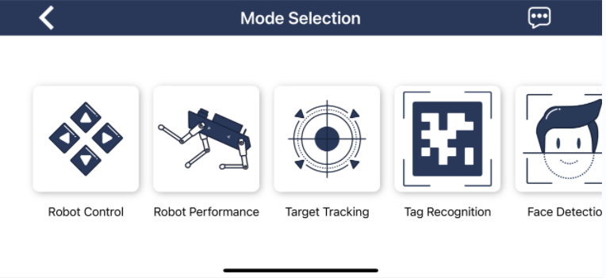
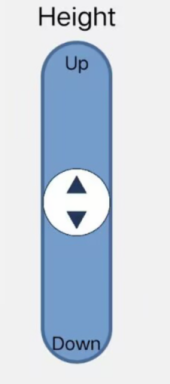

# 1. Getting Ready

## 1.1 Introduction to ROSPug

:::{Note}

The black ROSPug and the gun-gray ROSPug are only different in appearance; their internal functions and features are exactly the same.

:::

ROSPug is a quadruped robot dog specifically designed for ROS education, integrating the Ubuntu 18.04 system and ROS Melodic robot system.

It is equipped with advanced hardware components, including the NVIDIA Jetson Nano, high-voltage bus servos, Lidar, and an HD camera. With this high-performance hardware configuration, ROSPug excels in various applications such as robot motion control, mapping, navigation, tracking and obstacle avoidance, autonomous patrolling, human body recognition, and somatosensory interaction.

Moreover, ROSPug utilizes inverse kinematics, allowing for highly adjustable posture, height, and speed. This feature enhances the user's control experience, providing excellent maneuverability and customization options.

**1.1.1 Hardware Connection Diagram**

The diagram below shows the connections between the ROSPug robot dog's mainboard, expansion board, and various hardware modules.

## 1.2 Packing List

When receive robot package, check packing list to tally items received. If parts are missing, contact us at [support@hiwonder.com](mailto:support@hiwonder.com).

| No.  |       **Product Name**        | Quantity |                                **Picture**                                |
|:----:|:-----------------------------:|:--------:|:-------------------------------------------------------------------------:|
|  1   |            ROSPug             |    1     |   |
|  2   |         WIFI antennas         |    2     |                |
|  3   | 12.6V 2A charger(DC 4.0*1.7m) |    1     |  |
|  4   |          Card reader          |    1     |    |
|  5   |        Wireless handle        |    1     |  |
|  6   |       6.3cm Purple ball       |    1     |                |
|  7   |          Screwdiwer           |    1     |   |
|  8   |         Accessory bag         |          |   |
|  9   |          User manual          |    1     |   |

## 1.3 Startup Preparation

**1.3.1 Charging**

The ROSPug robot dog is powered by an 11.1V high-voltage lithium battery, and it is essential to use the specialized charger included in the kit. Upon receipt, please charge the battery, considering that it must be powered off during transportation and cannot be fully charged.

Full charge typically takes about 1 hour. For optimal movement performance, it is recommended to charge the battery when the voltage is ≤9.6V.

(1) Turn OFF the switch on the expansion board.

(2) Take out the battery wires from the bottom hole.

(3) Connect the battery by matching the wires: red to red and black to black.

(4) Secure the battery cover.

(5) Connect the provided charger to the DC power port on the Jetson expansion board to charge the robot.

**1.3.2 Safety Guideline to LiPo Battery**

(1) Please connect the battery by matching the wires: red to red and black to black before charging and using the robot.

(2) Use the dedicated charger provided in the kit to charge the robotic dog.

(3) Connect the charger to the battery without plugging it into the power supply; the indicator light will display green.

(4) To maintain optimal performance, please charge the battery when the voltage is ≤9.6V.

(5) When connecting the battery with the power on, the indicator light will turn red to indicate charging is in progress. Once it turns green, charging is complete. After charging, promptly disconnect the cable and switch to avoid overcharging.

(6) If the robot will not be used for an extended period, fully charge the battery and then disconnect it from the robot. Avoid pulling directly on the wires when disconnecting to prevent damage to the connectors.

(7) Store the battery in a cool, dry place, away from heat and liquids to prevent overheating, fire, or moisture damage, which can degrade its performance and lifespan.

(8) Do not hit, throw, or step on the battery.

(9) Avoid using the battery in areas with strong static or magnetic fields, as this can damage its safety protection features and create hazards.

(10) Do not connect the battery's positive and negative terminals with metal objects to prevent short circuits.

(11) Do not plug the battery into a power outlet.

(12) Do not throw the battery into fire or a heater.

(13) Do not store or transport the battery with metal objects, such as hairpins or necklaces.

## 1.4 Initial Startup

**1.4.1 Notes**

① To ensure stable performance, recharge the battery if its level falls below 10V before proceeding with operation. For detailed charging instructions, refer to [1.3 Startup Preparation](#anchor_1_3) .

② Keep the robot at a distance from your face and eyes during movement to prevent accidental injury.

③ During robot operation, avoid placing fingers within the robot's joint movement range to prevent injury.

④ Exercise caution to prevent the robot from falling off edges during movement.

⑤ If the robot operates continuously for an extended period, the servos may heat up. Allow the robot to "**rest**" until the servos cool down before resuming operation.

⑥ The robot's servos are precision components and consumables. Consider replacing them after prolonged or excessive use.

**1.4.2 Startup Notice**

(1) Before powering on, ensure all connections on the main controller are securely plugged in. Pay particular attention to the servo wires, OLED module, HD camera, controller, and radar connections.

(2) To prevent damage to the robot caused by sudden force upon startup, place the robot as shown in the picture.

(3) Switch ON the expansion board. LED1 will emit a faint blue light, and after 20 to 30 seconds, it will begin flashing. Soon after, LED1 will stay solid, and the OLED module at the rear will display the current voltage. At this point, the robot dog will shift to its initial posture, signaling that the ROS configuration is complete and the device is fully powered up.

(4) The default network connection mode is AP Direct Connection mode. Once the robot boots up successfully, it will generate a WiFi starting with the letter of **"HW",** and the initial password is **"hiwonder"**.