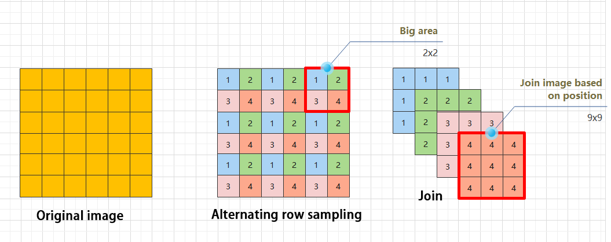
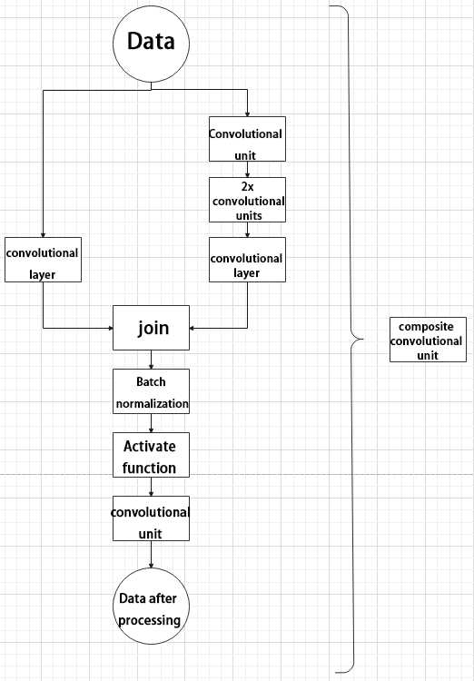
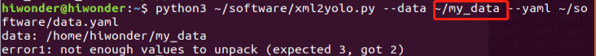

# 10. ROS + Deep Learning Course

## 10.1 Introduction to Machine Learning

### 10.1.1 What “Machine Learning” is

Machine Learning forms the cornerstone of artificial intelligence, serving as the fundamental approach to endow machines with intelligence. It spans multiple interdisciplinary fields such as probability theory, statistics, approximation theory, convex analysis, and algorithm complexity theory.


In essence, machine learning explores how computers can acquire new knowledge or skills by mimicking human learning behaviors and continuously enhancing their performance by reorganizing existing knowledge structures. Practically, it entails utilizing data to train models and leveraging these models for predictions.

For instance, consider AlphaGo, the pioneering artificial intelligence system that triumphed over human professional Go players and even world champions. `AlphaGo` operates on the principles of deep learning, wherein it discerns the intrinsic laws and representation layers within sample data to extract meaningful insights.

### 10.1.2 Types of Machine Learning

Machine learning can be broadly categorized into two types: supervised learning and unsupervised learning. The key distinction between these two types lies in whether the machine learning algorithm has prior knowledge of the classification and structure of the dataset.

*   **Supervised Learning**

Supervised learning involves providing a labeled dataset to the algorithm, where the correct answers are known. The machine learning algorithm uses this dataset to learn how to compute the correct answers. It is the most commonly used type of machine learning.

For instance, in image recognition, a large dataset of dog pictures can be provided, with each picture labeled as **"dog"**. This labeled dataset serves as the **"correct answer"**. By learning from this dataset, the machine can develop the ability to recognize dogs in new images.


(1) Model Selection: In supervised learning, selecting the right model to represent the data relationship is crucial. Common supervised learning models encompass linear regression, logistic regression, decision trees, support vector machines (`SVM`), and deep neural networks. The choice of model hinges on the data's characteristics and the problem's nature.

(2) Feature Engineering: Feature engineering involves preprocessing and transforming raw data to extract valuable features. This encompasses tasks like data cleaning, handling missing values, normalization or standardization, feature selection, and feature transformation. Effective feature engineering can significantly enhance model performance and generalization capabilities.

(3) Training and Optimization: Leveraging labeled training data, we can train the model to capture the data relationship. Training typically involves defining a loss function, selecting an appropriate optimization algorithm, and iteratively adjusting model parameters to minimize the loss function. Common optimization algorithms include gradient descent and stochastic gradient descent.

(4) Model Evaluation: Upon completing training, evaluating the model's performance on new data is essential. Standard evaluation metrics include accuracy, precision, recall, F1 score, and ROC curve. Assessing a model's performance enables us to gauge its suitability for practical applications.

In summary, supervised learning entails utilizing labeled training data to train a model for predicting or classifying new unlabeled data. Key steps encompass selecting an appropriate model, conducting feature engineering, training and optimizing the model, and evaluating its performance. Together, these components constitute the foundational elements of supervised learning.

*   **Unsupervised Learning**

Unsupervised learning involves providing an unlabeled dataset to the algorithm, where the correct answers are unknown. In this type of machine learning, the machine must mine potential structural relationships within the dataset.

For instance, in image classification, a large dataset of cat and dog pictures can be provided without any labels. Through unsupervised learning, the machine can learn to divide the pictures into two categories: cat pictures and dog pictures.


*   **Reinforcement Learning**

Reinforcement learning involves guiding algorithms with status and reward signals to learn optimal behavior in interacting with the environment. The aim is to maximize long-term rewards through strategic learning. Popular algorithms include Q-learning, Policy Gradient, Actor-Critic, and more.

### 10.1.3 Common Type of Machine Learning Framework

There are a large variety of machine learning frameworks. Among them, `PyTorch`, Tensorflow, MXNet and PaddlePaddle are common.

*   **PyTorch**

PyTorch is a powerful open-source machine learning framework, originally based on the BSD License Torch framework. It supports advanced multidimensional array operations and is widely used in the field of machine learning. PyTorch, built on top of Torch, offers even greater flexibility and functionality. One of its most distinguishing features is its support for dynamic computational graphs and its Python interface.

In contrast to TensorFlow's static computation graph, PyTorch's computation graph is dynamic. This allows for real-time modifications to the graph as computational needs change. Additionally, PyTorch enables developers to accelerate tensor calculations using GPUs, create dynamic computational graphs, and automatically calculate gradients. This makes PyTorch an ideal choice for machine learning tasks that require flexibility, speed, and powerful computing capabilities.

*   **Tensorflow**

TensorFlow is a powerful open-source machine learning framework that allows users to quickly construct neural networks and train, evaluate, and save them. It provides an easy and efficient way to implement machine learning and deep learning concepts. TensorFlow combines computational algebra with optimization techniques to make the calculation of many mathematical expressions easier.

One of  TensorFlow 's key strengths is its ability to run on machines of varying sizes and types, including supercomputers, embedded systems, and everything in between. TensorFlow can also utilize both  CPU and  GPU computing resources, making it an extremely versatile platform. When it comes to industrial deployment,  TensorFlow is often the most suitable machine learning framework due to its robustness and reliability. In other words,  TensorFlow is an excellent choice for deploying machine learning applications in a production environment.

*   **PaddlePaddle**

PaddlePaddle is a cutting-edge deep learning framework developed by Baidu, which integrates years of research and practical experience in deep learning. PaddlePaddle offers a comprehensive set of features, including training and inference frameworks, model libraries, end-to-end development kits, and a variety of useful tool components. It is the first open-source, industry-level deep learning platform to be developed in China, offering rich and powerful features to developers worldwide.

Deep learning has proven to be a powerful tool in many machine learning applications in recent years. From image recognition and speech recognition to natural language processing, robotics, online advertising, automatic medical diagnosis, and finance, deep learning has revolutionized the way we approach these fields. With `PaddlePaddle`, developers can harness the power of deep learning to create innovative and cutting-edge applications that meet the needs of users and businesses alike.

*   **MXNet**

MXNet  is a top-tier deep learning framework that supports multiple programming languages, including Python, C++, Scala, R, and more. It features a dataflow graph similar to other leading frameworks like TensorFlow and Theano, as well as advanced features such as robust multi-GPU support and high-level model building blocks comparable to Lasagne and  Blocks . MXNet can run on virtually any hardware, including mobile phones, making it a versatile choice for developers.

MXNet is specifically designed for efficiency and flexibility, with accelerated libraries that enable developers to leverage the full power of  GPUs and cloud computing. It also supports distributed computing across dynamic cloud architectures via distributed parameter servers, achieving near-linear scaling with multiple  GPUs/CPUs. Whether you're working on a small-scale project or a large-scale deep learning application, MXNet provides the tools and support you need to succeed.

## 10.2 MediaPipe Recognition & Detection

### 10.2.1 Introduction to MediaPipe

*   **Introduction to MediaPipe**

MediaPipe is an open-source framework of multi-media machine learning models. Cross-platform MediaPipe can run on mobile devices, workspace and servers, as well as support mobile GPU acceleration. It is also compatible with TensorFlow  and TF Lite Inference Engine, and all kinds of TensorFlow and TF Lite models can be applied on it. Besides, MediaPipe supports [GPU]() acceleration of mobile and embedded platform.

*   **MediaPipe Pros and Cons**

(1) MediaPipe Pros

① `MediaPipe` supports various platforms and languages, including iOS, Android, C++, Python, JAVA Script,Coral, etc.

② Swift running. Models can run in real-time.

③ Models and codes are with high reuse rate.

(2) MediaPipe Cons

① For mobile devices, MediaPipe will occupy 10M or above.

② As it greatly depends on Tensorflow, you need to alter large amount of codes if you want to change it to other machine learning frameworks, which is not friendly to machine learning developer.

③ It adopts static image which can improve efficiency, but make it difficult to find out the errors.

*   **How to use MediaPipe**

The figure below shows how to use `MediaPipe`. The solid line represents the part to coded, and the dotted line indicates the part not to coded. `MediaPipe` can offer the result and the function realization framework quickly.


### 10.2.2 Gesture Recognition

:::{Note}
Ensure the face is not within the camera's visual range during gesture recognition to avoid interference.
:::

Feed the image into the hand recognition model for gesture recognition, marking the key points of the gesture in the returned image.

*   **Program Logic**

The camera captures the image, followed by image processing using  OpenCV, including blurring, erosion, and dilation operations.

Next, the processed image is fed into the hand recognition model (MediaPipe) to detect palm joints, marking and connecting them.

Connecting lines denote finger knuckles, while marked dots signify knuckles or fingertips. Gesture recognition hinges on finger angles, distinguishing between bent and straight fingers based on their angles.

*   **Operation Steps**

:::{Note}
The input command should be case sensitive, and keywords can be complemented by pressing Tab key.
:::

(1) Start ROSPug robot dog, and access the robot system desktop using `NoMachine`.

(2) Click-on  to open the command-line terminal.

(3) Execute the following command, and hit Enter key to initiate the gesture recognition program.

```
rosrun pug_example hand_detect.py
```

(4) If you need to terminate this program, use short-cut **‘Ctrl+C’**. If the program cannot be stopped, please retry.

*   **Program Outcome**

Begin game by positioning your palm within the camera's view. Once the robot detects your palm, it will identify the key hand points in the captured image.


*   **Code Analysis**

The source code is saved in: [/home/pug/src/pug_example/scripts/machine_learning/hand_detect.py]()


(1) Import Function Library

Firstly, import the required libraries.

{lineno-start=1}
```python
#!/usr/bin/env python3
import cv2
import rospy
import numpy as np
import mediapipe as mp
from sensor_msgs.msg import Image
from pug_sdk.common import FPS
```
(2) Create Hand Recognition Model

Initiate a hand recognition model to detect gesture.

{lineno-start=}
```python
    def __init__(self):
        rospy.init_node('hand_detect_node')

        
        self.hand_detector = mp.solutions.hands.Hands( 
            static_image_mode=False,
            max_num_hands=1,
            # model_complexity=0,
            min_tracking_confidence=0.2,
            min_detection_confidence=0.7
        )
        self.drawing = mp.solutions.drawing_utils 

        self.fps = FPS() 
```
① Image Processing

{lineno-start=15}
```python
            static_image_mode=False,
```
Setting `static_image_mode=False` processes the input image as a video stream by default. This means that after detecting the first image, subsequent images are only subject to landmark tracking. The program won't detect the image again until tracking fails, reducing computation and latency.

Alternatively, when `static_image_mode=True`, the program detects all input images. This mode is ideal for detecting batches of static, unrelated images.

② Set Detection Number

{lineno-start=16}
```python
            max_num_hands=1,
```
`max_num_hands=1` sets the maximum number of hands that can be recognized simultaneously. This parameter is routinely configured to its maximum value.

③ Set the Minimum Confidence

{lineno-start=18}
```python
            min_tracking_confidence=0.2,
            min_detection_confidence=0.7
```
Setting `min_tracking_confidence=0.2` establishes the minimum confidence threshold for coordinate tracking, with values ranging from 0 to 1. Note that when `static_image_mode` is set to `True`, this parameter becomes inactive.

Similarly, `min_detection_confidence=0.7` sets the minimum confidence threshold for hand detection, also ranging from 0 to 1. A detection probability exceeding this threshold indicates successful hand detection.

④ Gesture Drawing

{lineno-start=21}
```python
        self.drawing = mp.solutions.drawing_utils 

        self.fps = FPS() 
```
Utilize the drawing tool from `drawing_utils` to sketch the gesture's shape.

(3) Hand Keypoint Detection

Process the obtained image to recognize the joints.

{lineno-start=27}
```python
        self.image_sub = rospy.Subscriber('/csi_camera/image_rect_color', Image, self.image_callback, queue_size=1)

        rospy.loginfo("hand detect node created")
```
① Subscribe to Topic

Through subscribing to the topic message published by the camera node, obtain the live camera feed.

{lineno-start=27}
```python
        self.image_sub = rospy.Subscriber('/csi_camera/image_rect_color', Image, self.image_callback, queue_size=1)
```
② Image Flipping

MediaPipe processes  RGB images, but the camera captures images in  BGR format, necessitating conversion. Failure to convert the image results in a mirrored output. Utilize the `cv2` library's `flip()` function to perform the necessary flip.

{lineno-start=35}
```python
        rgb_image = cv2.flip(rgb_image, 1) 
        result_image = np.copy(rgb_image) 
```
The first parameter within the function brackets, `rgb_image`, represents the input image. The second parameter, `1`, denotes the flip mode, where `0` signifies vertical flip, and `-1` represents both horizontal and vertical flips. After applying the flip, output the final image.

③ Detect Hand Key Points

Building upon the previously established hand recognition model, the algorithm identifies key points corresponding to the hand within the image.

{lineno-start=38}
```python
            results = self.hand_detector.process(rgb_image) 
```
(4) Information Feedback

① Hand Key Point Connection

Utilize the `solutions.drawing_utils.draw_landmarks()` function from the `MediaPipe` library to draw connections between the detected key points of the hand.

{lineno-start=}
```python
            if results is not None and results.multi_hand_landmarks: 
                for hand_landmarks in results.multi_hand_landmarks: 
                    self.drawing.draw_landmarks( 
                        result_image,
                        hand_landmarks,
                        mp.solutions.hands.HAND_CONNECTIONS)
        except Exception as e:
            rospy.logerr(str(e))
```
The first parameter, `result_image`, represents the input image.

The second parameter, `hand_landmarks`, holds the coordinates of the detected hand key points.

The third parameter, `mp.solutions.hands.HAND_CONNECTIONS`, specifies the lines connecting these coordinates.

② Output Live Camera Feed

Lastly, the `imshow()` function from the `cv2` library is invoked to create a window titled **"image"** for displaying the returned image.

{lineno-start=51}
```python
        cv2.imshow('image', result_image)
```
### 10.2.3 Gesture Control

*   **Program Logic**

The process involves capturing an image through the camera, followed by employing OpenCV for image processing tasks such as blurring, erosion, dilation, and more. Subsequently, the processed image is fed into the hand recognition model where the palm is identified, marked, and its joints are pinpointed. These marked points are then interconnected using lines.

Finger knuckles are represented by connecting lines, while knuckles or fingertips are denoted by marked dots. Further, gestures are recognized by analyzing the connecting lines and marked points. Gesture recognition entails evaluating the angle of each finger and determining whether it is bent or straightened based on these angles. Eventually, the robot dog responds differently according to the detected gestures.

*   **Operation Steps**

:::{Note}
The input command should be case sensitive, and keywords could be complemented by pressing `Tab` key.
:::

(1) Start the robot dog, and access the robot system desktop using `NoMachine`.

(2) Double-click  to open the command-line terminal.

(3) Execute the following command to initiate app auto-start service, and hit Enter key.

```
rosrun pug_example gesture_control.py
```

(4) If you need to terminate this program, use short-cut **‘Ctrl+C’**. If the program fail to exit, please retry.

*   **Program Outcome**

During game, execute particular gestures within the camera's field of view. Upon recognition of the gesture, the robot dog will execute corresponding feedback actions. Furthermore, the identified gesture name will be displayed on the screen, accompanied by the identification of key hand points.

The table below display the robot’s feedback action of specific gesture.

| **Gesture Name** | **Example** | **Feedback Action** |
|:--:|:--:|:--:|
| ok |  | Rotate around roll-axis (roll_turn) |
| fist |  | Push-up（push-up） |

*   **Code Analysis**

The source code is saved in: [/home/pug/src/pug_example/scripts/machine_learning/gesture_control.py]()


(1) Import Function Library

Firstly, import the required function library.

{lineno-start=1}
```python
#!/usr/bin/env python3
import cv2
import time
import rospy
import threading
import numpy as np
import mediapipe as mp
from pug_sdk.common import FPS
from sensor_msgs.msg import Image
from pug_sdk.common import vector_2d_angle
from pug_control.srv import SetActionName
```
(2) Basic Configuration

① Create Hand Recognition Model

Import the hand recognition example from the `MediaPipe` toolkit to create hand recognition model.

{lineno-start=}
```python
class HandGestureNode:
    def __init__(self):
        rospy.init_node('hand_gesture')

        self.hand_detector = mp.solutions.hands.Hands(
            static_image_mode=False,
            max_num_hands=1,
            # model_complexity=0,
            min_tracking_confidence=0.05,
            min_detection_confidence=0.6
```
`static_image_mode=False` defines the processing mode for the input image. The default value, `False`, treats the input image as a video stream. This means that after the initial image is detected, landmark tracking occurs solely on subsequent images until tracking discontinues. The program then rechecks the image. This detection mode aids in reducing computation and latency.

When set to `True`, the program detects all input images. This mode is suitable for detecting batches of static, unrelated images.

`max_num_hands=1` specifies the maximum number of hands that can be detected simultaneously.

`min_tracking_confidence=0.05` represents the minimum confidence value for the coordinate tracking model, ranging from 0 to 1. When `static_image_mode` is set to `True`, this parameter becomes ineffective.

`min_detection_confidence=0.6` signifies the minimum confidence value for the hand detection model, ranging from 0 to 1. If the hand detection probability exceeds this value, the detection is deemed successful.

② Instantiate

Then instantiate each functional module.

{lineno-start=122}
```python
        self.drawing = mp.solutions.drawing_utils
        self.fps = FPS()  
        self.gesture = ""
        self.action_finish = True
        self.count = 0

        self.image_sub = rospy.Subscriber("/csi_camera/image_rect_color", Image, self.image_callback, queue_size=1)
```
③ Subscribe to Topic

Subscribe to topic messages published by the camera node to obtain real-time images from the camera.

{lineno-start=128}
```python
        self.image_sub = rospy.Subscriber("/csi_camera/image_rect_color", Image, self.image_callback, queue_size=1)
```
(3) Gesture Recognition

Process the image captured by the camera, them determine the gesture within the image.

① Image Flip

`MediaPipe` processes images in `RGB` format, while the images captured by the camera are in `BGR` format. Hence, conversion is necessary to ensure proper processing. Failure to perform this conversion may result in a mirrored image. Utilize the `flip()` function from the `cv2` library to address this issue by flipping the image as needed. Finally, output the processed image.

{lineno-start=153}
```python
        rgb_image = cv2.flip(rgb_image, 1)
```
The first parameter within the function brackets, `rgb_image`, represents the input image. The second parameter, `1`, denotes the flip mode, where `0` signifies vertical flip, and `-1` represents both horizontal and vertical flips. After applying the flip, output the final image.

② Hand Key Point Detection

Once the image processing is finished, the hand recognition model previously constructed is employed to detect the key points of the hand in the processed image.

{lineno-start=158}
```python
                results = self.hand_detector.process(rgb_image)
```
③ Hand Key Point Connection

Utilize the function `solutions.drawing_utils.draw_landmarks()` from the `MediaPipe` library to draw connections between the key points of the hand, as illustrated in the figure below:

{lineno-start=}
```python
                        self.drawing.draw_landmarks(
```
The first parameter, `result_image`, represents the input image.

The second parameter, `hand_landmarks`, holds the coordinates of the detected hand key points.

The third parameter, `mp.solutions.hands.HAND_CONNECTIONS`, specifies the lines connecting these coordinates.

④ Determine Gesture

The bending angle of each finger is calculated based on the connections between the key points of the hand to finalize the gesture determination.

{lineno-start=20}
```python
    h, w, _ = img.shape
    landmarks = [(lm.x * w, lm.y * h) for lm in landmarks]
    return np.array(landmarks)
```
Gestures are evaluated using the following list of angles (the screenshots provided below depict only a portion of the angle list).

{lineno-start=55}

```
    thr_angle = 65.
    thr_angle_thumb = 53.
    thr_angle_s = 49.

    gesture_str = "none"
    if (angle_list[0] > thr_angle_thumb) and (angle_list[1] > thr_angle) and (angle_list[2] > thr_angle) and (
            angle_list[3] > thr_angle) and (angle_list[4] > thr_angle):
        gesture_str = "fist"
    elif (angle_list[0] > thr_angle_thumb) and (angle_list[1] > thr_angle) and (angle_list[2] < thr_angle_s) and (
            angle_list[3] < thr_angle_s) and (angle_list[4] < thr_angle_s):
        gesture_str = "ok"
    elif (angle_list[0] < thr_angle_s) and (angle_list[1] < thr_angle_s) and (angle_list[2] > thr_angle) and (
            angle_list[3] > thr_angle) and (angle_list[4] > thr_angle):
        gesture_str = "gun"
    elif (angle_list[0] > 5) and (angle_list[1] < thr_angle_s) and (angle_list[2] > thr_angle) and (
            angle_list[3] > thr_angle) and (angle_list[4] > thr_angle):
```

Invoke `putText()` function from `cv2` library to print gesture name on the live camera feed.

{lineno-start=169}
```python
                    cv2.putText(result_image, gesture, (10, 50), cv2.FONT_HERSHEY_SIMPLEX, 1, (0, 0, 0), 5)
                    cv2.putText(result_image, gesture, (10, 50), cv2.FONT_HERSHEY_SIMPLEX, 1, (255, 255, 0), 2)
```
The code `cv2.putText(result_image, gesture, (10, 50), cv2.FONT_HERSHEY_SIMPLEX, 1, (0, 0, 0), 5)` is explained as follows:

The first parameter `result_image` represents the input image.

The second parameter `gesture` denotes the text to be added, which in this case is the gesture name.

The third parameter `(10, 50)` specifies the coordinates of the upper-left corner where the text will be added.

The fourth parameter `cv2.FONT_HERSHEY_SIMPLEX` indicates the font type used for adding the text.

The fifth parameter `1` defines the font size.

The sixth parameter `(0, 0, 0)` signifies the font color, where the order is Blue, Green, Red (`BGR`).

The seventh parameter `5` represents the font thickness.

(4) Gesture Control

① Feedback Action

Through calling the function `self.action_set()`, command the robot dog to execute the designated action.

{lineno-start=}
```python
    gesture_str = "none"
    if (angle_list[0] > thr_angle_thumb) and (angle_list[1] > thr_angle) and (angle_list[2] > thr_angle) and (
            angle_list[3] > thr_angle) and (angle_list[4] > thr_angle):
        gesture_str = "fist"
    elif (angle_list[0] > thr_angle_thumb) and (angle_list[1] > thr_angle) and (angle_list[2] < thr_angle_s) and (
            angle_list[3] < thr_angle_s) and (angle_list[4] < thr_angle_s):
        gesture_str = "ok"
    elif (angle_list[0] < thr_angle_s) and (angle_list[1] < thr_angle_s) and (angle_list[2] > thr_angle) and (
            angle_list[3] > thr_angle) and (angle_list[4] > thr_angle):
        gesture_str = "gun"
    elif (angle_list[0] > 5) and (angle_list[1] < thr_angle_s) and (angle_list[2] > thr_angle) and (
            angle_list[3] > thr_angle) and (angle_list[4] > thr_angle):
        gesture_str = "one"
    elif (angle_list[0] > thr_angle_thumb) and (angle_list[1] < thr_angle_s) and (angle_list[2] < thr_angle_s) and (
            angle_list[3] > thr_angle) and (angle_list[4] > thr_angle):
        gesture_str = "two"
    elif (angle_list[0] > thr_angle_thumb) and (angle_list[1] < thr_angle_s) and (angle_list[2] < thr_angle_s) and (
            angle_list[3] < thr_angle_s) and (angle_list[4] > thr_angle):
        gesture_str = "three"
    
    elif (angle_list[0] > thr_angle_thumb) and (angle_list[1] < thr_angle_s) and (angle_list[2] < thr_angle_s) and (
            angle_list[3] < thr_angle_s) and (angle_list[4] < thr_angle_s):
        gesture_str = "four"
    elif (angle_list[0] < thr_angle_s) and (angle_list[1] < thr_angle_s) and (angle_list[2] < thr_angle_s) and (
            angle_list[3] < thr_angle_s) and (angle_list[4] < thr_angle_s):
        gesture_str = "five"
    elif (angle_list[0] < thr_angle_s) and (angle_list[1] > thr_angle) and (angle_list[2] > thr_angle) and (
            angle_list[3] > thr_angle) and (angle_list[4] < thr_angle_s):
        gesture_str = "six"
    else:
        "none"
    return gesture_str
```
The first parameter within the parentheses of the `action_set()` function is the name of the action group. This action group should be located under the directory path **"/home/pug/Pug_PC_Software/Actiongroups"**.

## 10.3 Fingertip & Pose Control

### 10.3.1 Fingertips Trajectory Recognition

*   **Program Logic**

First, instantiate a hand recognizer to acquire hand point information and establish connections between key points.

Subsequently, normalize the point positions to compute finger angles and identify the current gesture.

Finally, when a specific gesture is detected, initiate tracking and record the finger movement trajectory points, ultimately returning the recognized trajectory map.

*   **Operation Steps**

:::{Note}
The input command should be case sensitive, and keywords could be complemented by pressing `Tab` key.
:::

(1) Start the robot dog, and access the robot system desktop using `NoMachine`.

(2) Double-click  to open the command-line terminal.

(3) Execute the following command to initiate app auto-start service, and hit Enter key.

```
rosrun pug_example finger_track.py
```

(4) If you need to terminate this program, use short-cut **‘Ctrl+C’**. If the program fail to exit, please retry.

*   **Program Outcome**

Once the game commences, position your hand within the camera's recognition range. Upon detecting the hand, the `ROSPug` robot dog will connect the key points of the hand. When it identifies the index finger extended independently, the buzzer will sound, initiating fingertip trajectory recognition mode, and drawing the fingertip trajectory on the screen.

Upon transitioning to a five-finger spread posture, the robot will cease trajectory recognition and return to displaying the recognized trajectory image window.

*   **Code Analysis**

[Source Code]()

The source code is saved in: [/home/pug/src/pug_example/scripts/machine_learning/finger_track.py]()


(1) Hand Recognition

First, instantiate a hand recognizer using the `mp.solutions.hands.Hands()` function. This recognizer includes a palm detection model and a hand landmark model. It can process the entire image and provide outputs such as a hand bounding box and hand key points.

{lineno-start=98}
```python
        self.hand_detector = mp.solutions.hands.Hands(
            static_image_mode=False,
            max_num_hands=1,
            # model_complexity=0,
            min_tracking_confidence=0.05,
            min_detection_confidence=0.6
        )
```
`static_image_mode` defines the processing mode for the input image. The default value, `False`, treats the input image as a video stream. This means that after the initial image is detected, landmark tracking occurs solely on subsequent images until tracking discontinues. The program then rechecks the image. This detection mode aids in reducing computation and latency.

When set to `True`, the program detects all input images. This mode is suitable for detecting batches of static, unrelated images.

`max_num_hands` specifies the maximum number of hands that can be detected simultaneously.

`min_tracking_confidence` represents the minimum confidence value for the coordinate tracking model, ranging from 0 to 1. When `static_image_mode` is set to `True`, this parameter becomes ineffective.

`min_detection_confidence` signifies the minimum confidence value for the hand detection model, ranging from 0 to 1. If the hand detection probability exceeds this value, the detection is deemed successful.

(2) Key Point Connection

{lineno-start=128}
```python
                for hand_landmarks in results.multi_hand_landmarks:
                    self.drawing.draw_landmarks(
                        result_image,
                        hand_landmarks,
                        mp.solutions.hands.HAND_CONNECTIONS)
                    landmarks = get_hand_landmarks(rgb_image, hand_landmarks.landmark)
                    angle_list = (hand_angle(landmarks))
                    gesture = (h_gesture(angle_list))
                    index_finger_tip = landmarks[8].tolist()
```
Gesture key point drawing is primarily accomplished using the `draw_landmarks()` function, illustrated by the code `self.drawing.draw_landmarks(result_image, hand_landmarks, mp.solutions.hands.HAND_CONNECTIONS)`. Here's a breakdown of the parameters:

The first parameter `result_image` represents the image of the recognition screen.

The second parameter `hand_landmarks` denotes the key points of the gesture.

The third parameter `mp.solutions.hands.HAND_CONNECTIONS` selects the connection mode, specifically the connection lines between the key points of the hand.

(3) Calculate Finger Angle and Determine Gesture

The acquired key points are normalized and then passed into the `hand_angle()` function to compute the finger angles. Subsequently, they are processed by the `h_gesture()` function to determine the gesture.

{lineno-start=133}
```python
                    landmarks = get_hand_landmarks(rgb_image, hand_landmarks.landmark)
                    angle_list = (hand_angle(landmarks))
                    gesture = (h_gesture(angle_list))
```
(4) Draw Trajectory

Once in the trajectory recognition mode, the coordinate points of the fingertips will be logged, and line segments will be drawn in pairs. The trajectory connection is executed using the `draw_points()` function with the following specific parameters:

{lineno-start=69}
```python
def draw_points(img, points, tickness=4, color=(255, 0, 0)):
    
    
    
    points = np.array(points).astype(dtype=np.int)
    if len(points) > 2:
        for i, p in enumerate(points):
            if i + 1 >= len(points):
                break
            cv2.line(img, tuple(p), tuple(points[i + 1]), color, tickness)
```
The first parameter `img` represents the screen image.

The second parameter `points` indicates the set of points transmitted by the index finger.

The third parameter `thickness=4` denotes the width of the drawn line.

The fourth parameter `color=(255, 0, 0)` specifies the line color, which is red in this instance.

(5) Trajectory Recognition

The trajectory shape is determined by assessing the number of convex corners present in the trajectory image.

{lineno-start=170}
```python
                                if len(approx) == 3:
                                    cv2.putText(track_img, 'Triangle', (10, 40),cv2.FONT_HERSHEY_SIMPLEX, 1.2, (255, 255, 0), 2)
                                if len(approx) == 4 or len(approx) == 5:
                                    cv2.putText(track_img, 'Square', (10, 40),cv2.FONT_HERSHEY_SIMPLEX, 1.2, (255, 255, 0), 2)
                                if 5 < len(approx) < 10:
                                    cv2.putText(track_img, 'Circle', (10, 40),cv2.FONT_HERSHEY_SIMPLEX, 1.2, (255, 255, 0), 2)
                                if len(approx) == 10:
                                    cv2.putText(track_img, 'Star', (10, 40),cv2.FONT_HERSHEY_SIMPLEX, 1.2, (255, 255, 0), 2)
                        # cv2.imshow('track', track_img)
```
Shape name drawing is primarily achieved using the `putText()` function, exemplified by the code `cv2.putText(track_img, 'Triangle', (10, 40), cv2.FONT_HERSHEY_SIMPLEX, 1.2, (255, 255, 0), 2)`. Here's an explanation of the specific parameters:

The first parameter `track_img` refers to the image of the recognition screen.

The second parameter `Triangle` represents the name of the shape.

The third parameter  `(10, 40)`  specifies the coordinate position for displaying the text on the screen.

The fourth parameter `cv2.FONT_HERSHEY_SIMPLEX` denotes the chosen text font.

The fifth parameter `1.2` defines the scaling factor of the text.

The sixth parameter `(255, 255, 0)` indicates the display color of the text.

The seventh parameter `2` represents the thickness of the font.

### 10.3.2 Pose Control

*   **Program Logic**

Initially, instantiate a human posture estimator to acquire limb point information and establish connections between key points.

Subsequently, after processing these points, assess arm movements using manual `2D` geometric features.

Finally, when the arms are raised high, readiness to enter limb control mode is determined. Upon spreading the arms horizontally and raising the left hand while moving it up and down, the robot dog will swing up and down correspondingly.

*   **Operation Steps**

:::{Note}
The input command should be case sensitive, and keywords can be complemented using `Tab` key.
:::

(1) Start the robot dog, and access the robot system desktop using `NoMachine`.

(2) Double-click  to open the command-line terminal.

(3) Execute the following command to initiate the game, and hit Enter key.

```
rosrun pug_example pose_control.py
```

(4) If you need to terminate this program, use short-cut **‘Ctrl+C’**. If the program fail to exit, please retry.

*   **Program Outcome**

Once the game starts, the robot dog will be prepared for pose recognition. Upon standing in front of its camera, the robot will recognize and connect the keypoints of your body.

Upon recognizing the **"hands-up"** gesture, the robot will emit a beeping sound to indicate entry into body pose control mode. Users should then extend their arms horizontally and wave their left arm up and down. The robot dog will mirror these movements by moving up and down accordingly.

Upon recognizing a **"cross"** gesture with the raised arms, the robot will exit the pose control mode.

*   **Program Analysis**

The source code is saved in: [/home/pug/src/pug_example/scripts/machine_learning/pose_control.py]()


(1) Human Pose Recognition

First, instantiate a human pose evaluator using the `mp.solutions.pose.Pose()` function to obtain information about human joints. Here's an explanation of the parameters:

{lineno-start=126}
```python
        self.pose = mp.solutions.pose.Pose(
            static_image_mode=False,
            model_complexity=1,
            min_detection_confidence=0.8,
            min_tracking_confidence=0.4
        )
```
The first parameter, `static_image_mode`, is used to specify whether the input is an image. The default value is `False`, indicating that the input is a video stream.

The second parameter, `model_complexity`, sets the complexity of the model. A value of `0` represents the most basic joint point positions.

The third parameter, `min_tracking_confidence`, defines the minimum confidence value of the coordinate tracking model, ranging between 0 and 1. This value is used to determine whether the hand coordinates are successfully tracked. If tracking fails, hand detection is automatically triggered on the next input image.

The fourth parameter, `min_detection_confidence`, specifies the minimum confidence value of the hand detection model, ranging between 0 and 1. If the confidence value exceeds this threshold, the detection is considered successful.

(2) Keypoint Connection

{lineno-start=190}
```python
            try:
                results = self.pose.process(rgb_image)
            except:
                results = False
            if results:
                self.drawing.draw_landmarks(result_image, results.pose_landmarks, mp.solutions.pose.POSE_CONNECTIONS)
```
Drawing human body key points is primarily accomplished using the `draw_landmarks()` function. Here's an example code: `self.drawing.draw_landmarks(result_image, results.pose_landmarks, mp.solutions.pose.POSE_CONNECTIONS)`. Here are the specific parameters:

The first parameter `result_image` refers to the image of the recognition screen.

The second parameter `results.pose_landmarks` represents the key points of the human body.

The third parameter `mp.solutions.pose.POSE_CONNECTIONS` selects the connection mode, which in this case is the connection lines between the key points of the limbs.

(3) Determine Pose

The acquired key points are passed into the `is_level`, `is_flat`, and `is_cross` functions to ascertain the posture.

{lineno-start=}
```python
def is_level(landmarks, angle_threshold=15):
    """
    
    :param landmarks:
    :param angle_threshold:
    :return:
    """
    try:
        p0 = landmarks[12].copy()
        p0[0] = 0
        if abs(get_angle(p0, landmarks[12], landmarks[11])) > angle_threshold:
            return False
    except BaseException as e:
        print(2, e)
    return True

def is_flat(landmarks, angle_threshold):
    """
    
    :param landmarks:
    :param angle_threshold:
    :return: True or False  
    """
    try:
        arm_marks = [15, 13, 11, 12, 14, 16]
        for i in range(3):
            angle = get_angle(landmarks[arm_marks[i]], landmarks[arm_marks[i + 1]], landmarks[arm_marks[i + 2]])
            if abs(angle) > angle_threshold:
                return False
    except BaseException as e:
        print(3, e)
    return is_level(landmarks, angle_threshold)

def is_cross(landmarks):
    """
     
    :param landmarks:
    :return: True of False
    """
    try:
        if landmarks[16][0] <= landmarks[15][0]:
            return False
    except BaseException as e:
        print(4, e)
    return is_pentagon(landmarks)
```
(4) Calculate the Height

The angle of the left arm is obtained through the `get_angle()` function, and then the height is calculated based on the angle of the left arm.

{lineno-start=219}
```python
                    else:
                        self.timestamp = time.time()
                         
                        if not is_cross(landmarks):
                            left_angle_2 = get_angle(landmarks[11], landmarks[12], landmarks[14])
                            right_angle_2 = get_angle(landmarks[12], landmarks[11], landmarks[13])
                            height = None
                            if left_angle_2 > -20 and left_angle_2 < 10:
                                height = -0.13
                            elif left_angle_2 <= -20:
                                height = -0.09
                            elif left_angle_2 >= 10:
                                height = -0.16
                            self.height = height
```
(5) Control the Height

The posture control message is published using `self.pose_pub.publish()`, which controls the change in the robot dog's body height.

{lineno-start=173}
```python
    def action_thread(self):
        while self.running:
            if self.action_finish:
                if self.height is not None:
                    self.action_finish = False
                    self.pose_pub.publish(0, 0, 0, self.height, 0, 0, 0, 0.3)
                    time.sleep(0.3)
                    self.action_finish = True
                else:
                    time.sleep(0.01)
            else:
                time.sleep(0.01)
```
## 10.4 Introduction to Yolov5 Model Structure and Working Procedure

### 10.4.1 YOLOv5 Description & Model Structure

*   **YOLO Series Model Description**

(1) YOLO Series

YOLO (You Only Look Once) is an one-stage regression algorithm based on deep learning.

R-CNN series algorithm dominates target detection domain before YOLOv1 is released. It has higher detection accuracy, but cannot achieve real-time detection due to its limited detection speed engendered by its two-stage network structure.

To tackle this problem, YOLO is released. Its core idea is to redefine target detection as a regression problem, use the entire image as network input, and directly return position and category of Bounding Box at output layer. Compared with traditional methods for target detection, it distinguishes itself in high detection speed and high average accuracy.

(2) YOLOv5

YOLOv5 is an optimized version based on previous YOLO models, whose detection speed and accuracy is greatly improved.

In general, a target detection algorithm is divided into 4 modules, namely input end, reference network, Neck network and Head output end. The following analysis of improvements in YOLOv5 rests on these four modules.

① Input end: YOLOv5 employs Mosaic data enhancement method to increase model training speed and network accuracy at the stage of model training. Meanwhile, adaptive anchor box calculation and adaptive image scaling methods are proposed.

② Reference network: Focus structure and CPS structure are introduced in YOLOv5.

③ Neck network: same as YOLOv4, Neck network of YOLOv5 adopts FPN+PAN structure, but they differ in implementation details.

④ Head output layer: YOLOv5 inherits anchor box mechanism of output layer from YOLOv4. The main improvement is that loss function GIOU_Loss, and DIOU_nms for prediction box screening are adopted.

*   **YOLOv5 Model Structure**

(1) Component

① Convolution layer: extract features of the image

Convolution refers to the effect of a phenomenon, action or process that occurs repeatedly over time, impacting the current state of things. Convolution can be divided into two components: **"volume"** and **"accumulation"**. **"Volume"** involves data flipping, while **"accumulation"** refers to the accumulation of the influence of past data on current data. Flipping the data helps to establish the relationships between data points, providing a reference for calculating the influence of past data on the current data.

In YOLOv5, the data being processed is typically an image, which is two-dimensional in computer vision. Therefore, the convolution applied is also a two-dimensional convolution, with the aim of extracting features from the image. The convolution kernel is an unit area used for each calculation, typically in pixels. The kernel slides over the image, with the size of the kernel being manually set.

During convolution, the periphery of the image may remain unchanged or be expanded as needed, and the convolution result is then placed back into the corresponding position in the image. For instance, if an image has a resolution of 6×6, it may be first expanded to a 7×7 image, and then substituted into the convolution kernel for calculation. The resulting data is then refilled into a blank image with a resolution of 6×6.


② Pooling layer: enlarge the features of image

The pooling layer is an essential part of a convolutional neural network and is commonly used for downsampling image features. It is typically used in combination with the convolutional layer. The purpose of the pooling layer is to reduce the spatial dimension of the feature map and extract the most important features.

There are different types of pooling techniques available, including global pooling, average pooling, maximum pooling, and more. Each technique has its unique effect on the features extracted from the image.


Maximum pooling can extract the most distinctive features from an image, while discarding the remaining ones. For example, if we take an image with a resolution of 6×6 pixels, we can use a 2×2 filter to downsample the image and obtain a new image with reduced dimensions.


③ Upsampling layer: restore the size of an image

This process is sometimes referred to as **"anti-pooling"**. While upsampling restores the size of the image, it does not fully recover the features that were lost during pooling. Instead, it tries to interpolate the missing information based on the available information.

For example, let's consider an image with a resolution of 6×6 pixels. Before upsampling, use 3X3 filter to calculate the original image so as to get the new image.


④ Batch normalization layer: organize data

It aims to reduce the computational complexity of the model and to ensure that the data is better mapped to the activation function.

Batch normalization works by standardizing the data within each mini-batch, which reduces the loss of information during the calculation process. By retaining more features in each calculation, batch normalization can improve the sensitivity of the model to the data.


⑤ RELU layer: activate function

The activation function is a crucial component in the process of building a neural network, as it helps to increase the nonlinearity of the model. Without an activation function, each layer of the network would be equivalent to a matrix multiplication, and the output of each layer would be a linear function of the input from the layer above. This would result in a neural network that is unable to learn complex relationships between the input and output.

There are many different types of activation functions. Some of the most common activation functions include the ReLU, Tanh, and Sigmoid. For example, `ReLU` is a piecewise function that replaces all values less than zero with zero, while leaving positive values unchanged.


⑥ ADD layer: add tensor

In a typical neural network, the features can be divided into two categories: salient features and inconspicuous features.


⑦ Concat layer: splice tensor

It is used to splice together tensors of features, allowing for the combination of features that have been extracted in different ways. This can help to increase the richness and complexity of the feature set.


(2) Compound Element

When building a model, using only the layers mentioned above to construct functions can lead to lengthy, disorganized, and poorly structured code. By assembling basic elements into various units and calling them accordingly, the efficiency of writing the model can be effectively improved.

① Convolutional unit:

A convolutional unit consists of a convolutional layer, a batch normalization layer, and an activation function. The convolution is performed first, followed by batch normalization, and finally activated using an activation function.


② Focus module

The `Focus` module for interleaved sampling and concatenation first divides the input image into multiple large regions and then concatenates the small images at the same position within each region to break down the input image into several smaller images. Finally, the images are preliminarily sampled using convolutional units.

As shown in the figure below, taking an image with a resolution of `6×6` as an example, if we set a large region as `2×2`, then the image can be divided into 9 large regions, each containing 4 small images.

By concatenating the small images at position 1 in each large region, a `3×3` image can be obtained. The small images at other positions are similarly concatenated, and the original `6×6` image will be broken down into four `3×3` images.



③ Residual Unit

The function of the residual unit is to enable the model to learn small changes in the image. Its structure is relatively simple and is achieved by combining data from two paths.

The first path uses two convolutional units to sample the image, while the second path does not use convolutional units for sampling but directly uses the original image. Finally, the data from the first path is added to the second path.


④ Composite Convolution Unit

In `YOLOv5`, the composite convolution unit is characterized by the ability to customize the convolution unit according to requirements. The composite convolution unit is also realized by superimposing data obtained from two paths.

The first path only has one convolutional layer for sampling, while the second path has `2x+1` convolutional units and one convolutional layer for sampling. After sampling and splicing, the data is organized through batch normalization and then activated by an activation function. Finally, a convolutional layer is used for sampling.



⑤ Compound Residual Convolutional Unit

The compound residual convolutional unit replaces the `2x` convolutional layers in the compound convolutional unit with `x` residual units. In `YOLOv5`, the feature of the compound residual unit is mainly that the residual units can be customized according to the needs.


⑥ Composite Pooling Unit

The output data of the convolutional unit is fed into three max pooling layers and an additional copy is kept without processing. Then, the data from the four paths are concatenated and input into a convolutional unit. Using the composite pooling unit to process the data can significantly enhance the features of the original data.


(3) Structure

Composed of three parts, `YOLOv5` can output three sizes of data. Data of each size is processed in different way. The below picture is the output structure of `YOLOv5`.


Below is the output structures of data of three sizes.


### 10.4.2 YOLOv5 Working Procedure

In this section, we provide an explanation of the model workflow using the anchor boxes, prediction boxes, and prior boxes employed in `YOLOv5`.

*   **Prior Bounding Box**

When an image is input into model, object detection area requires us to offer, while prior bounding box is that box used to mark the object detection area on image before detection.


*   **Prediction Box**

The prediction box is not required to set manually, which is the output result of the model. When the first batch of training data is input into model, the prediction box will be automatically generated with it. The position in which the object of same type appear more frequently are set as the center of the prediction box.


*   **Anchor Box**

After the prediction box is generated, deviation may occur in its size and position. At this time, the anchor box serves to calibrate the size and position of the prediction box.

The generation position of anchor box is determined by prediction box. In order to influence the position of the next generation of the prediction box, the anchor box is generated at the relative center of the existing prediction box.


*   **Realization Process**

After the data is calibrated, a prior bounding box appears on image. Then, the image data is input to the model, the model generates a prediction box based on the position of the prior bounding box. Having generated the prediction box, an anchor box will appear automatically. Lastly, the weights from this training are updated into model.

Each newly generated prediction will be influenced by the last generated anchor box. Repeating the operations above continuously, the deviation of the size and position of the prediction box will be gradually erased until it coincides with the priori box.


## 10.5 Yolov5 Model Training

### 10.5.1 Image Collecting and Labeling

Given that training the Yolov5 model necessitates a substantial volume of data, our initial step involves collecting and labeling the requisite data in preparation for subsequent model training.

To begin, you can assemble the images that require collection. As an illustration, let's consider the collection of traffic signs.

*   **Preparation**

(1) Prepare a laptop. If you are using a desktop computer, please prepare a wireless network card and a mouse.

(2) Start the robot, and access the system desktop using NoMachine.

*   **Training Procedure**

(1) Create New Data Set Folder

① Create a new folder under any path, such as **'My_Data'**, to store the dataset. To prevent interference with the normal use of other folders, it's advisable to create the folder within the **'Home'** directory.


② Within the **'My_Data'** folder, create three subfolders: **'Annotations'** (for saving annotation files), **'ImageSets'** (for storing path files of the dataset), and **'JPEGImages'** (for saving dataset pictures).


(2) Prepare Data Set

Photos can be sourced from the internet. To reduce the performance required for subsequent annotation and training, image resolution can be adjusted to `640x480`. Images taken with the **'Capture'** tool default to this resolution.

① Start **‘Capture’** tool to capture images.


② Click-on **‘Select’** button, then choose **‘/home/hiwonder/My_Data/JPEGImages’** and click-on **‘Open’** to save pictures.


③ Position the card that requires training within the camera's field of view, and click **"Save"** to capture the current image. Ensure that the number of images for each type is consistent. For instance, if you capture 50 images of the **‘left turn’** card, you should also capture 50 images of the **‘right turn’** card.


④ By capturing the card and shooting its material from various angles, the model's reliability has been enhanced. A higher number of materials leads to a more accurate model recognition, although training time increases accordingly. To maintain recognition stability, it's advised to capture around 200 pictures for each material type during training.

⑤ After capturing the pictures, you can turn off the image collecting tool, and proceed with image labeling.

(3) Image Labeling

① Double-click **‘labelImg’** icon to open the annotation tool.


Upon launching the image annotation tool, the table below outlines the key functions.

| **Icon** | **Shortcut Key** | **Function** |
|:--:|:--:|:--:|
|  | Ctrl+U | Select the directory where the picture is saved. |
|  | Ctrl+R | Select the directory where the calibration data is saved. |
|  | W | Create annotation box |
|  | Ctrl+S | Save annotation |
|  | A | Switch to the previous image |
|  | D | Switch to the next image |

② To set the save path for annotation data, begin by clicking **"Change Save Dir"**. Next, select **"/home/hiwonder/My_Data/Annotations"**, and then click **"Open"** to proceed.


③ Begin by clicking **"Open Dir"** to access the folder where the pictures are stored. Next, select **"/home/hiwonder/My_Data/JPEGImage"**, then click **"Open"** to proceed.


④ Click-on **‘Create RectBox’** button to create a annotation box.


⑤ Position the mouse cursor appropriately, then press and hold the left mouse button while dragging out a rectangular frame to select the training content in the photo. Let's use `left turn` as an example.


⑥ After releasing the mouse, enter the category name of this card in the pop-up dialog box, then click **"OK"**. For instance, you can enter **"left"**. (Items of the same type must have the same name)


⑦ After labeling a picture, click-on **‘Save’** button, then click-on **‘Next Image’** to proceed with the image labeling.


:::{Note}
*   While annotating, you can use shortcut keys to expedite the process. For instance, press **"D"** to switch to the next picture and press **"W"** to create a label box.
*   You can also use **"Ctrl+v"** to paste the annotation box from the previous picture here. However, note that this method is only applicable to annotations of the same type of image. This is because when pasting the annotation box, it also pastes the name information from the previous picture.
:::

⑧ Once all materials are annotated, an `XML` format file with the same name as the image file will be generated in the **"Annotations"** folder. (Note: A certain number of annotated images is required to ensure model reliability.)


⑨ Once the labeling is completed, you can close the labeling tool to proceed with the next step.

### 10.5.2 Data Format Conversion

*   **Preparation**

Before proceeding with this section, ensure that image collection and annotation have been completed. For detailed operational steps, please refer to the documents located in the [10. ROS + Deep Learning Course -> 10.5 Yolov5 Model Training ->10.5.1 Image Collecting and Labeling]() directory.

Prior to feeding the data into the `YOLOv5` model for training, it is essential to assign categories to the images and convert the annotated data into the required format.

*   **Format Conversion**

:::{Note}
The input command should be case sensitive, and keywords can be complemented using `Tab` key.
:::

(1) Start the robot dog, and access the robot system desktop using `NoMachine`.

(2) Click-on  to launch the command-line terminal.

(3) Execute the command below:

```
vim ~/my_data/classes.names
```

(4) Press the **'I'** key to enter edit mode and add class names for the target recognition content. When adding multiple class names, enter one class name per line.

```
# class names here
```

:::{Note}
The class names added here must match the names used in the image annotation software **'labelImg'**.
:::

(5) Having finished the input, press **‘Esc’** key, and input **‘:wq’** to save and close the file.

```
:wq
```

(6) Run the following command to convert the format of the data, and hit Enter key.

```
python3 ~/software/xml2yolo.py --data ~/my_data --yaml ~/software/data.yaml
```

If the error shown in the image below occurs, you can resolve it by changing the file path.


Modify the selected path to the correct location where your system files are stored.



If the message shown in the image below appears, the conversion has been successful.


### 10.5.3 Model Training

:::{Note}
The input command should be case sensitive, and keywords can be complemented by pressing Tab key.
:::

*   **Preparation**

In this lesson, we will use pre-prepared data files stored in the **'/home/hiwonder/my_data/'** directory.


Run the following command to convert the format of the data.

```
python3 ~/software/xml2yolo.py --data ~/hiwonder/my_data --yaml ~/software/data.yaml
```

*   **Model Training**

(1) Access the robot system desktop using `NoMachine`.

(2) Click-on  to initiate the command-line terminal.

(3) Run the following command to navigate to the designated directory.

```
cd hiwonder/yolov5/
```

(4) Run the command, and press Enter key to train the model.

```
python3 train.py --img 640 --batch 8 --epochs 5 --data ~/software/data.yaml --weights yolov5n.pt
```

In the command, `--img-size` specifies the image size; `--batch` indicates the number of single input images; `--epochs` defines the number of training iterations; `--data` represents the dataset path; `--weights` denotes the path to the training file.

Users can adjust these parameters based on their specific requirements. For instance, to enhance the model's reliability, one can increase the number of training iterations. However, it's important to note that this will also result in longer training times.

(5) When you are prompted enter your choice, please enter **‘3’** and hit Enter key.


If the content shown in the image below appears, it means that training is currently in progress.


After the model training is complete, the terminal will display the path to the generated files. Record this path, as it will be needed for the subsequent lesson.


:::{Note}
The path for the generated file is not fixed.
:::

## 10.6 GPU and TensorRT Acceleration

### 10.6.1 GPU Acceleration

*   **Introduction to GPU Accelerated Computing**

A graphics processing unit (GPU) is a specialized micro processor used to process image in personal computers, workstations, game consoles and mobile devices (phone and tablet). Similar to CPU, but CPU is designed to implement complex mathematical and geometric calculations which are essential for graphics rendering.

`GPU`-accelerated computing is the employment of a graphics processing unit (GPU) along with a computer processing unit (CPU) in order to accelerate science, analytics, engineering, consumer and cooperation applications. Moreover, GPU can facilitate the applications on various platforms, including vehicles, phones, tablets, drones and robots.

*   **Comparison between GPU and CPU**

The main difference between CPU and GPU is how they handle the tasks. CPU consists of several cores optimized for sequential processing. While GPU owns a large parallel computing architecture composed of thousands of smaller and more effective cores tailored for multitasking simultaneously.

GPU stands out for thousands of cores and large amount of high-speed memory, and is initially intended for processing game and computer image. It is adept at parallel computing which is ideal for image processing, because the pixels are relatively independent. And the GPU provides a large number of cores to perform parallel processing on multiple pixels at the same time, but it only improves throughput without alleviating the delay. For example, when receives one message, it will use only one core to tackle this message although it has thousands of cores. GPU cores are usually employed to complete operations related to image processing, which is not universal as CPU.

*   **Advantage of GPU**

GPU is excellent in massive parallel operations, hence it has an important role in deep learning. Deep learning relies on neural network that is utilized to analyze massive data at high speed.

For example, if you want to let this network recognize the cat, you need to show it lots of the pictures of cats. And that is the forte of GPU. Besides, GPU consumes less resources than CPU.

### 10.6.2 TensorRT Acceleration

*   **Introduction to TensorRT**

TensorRT is a high-performance deep learning inference, includes a deep learning inference optimizer and runtime that delivers low latency and high throughput for inference applications. It is deployed to hyperscale data centers, embedded platforms, or automotive product platforms to accelerate the inference.

TensoRT supports almost all deep learning frameworks, such as TensorFlow, Caffe, Mxnet and Pytorch. Combing with new NVIDIA GPU, TensorRT can realize swift and effective deployment and inference on almost all frameworks.

To accelerate deployment inference, multiple methods to optimize the models are proposed, such as model compression, pruning, quantization and knowledge distillation. And we can use the above methods to optimize the models during training, however TensorRT optimize the trained models. It improves the model efficiency through optimizing the network computation graph.

*   **Optimization Methods**


(1) TensorRT has the following optimization strategies:

① Precision Calibration

② Layer & Tensor Fusion

③ Kernel Auto-Tuning

④ Dynamic Tenser Memory

⑤ Multi-Stream Execution

(2) Precision Calibration

In the training phase of neural networks across most deep learning frameworks, network tensors commonly employ 32-bit floating-point precision (FP32). Following training, since backward propagation is unnecessary during deployment inference, there is an opportunity to judiciously decrease data precision, for instance, by transitioning to FP16 or INT8. This reduction in data precision has the potential to diminish memory usage and latency, leading to a more compact model size.

The table below provides an overview of the dynamic range for different precision:

| **Precision** | **Dynamic Range** |
|:-------------:|:-----------------:|
| FP32 | −3.4×1038 ~ +3.4×1038 |
| FP16 | −65504 ~- +65504 |
| INT8 | −128 ~ +127 |

`INT8` is limited to 256 distinct numerical values. When `INT8` is employed to represent values with `FP32` precision, information loss is certain, resulting in a decline in performance. Nevertheless, `TensorRT` provides a fully automated calibration process to optimally align performance by converting `FP32` precision data to `INT8` precision, thereby minimizing performance loss.

(3) Layer & Tensor Fusion

While `CUDA` cores efficiently compute tensor operations, a significant amount of time is still spent on the initialization of `CUDA` cores and read/write operations for each layer's input/output tensors. This results in `GPU` resource wastage and creates a bottleneck in memory bandwidth.

`TensorRT` optimizes the model structure by horizontally or vertically merging layers, reducing the number of layers and consequently decreasing the required `CUDA` core count, achieving structural optimization.

Horizontal merging combines convolution, bias, and activation layers into a unified `CBR` structure, utilizing only one `CUDA` core. Vertical merging consolidates layers with identical structures but different weights into a broader layer, also using only one `CUDA` core.

Moreover, in cases of multi-branch merging, `TensorRT` can eliminate `concat` layers by directing layer outputs to the correct memory address without copying, thereby reducing memory access frequency.

(4) Kernel Auto-Tuning

During the inference calculation process, the neural network model utilizes the `GPU`'s `CUDA` cores for computation. `TensorRT` can adjust the `CUDA` cores based on different algorithms, network models, and `GPU` platforms, ensuring that the current model can perform computational operations with optimal performance on specific platforms.

(5) Dynamic Tenser Memory

During the utilization of each `Tensor`, `TensorRT` allocates dedicated `GPU` memory to prevent redundant memory requests, thereby reducing memory consumption and enhancing the efficiency of memory reuse.

(6) Multi-Stream Execution

By leveraging `CUDA Streams`, parallel computation is achieved for multiple branches of the same input, maximizing the potential for parallel operations.

## 10.7 Target Detection Using TensorRT

### 10.7.1 Preparation

After undergoing multiple training sessions, a new model will be generated. Subsequently, converting this new model into a `TensorRT`-accelerated model enhances its performance.

### 10.7.2 Generate TensonRT Acceleration Model

:::{Note}
The input command should be case sensitive, and keywords can be complemented by pressing `Tab` key.
:::

(1) Start the robot dog, and access the robot system desktop using NoMachine.

(2) Click-on  to open the command-line terminal.

(3) Execute the command below to navigate to the designated directory.

```
cd third_party/yolov5/
```

(4) Enter the command and press Enter to convert the .pt file to a .wts file. yolov5n.pt is an example of a trained model. If you are using your own trained model, place it in the same directory and update the filename in the command accordingly.

```
python3 gen_wts.py -t detect -w yolov5n.pt -o yolov5n.wts
```

:::{Note}
If the data file saved at [/home/third_party/my_data/]() is used for training the model, skip steps 6 through 8 and proceed directly to step 9.
:::

(5) Run the following command to navigate to the designated directory.

```
cd ~/third_party/tensorrtx/yolov5/
```

(6) Execute the command below to open the designated file.

```
vim yololayer.h
```

(7) Locate the code shown in the image below. This parameter defines the number of categories for target recognition. Modify the value to match the number of categories in your dataset.


(8) After the modification, hit **‘Esc’** key, and input **‘:wq’**, then hit Enter key to save and exit the editing.

```
:wq
```

(9) Run the following command to navigate to the target directory.

```
cd ~/third_party/tensorrtx/yolov5/build/
```

(10) Input the command below and hit Enter key to compile and configure the file.

```
make
```

(11) Enter the command and press Enter to copy the generated `yolov5n.wts` file to the current directory.

```
cp /home/hiwonder/third_party/yolov5/yolov5n.pt ./
```

(12) Enter the command and press Enter to generate the `TensorRT` model engine file.

```
sudo ./yolov5_det -s yolov5n.wts yolov5n.engine n
```

In the command, `yolov5n.wts` refers to the path of the `yolov5n.wts` file. Since you are already in the directory containing the `.wts` file, you only need to specify the file name here. `yolov5n.engine` is the name of the engine file.

If you see the message **'Build engine successfully!'**, the engine file has been generated successfully.


### 10.7.3 Target Detection

*   **Operation Steps**

(1) Copy the `TensonRT` model engine file to the designated file. Then run the following command.

```
cp yolov5n.engine libmyplugins.so ~/ros_ws/src/hiwonder_example/scripts/yolov5_detect/
```

(2) Click-on  to navigate to the file manager and locate the following folder.


(3) Right-click the file **‘yolo5v_trt.py’**, and choose **‘Open With Text Editor’**.


(4) In the list within the first red box, enter the names of the objects you want to recognize (remove the existing entries). In the first parameter field of the second red box, enter the name of the trained model. In the second parameter field, specify the `libmyplugins.so` file.


(5) Click-on **‘Save’** button to save the modification.


(6) Run the following command to navigate to the directory containing the programs.

```
cd pug/src/pug_example/scripts/machine_learning/
```

(7) Execute the command to initiate target detection.

```
python3 yolov5_trt.py
```

*   **Program Outcome**

Position the traffic sign within the camera’s field of view. Once the sign is recognized, it will be highlighted with a bounding box in the displayed image, and the category name and detection confidence will be shown. Relevant detection information will also be displayed on the terminal screen.


class_name refers to the category of the recognized object; box specifies the coordinates of the bounding box, including the top-left and bottom-right corners; score  indicates the confidence level of the detection.