# 2. Quick User Experience

## 2.1 App Installation & Connection

### 2.1.1 Preparation

* **App Installation**

Scan the QR code below to download.

**Before using the app, ensure that both location service and Wi-Fi are enabled on your phone.**

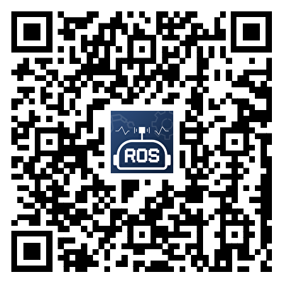

* **Start the Robot**

Turn on the switch on the Jetson Nano expansion to start the robot. For detailed guideline, please refer to the tutorial locating in [1.Getting Ready->1.4 Initial Startup]() .

### 2.1.2 Device Connection

Once the robot successfully starts up, it will create a WiFi starting with the letter **"HW"**. Connect the app to this WiFi to access and enjoy the games on the app.

There are two available connection modes, and detailed connection instructions are provided below.

* **Introduction to Connection Mode**

Here are the two network modes for the robot dog:

① AP Direct Connection Mode: The controller can create a hotspot to be connected to by a mobile phone (although it cannot access external networks).

② STA Local Area Network (LAN) Mode: The controller can actively connect to a specified hotspot/Wi-Fi (allowing access to external networks).

LAN mode and direct connection mode cannot be active simultaneously. The robot dog defaults to AP Direct Connection mode. Whether users choose AP Direct Connection or STA LAN mode, the game functionality remains consistent.

It is recommended for users to experience the robot functions under direct connection mode.

* **Direct Connection Mode Connection (MUST READ)**

The connection procedure outlined below is based on the Android system but is also applicable to the iOS system.

Start **"ROSPug"** first.
    

① Open **"WonderROS"** app, then select **"ROSPug"**.
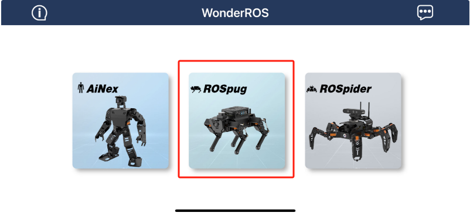

② Click-on **"+"** at the lower right corner, and choose **"Direct Connection Mode"**.

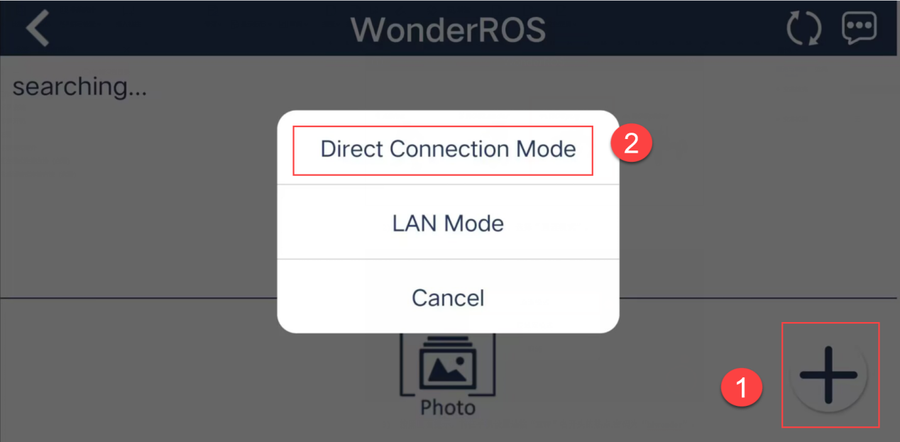

③ Join the WiFi starting with the letter **"HW"**, and the initial password is **"hiwonder"**.

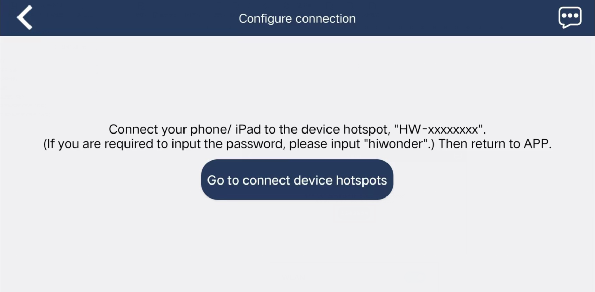

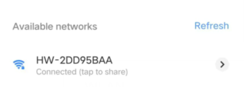

:::{Note}
Please don’t return to the app until the WiFi icon appears on the status bar, otherwise the app will fail to connect to the robot. If the app cannot search any device, please tap-on  to refresh.
:::

④ After successful network connection, go back to the app. Then the app will connect to the corresponding device automatically. When the **"ROSPug"** icon occurs, it indicates successful match.

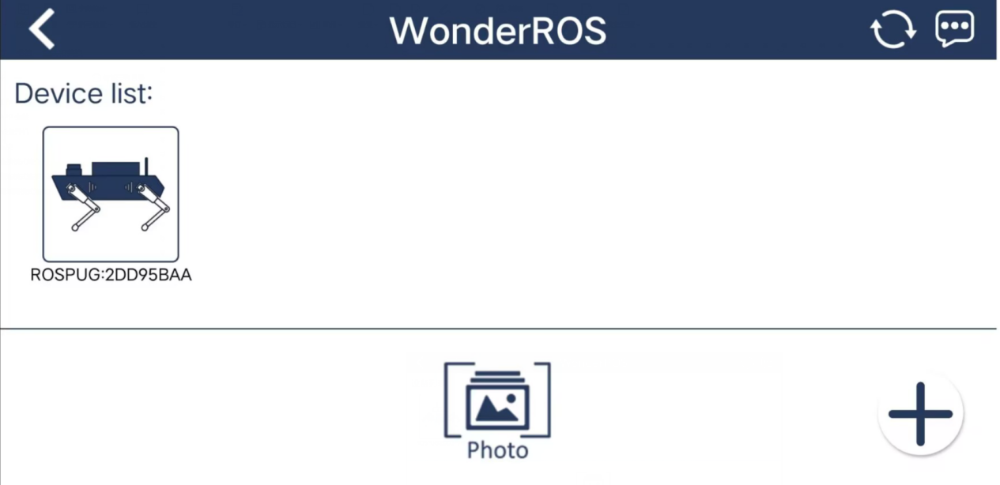

:::{Note}

If the box with the message **"Network not available. Whether to continue connecting?"** click on **"Keep Connection."**

:::

* **LAN Mode Connection Mode (Optional)**

The connection procedure outlined below is based on the Android system but is also applicable to the iOS system

① Connect your phone to random WiFi. Take **"hiwonder_5G"** as example.

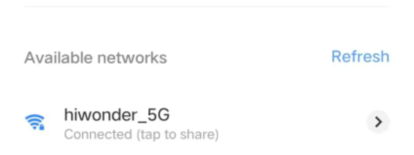 

② Open **"WonderROS"** app, then select **"ROSPug"**.

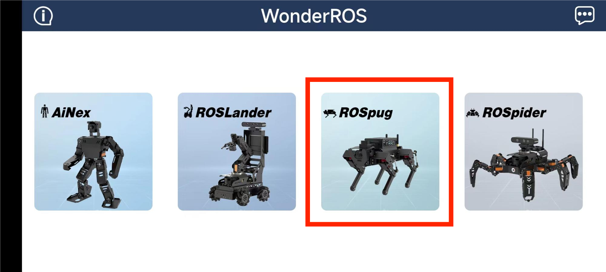 

③ Click-on **"+"** at the lower right corner, and choose **"LAN Mode"**. Follow the on-screen instructions to access your phone’s settings and connect to Wi-Fi. After connecting, return to the app.
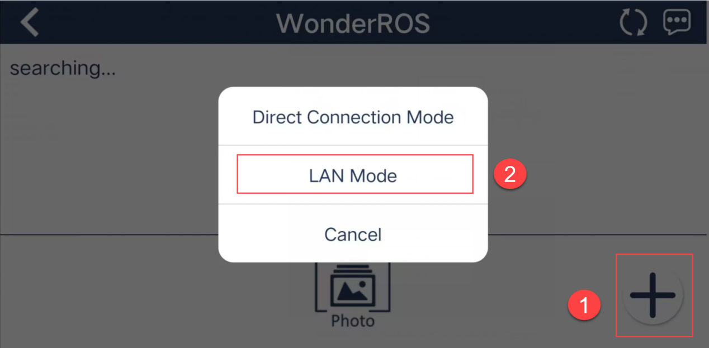

④ Enter the correct password for the WiFi network your phone is connecting to. Proceed to the next step, ensuring the password is accurate to avoid connection failure.

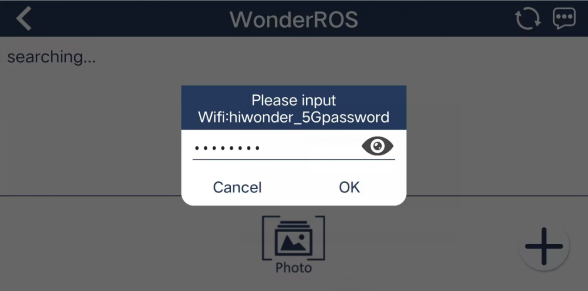

⑤ Follow the hint to connect the WiFi starting with the letter **"HW"**.

⑥ Upon successful network connection, return to the app. The app will then automatically pair with the robot. If a pop-up appears prompting you to join, tap on **"Join."**

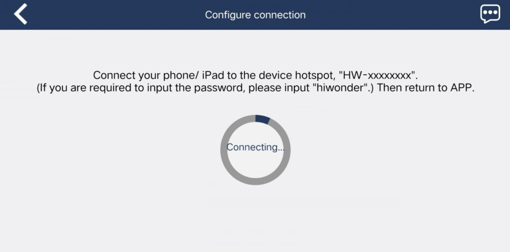

⑦ After a while, the app will search for the **"ROSPug"** device automatically.

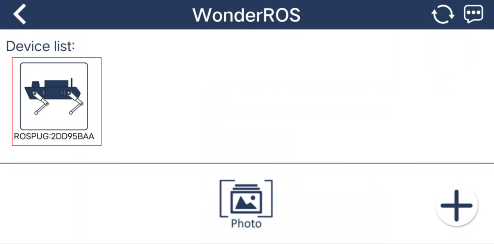

⑧ Get the IP address and ID of the robot dog by pressing **"ROSPug"** icon.

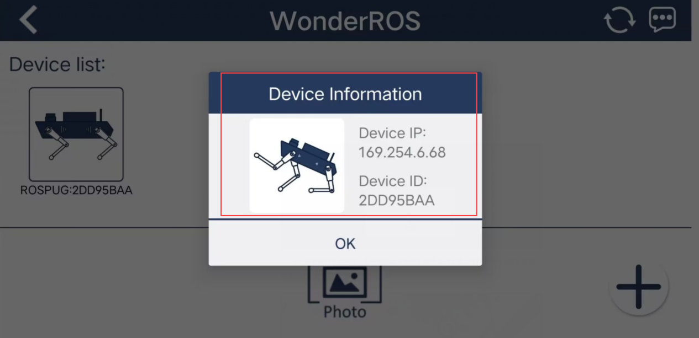

⑨ If you want to switch to **"Direct Connection Mode"**, you can use screwdriver to press the **"KEY1"** through the hole till it flickers blue.

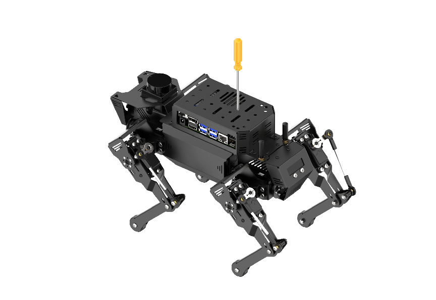

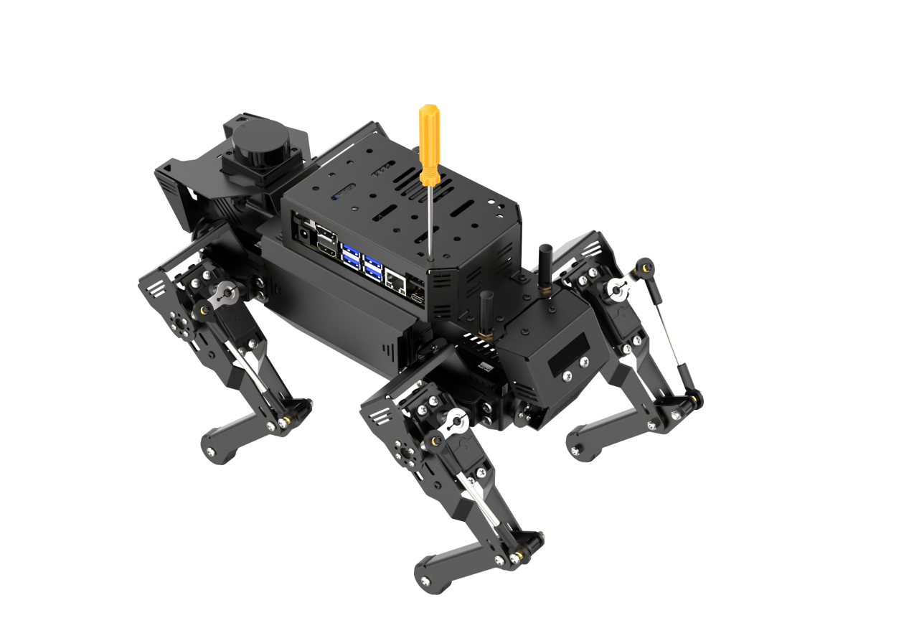

## 2.2 App Control

### 2.2.1 Preparation

Install the app according to the instructions provided in the folder [2. Quick User Experience->2.1 App Installation & Connection]() .

### 2.2.2 Start the Game

Tap-on **"ROSPug"** robot icon to enter the mode selection interface.

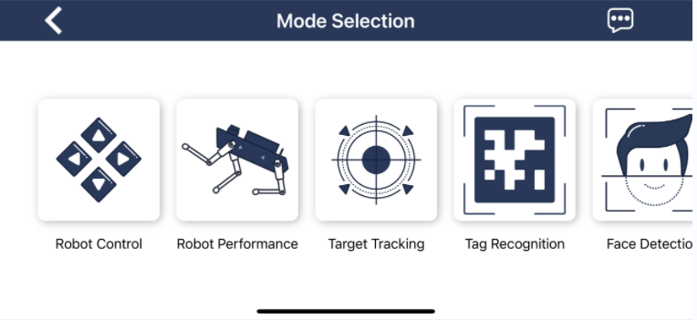

* **Robot Control**

(1) Choose **"Robot Control"** to enter the game interface, and the **"ROSPug"** will immediately return to its initial posture.

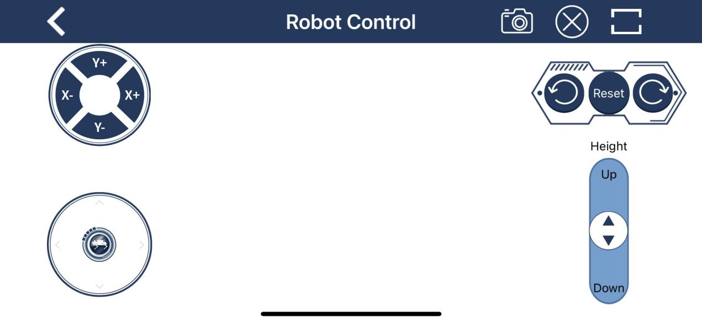

|                           **Icon**                           |                         **Function**                         |
| :----------------------------------------------------------: | :----------------------------------------------------------: |
| 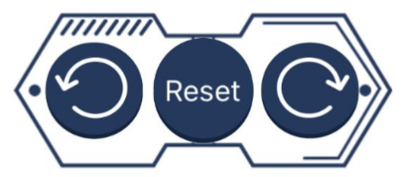 | Control the robot dog to turn and return to the initial position. |
|  | Move the virtual joystick to control the robot to go forward, backward, left and right. |
| 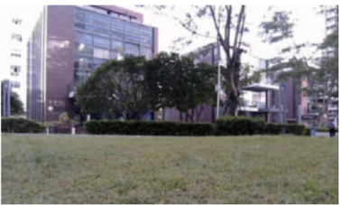 |                Display the live camera feed.                 |
| 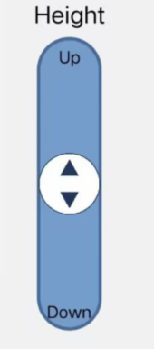 |                    Adjust robot’s height                     |
|  | Control the robot to tilt forward, backward, left and right. |

(2) If you need to return to the last interface, tap-on .

* **Robot Performance**

(1) Click-on **"Robot Performance"** icon to enter the game interface.

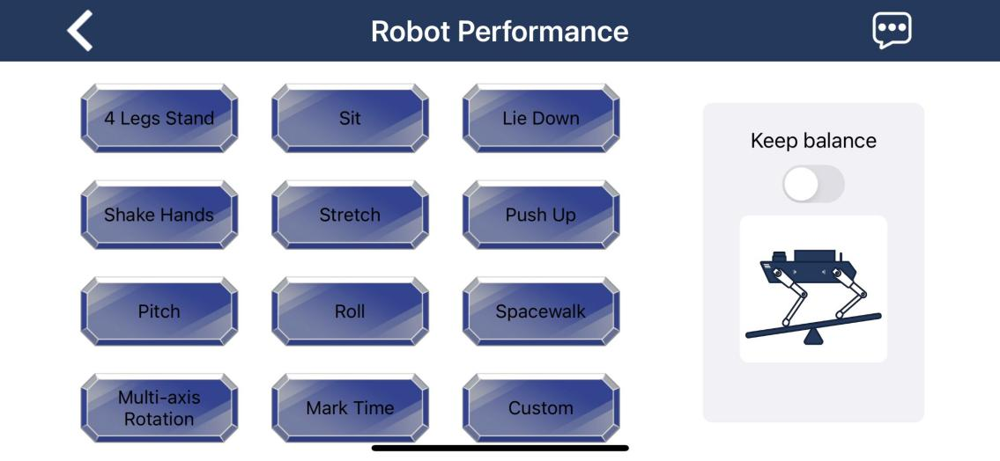

If you wish to customize the action group, please consult the tutorial in the following resource: [5. Action Editing Course->5.5 APP Custom Control]() .

|                           **Icon**                           |                   **Function Description**                   |
| :----------------------------------------------------------: | :----------------------------------------------------------: |
| 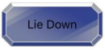 | As an example, when you press the **"Lie Down"** action group button, the robot dog will execute the pre-programmed action. |
| 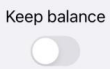 |            Initiate **"self-balancing function"**            |

* **Target Tracking**

:::{Note}
* Make sure there are no other objects in the camera's field of view with the same color as the target, as it may affect the game's performance.
* Adjust the color pickup range to an appropriate level.
:::

(1) Click-on **"Target Tracking"** icon to enter the game interface.

This interface is split into two sections:

① The left side features the controls for toggling functions and selecting colors.

② The right side shows the camera feed.

**Operation Steps & Program Outcome**

 (1) Click the **"Pick"** button, then drag the red circle over the target object in the camera feed to select its color.

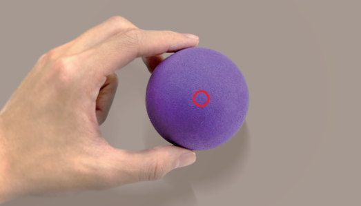

(2) Then, click-on **"OK"** button, and the selected color will be displayed on the **"Selected Color"** box.

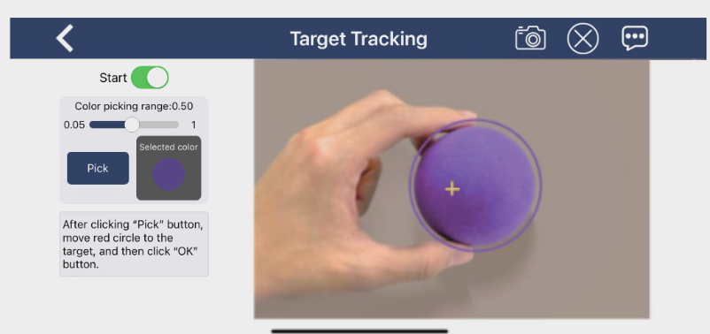

(3) Click the **"Start"** button to activate the feature. As you move the target object, the robot dog will track and follow it.

* **Tag Recognition**

:::{Note}
* Perform the process in well-lit indoor environments.
* Ensure the label remains intact; missing corners or stains may impact the recognition effectiveness.
:::

(1) The interface is divided into two parts:

① On the left side is the game control area.

② On the right side is the live camera feed.

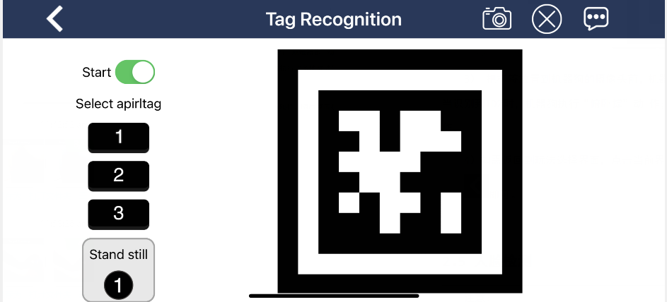

(2) Click the **"Start Recognition"** button and place each tag in front of the camera one at a time. The **"ROSPug"** quadruped robot dog will perform the corresponding action when it recognizes a tag with a specific ID:

① For **"ID1"**, the robot dog will march in place.

② For **"ID2"**, the robot dog will do push-ups.

③ For **"ID3"**, the robot dog will wiggle.

|                           **Icon**                           |     **Function**      |
| :----------------------------------------------------------: | :-------------------: |
| 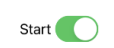 | Start/ close the game |

(3) If you want to return to the mode selection interface, tap-on the blank area to make the navigation bar appear, and tap-on .

* **Face Detection**

:::{Note}
Wearing a mask does not affect normal recognition, and the system supports simultaneous recognition of multiple faces within the camera feed.
:::

(1) The interface is divided into two parts:

① On the left side is the game control area.

② On the right side is the live camera feed.

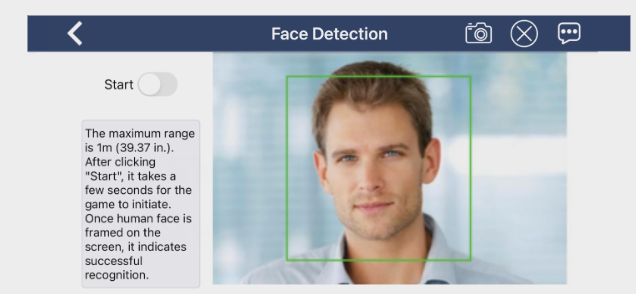

(2) Press the **"Start"** button, and the robot dog will scan for faces within one-meter radius. Upon recognizing a face, **"ROSPug"** will execute a **"waving"** action.

(3) If you want to return to the mode selection interface, tap-on the blank area to make the navigation bar appear, and tap-on .

### 2.2.8 Line Following

:::{Note}
* Before starting, lay out the line-following track with tape and place the robot dog on it.
* Adjust the color picking range to be neither too broad nor too narrow. A range that is too broad may include unintended colors, while a range that is too narrow may miss the target. Also, ensure no objects with colors similar to the target are in the camera feed.
* Once the feature is activated, ensure that no other objects with the target color are within the camera’s view to avoid interfering with the feature's performance.
:::

(1) The interface is divided into two parts:

① On the left side is the game control and color picking area.

② On the right side is the live camera feed.

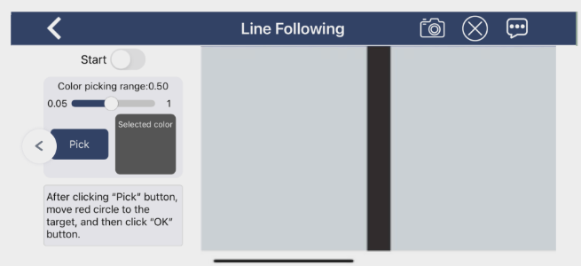

**Operation Steps & Program Outcome**

(1) Tap-on **"Pick"** button, then move the red circle on the live camera feed onto the path to capture its color.

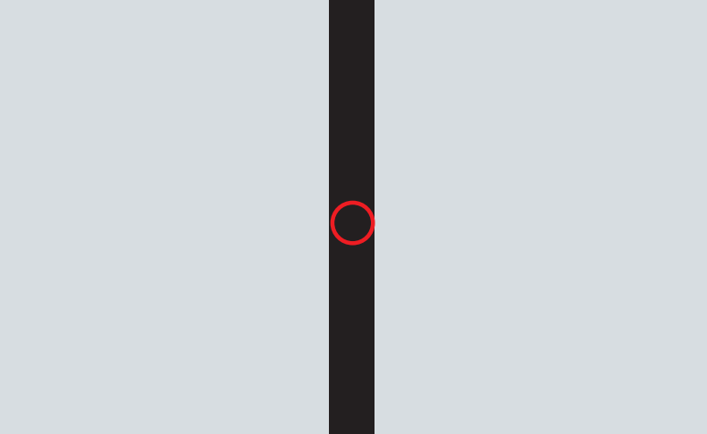

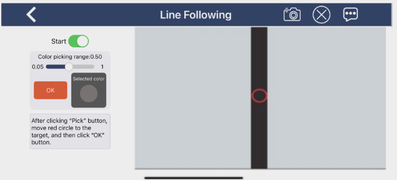

(2) Then tap **"OK"** button, and the selected color will be displayed.

(3) Click-on **"Start"** button to initiate the game, and the robot dog will go forward following the line.

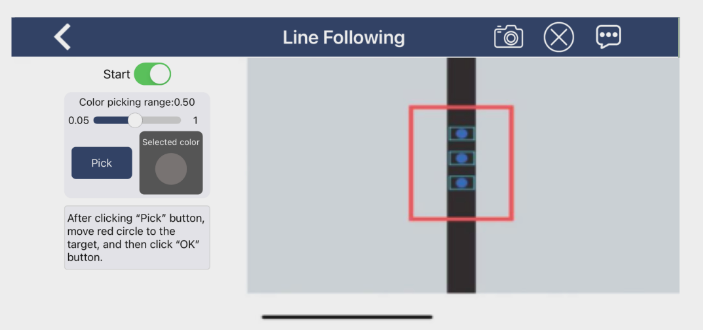

* **Gesture Control**

Click **"Gesture Control"** on the mode selection screen to open the control interface for this feature. The interface is divided into two sections:

① The left side has the feature controls.

② The right side shows the camera feed.

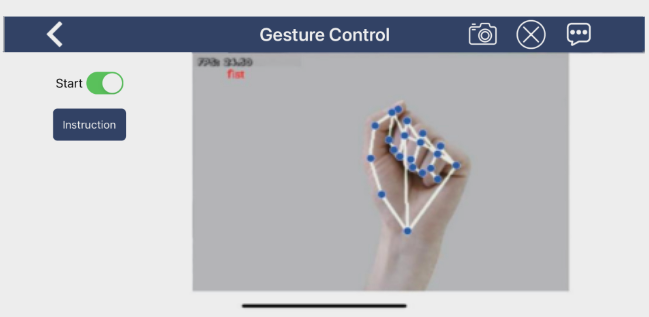

* **Lidar**

:::{Note}
* Before starting, place the robot dog on a spacious platform to ensure it has ample room to move.

* In **"Avoid Obstacle"** and **"Lidar Following"** modes, the robot dog detects obstacles within a 90° sector directly in front of it.
  :::

(1) Introduction to Game Interface

①  Click **"Lidar"** on the mode selection screen to open the control interface for this feature.

The **"Lidar"** feature includes three modes: **"Avoid Obstacle"**, **"Lidar Following"**, and **"Lidar Guarding"**. The interface is divided into two sections:

The left side has controls for switching between modes.

The right side shows the camera feed.

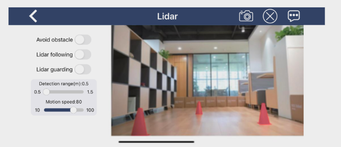

(2) Operation Steps & Program Outcome

① Avoid Obstacle

The robot dog moves forward continuously. When it detects an obstacle, it automatically changes direction to avoid it.

② Lidar Following

The robot dog adjusts its position to keep a consistent distance from detected obstacles.

③ Lidar Guarding

The robot dog adjusts its orientation to face any detected obstacles directly.

## 2.3 Wireless Handle Control

### 2.3.1 Preparation

:::{Note}
Please ensure that the **"handle receiver"** is inserted before turning on the **"wireless handle"**. If it is already plugged in, disregard this step. Also, when inserting the battery, pay attention to distinguish between the **"positive"** and **"negative terminals"**.
:::

(1) Insert the **"handle receiver"** into any USB interface on **"ROSPug"**. Generally, the **"handle receiver"** has already been inserted to the robot before leaving the factory.

(2) Please bring your own two **"AAA dry batteries"**. And insert them into the **"battery slot"**.

### 2.3.2 Device Connection

(1) Start **"ROSPug"**. After the robot starts successfully, turn on the **"handle"**. At this time, two **"LED"** lights will flash simultaneously.

(2) Please wait for a while. Then the robot will pair with the **"handle"** automatically. After successful pairing, the green light will keep lighting up and red **"LED"** light goes out.

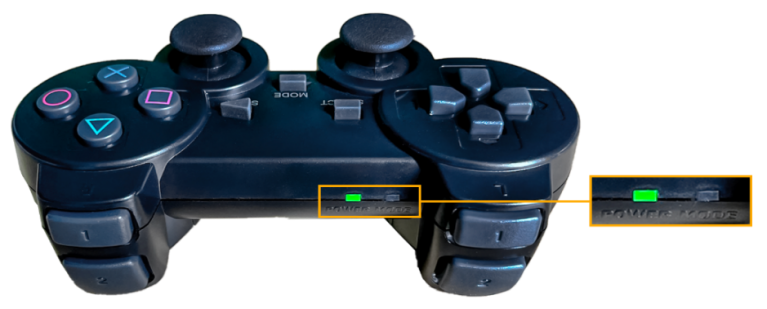

:::{Note}
If the **"handle"** doesn’t connect to the **"robot"** within 30s or there is no operation on the **"handle"** within 5 minutes after turning on, it will enter sleep mode. And you can press **"START"** to activate the **"handle"**.
:::

### 2.3.3 Button Function

Below are the functions of the buttons and joysticks, presented from the perspective of **"ROSPug"**.

:::{Note}
A gentle push on the **"joystick"** in any direction can achieve slow-motion movement.
:::

|    **Button**    |                         **Function**                         |
| :--------------: | :----------------------------------------------------------: |
|      START       |                   Restore to Initial Pose                    |
|        ↑        |                         Move Forward                         |
|       ↓       |                        Move Backward                         |
|       ←       |                          Turn Left                           |
|       →        |                          Turn Right                          |
|       △        |                      Raise Body Height                       |
|       ×        |                      Lower Body Height                       |
|       ◻        |                          Move Left                           |
|       ○        |                          Move Right                          |
|       L1       |                       Tilt Body Upward                       |
|       L2       |                      Tilt Body Downward                      |
|       R1      |                       Twist Body Left                        |
|       R2       |                       Twist Body Right                       |
| Left joystick  | Control the robot to go forward, backward, translate left and right |
| Right joystick |                     Turn left and right                      |