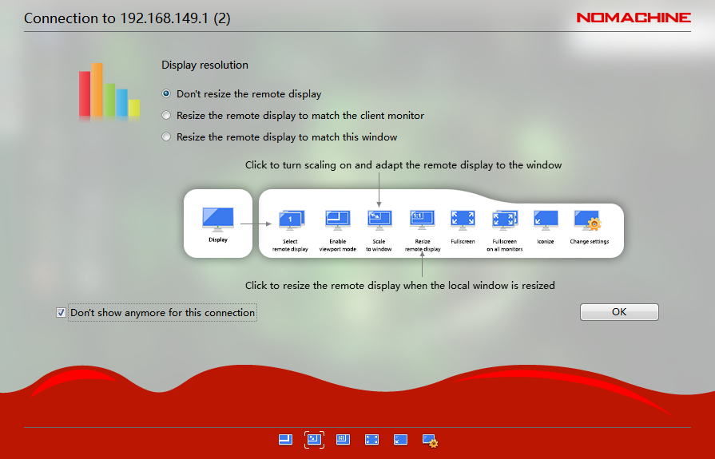

# 3. Remote Connection Tool Installation & Connection

:::{Note}
Before running the robot game, checking, and revising the code, you need to install and connect the remote connection tool.
:::

## 3.1 Preparation

### 3.1.1 Hardware Preparation

Get ready with a laptop; if you're using a desktop, make sure to have a wireless network card that supports the 5G frequency band, or you may face issues locating the ROSPug hotspot.

### 3.1.2 NoMachine Installation

(1) Open the software pack [nomachine_7.1.3_1.exe](Appendix.md) in the same folder.

(2) Click **"Next"** button.


(3) Set the language as **"English"** and tick **"I accept the agreement"**. Then move to **"Next"** step.


(4) Remain the default storage path for NoMachine, then click **"Next"**.


(5) Please wait until the installation completes. Click **"Finish"** button.


(6) Click **"Yes"** to restart the computer. Please don't skip this step!


## 3.2 Access under AP Direct Connection/ STA LAN Mode

(1) ROSPug is default to AP direct connection mode. After it boots up successfully, it will create a WiFi starting with **'HW'**. Connect your computer to this WiFi.


(2) Open NoMachine. Input **"192.168.149.1"** in the search bar, then click-on **"Configure connection to new host 192.168.149.1"**.


(3) Rename it to **'ROSPug'** and leave the remaining settings unchanged. Then, click **'Connect'**.


(4) Use the username **"hiwonder"** and password **"hiwonder"** to log in. Remember to select **"Save this password in the connection file"** before clicking the **"Login"** button to access the Jetson Nano desktop.





:::{Note}
If the robot is configured to STA LAN mode, the instructions are the same as before. However, in step 2, 3, and 4, you need to use the corresponding IP address, username, and password for the STA LAN mode configuration.
:::

## 3.3 Method To Fix Abnormal Resolution

When using the remote tool NoMachine to connect to the ROSPug, if you experience abnormal screen resolution (as shown in the figure below), you can address this issue by following the methods outlined in 3.3.1 or 3.3.2 (beginners are advised to use the approach detailed in 3.3.1).


### 3.3.1 Change Resolution On The Desktop

(1) Double-click **"1920\*1080"** icon to change the resolution.


(2) After revision, you can directly close the window.


(3) Lastly, restart NoMachine.

### 3.3.2 Change Resolution Using Command

(1) Double-click the terminal icon to open the command line terminal.

(2) Type `rm -rf ~/.bash_history` and press Enter to delete the command history file.
```
rm -rf ~/.bash_history
```

(3) Type `history -c` and press Enter to clear the command history. If you see the message **'History file deleted.'**, the process was successful.
```
history -c
```

(4) Type `xrandr --fb 1920x1080` and press Enter to adjust the screen resolution.
```
xrandr --fb 1920x1080
```

(5) Once these changes are made, click the close button in the upper-right corner to close the current window.

(6) Reopen NoMachine to apply the changes.