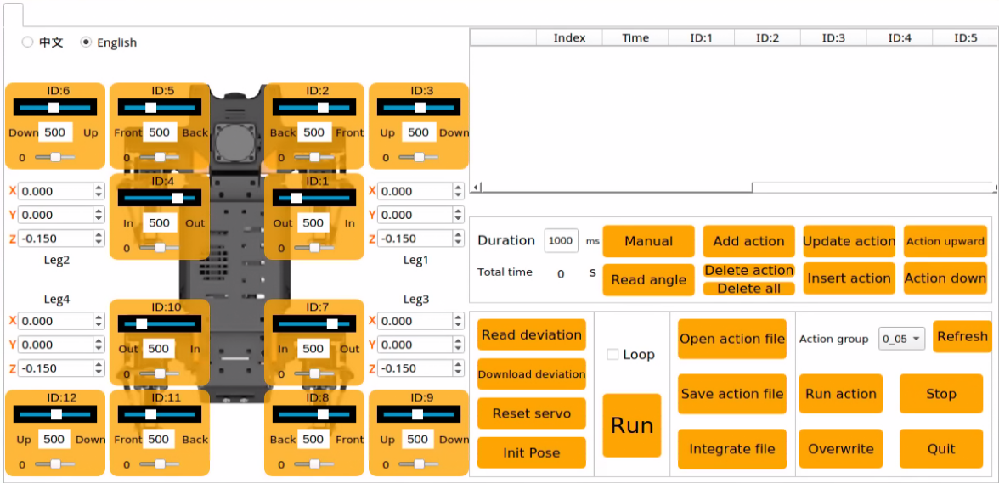
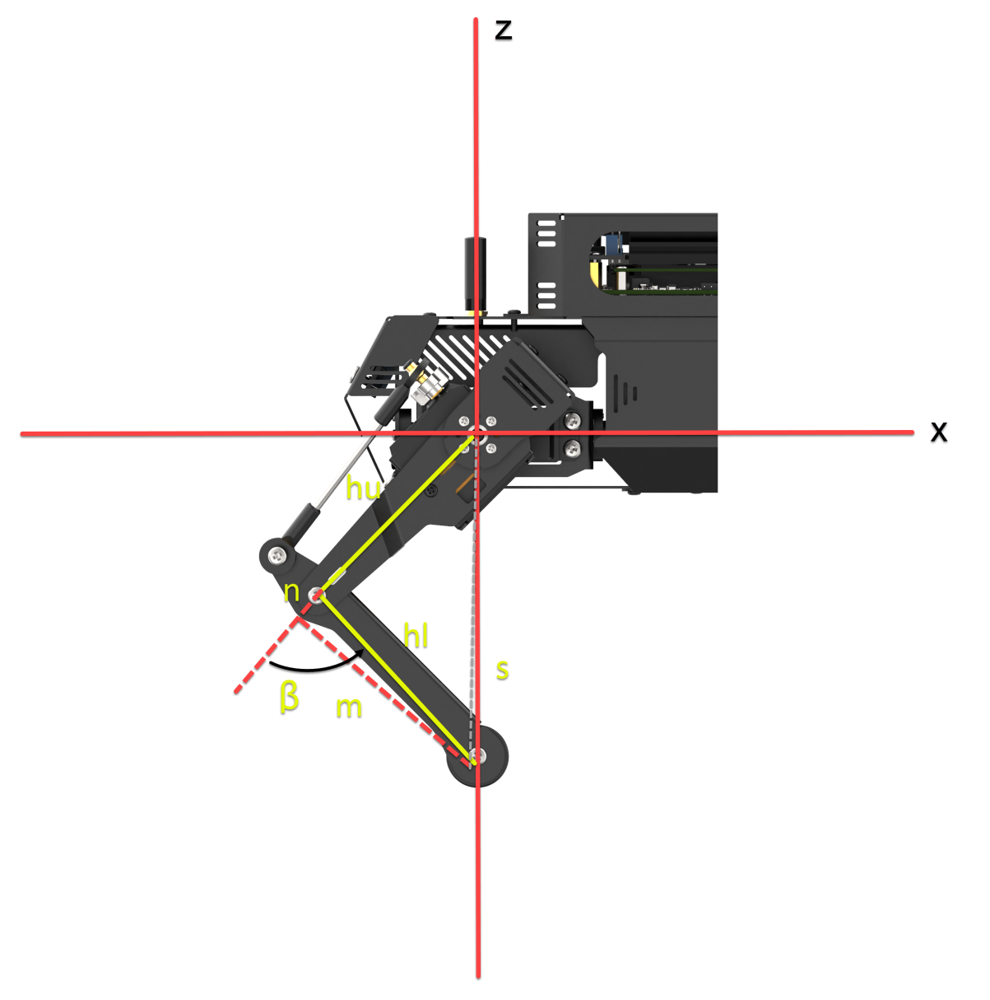
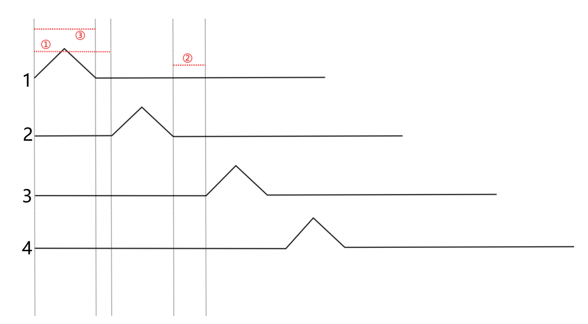
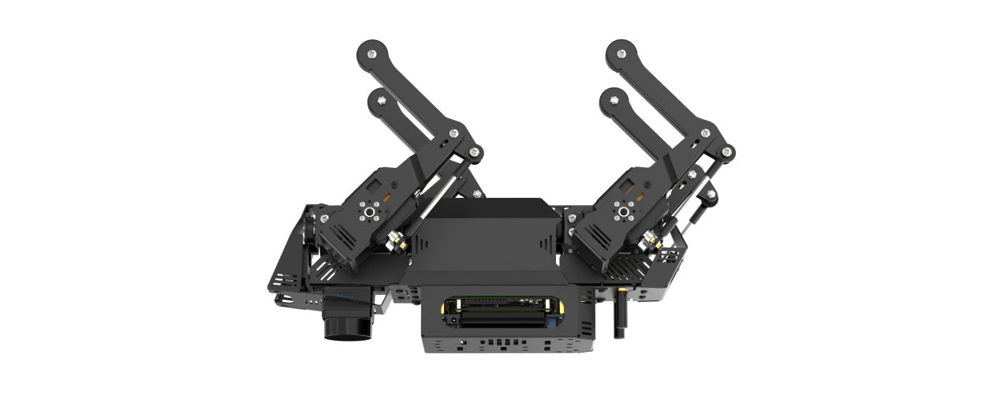
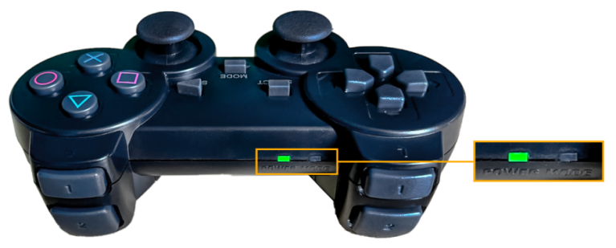

# 4. Motion Control Course

## 4.1 Coordinates System Establishing

### 4.1.1 Coordinate System Introduction

Regarding the design of the degrees of freedom for each leg of a quadruped robot, three actuators are distributed at the upper joints, while for the lower joint, driving force is transmitted through linkage or ball screw, which is beneficial for minimizing the inertia of lower legs and enhancing the dynamics motion performance.

When controlling the motion of ROSPug robot, the inverse kinematics can be employed by inputting the coordinates of the footholds for four legs. This allows the calculation of the rotational angles for all servos, thereby achieving the goal of controlling the walking motion of the robot dog.

Therefore, the coordinates system of ROSPug should be established in the beginning. When establishing the coordinates, take the center of four upper joints as the origin (0,0,0) and set the coordinates for the footholds of the four legs. During setting the coordinates, only the values for x-axis, y-axis and z-axis of the foothold coordinates need to be specified, as shown in the figure below.


### 4.1.2 Coordinate Instructions

For clarity, we'll use the robot dog's standing posture as an example. The coordinates for this standing position are shown in the box below:



In the image, Leg1, Leg2, Leg3, and Leg4 represent the positions of the robot dog's four legs. From the robot dog's perspective, the corresponding positions are shown in the table below:

| Leg1 | Leg2 | Leg3 | Leg4 |
|:---:|:---:|:---:|:---:|
| front right | front left | behind right | behind left |

The coordinates are in meters. For the ROSPug robot dog in its standing posture, the leg coordinates are (0.010, 0, -0.130). The Z-axis value of -0.130 means the foot contact point is 0.13 meters below the origin.

The X-axis value of 0.010 indicates the foot contact point is 0.010 meters from the origin along the X-axis.

The Y-axis coordinate is 0 by default. For lateral movement, such as moving right by 0.02 meters, the Y-axis coordinate should be -0.02 for the left leg and 0.02 for the right leg, and vice versa.

## 4.2 Inverse Kinematics Analysis

### 4.2.1 Inverse Kinematics Introduction

Inverse kinematics matters in ROSPug's motion planning and control, because whether the inverse kinematics solution is fast and accurate directly affects the precision of ROSPug's path planning and control. Therefore, fast and accurate inverse kinematics solution is essential.

For ROSPug, inverse kinematics involves solving the rotational angle of the upper joint and lower joint according to the foot coordinate. The joint distribution is as shown in the picture.


The rotational angle of the upper joint is controlled by 8 servos on ROSPug, as shown in the below picture.


The rotational angle of the lower joint is controlled by `ID3`, `ID6`, `ID9` and `ID12` servos on upper joints. Linkage mechanism is adopted in the control.


Per the inverse kinematics analysis, the solution procedure is divided into two steps:

(1) Calculate the position to which the upper and lower joints move based on the foot coordinates so as to solve the rotation angle of the corresponding servo.

(2) According to the rotation angle of servo, calculate the corresponding value, and then directly control the servo to rotate.

### 4.2.2 Project Analysis

* **Storage Path of Source Code**

For better understanding, we will combine program control and inverse kinematics to analyze.

The source code of this program is stored in [pug/src/pug_tutorial/scripts/intermediate_control_course/demo01_kinematics.py](../_static/source_code/intermediate_control_course.zip).


* **Operation Steps**

:::{Note}
The entered command should be case sensitive, and **Tab** key can be used to complement key words.
:::

(1) Turn on ROSPug, and access the robot system desktop using NoMachine.

(2) Click  to open the command line terminal.

(3) Enter command and press Enter to initiate the game.

```
python3 pug/src/pug_tutorial/scripts/intermediate_control_course/demo01_kinematics.py
```

(4) If want to close this game, press **Ctrl+C**. If it fails to close, please try again.

* **Program Outcome**

Once the feature is activated, all servos on the ROSPug robot dog will adjust to their specified angles according to the set coordinates. The terminal will then show the positions of each servo and the coordinates of the robot dog's foot contact points.


* **Program Analysis**

The source code of this program is stored in: [/home/pug/src/pug_tutorial/scripts/intermediate_control_course/demo01_kinematics.py](../_static/source_code/intermediate_control_course.zip)

{lineno-start=12}

```python
                            # FR     FL     BR     BL
foot_locations = np.array([[-0.01, -0.01, -0.01, -0.01],  # X
                           [ 0.0,   0.0,   0.0,   0.0],   # Y
                           [-0.1,  -0.1,  -0.1,  -0.1]    # Z
                          ])
```
* **Set coordinate**

With ROSPug as the first-person perspective, FR, FL, BR and BL respectively represent its 4 legs.

| FR | FL | BR | BL |
|:---:|:---:|:---:|:---:|
| Front right | Front left | Behind right | Behind left |

:::{Note}
* When setting coordinates, the range for the X-axis is '-0.15 to +0.15,' and the range for the Z-axis is '-0.15 to -0.05.'
:::

When the coordinate of X axis is set as 0, the line connecting foothold and the origin is perpendicular to the ground. If the coordinate of X axis is positive, the foothold is at the front.


The larger the coordinate of Z axis, the higher its feet lift, which means that the perpendicular distance between foothold and the origin is shorter.

* **Acquire servo angle**

Calculate the servo angle through inverse kinematics.

{lineno-start=24}

```python
res = set_leg_ik(foot_locations.reshape(12).tolist())
```
* **Control servo to rotate**

Calculate the pulse width of the servo according to the angle value so as to directly control servo rotation.

{lineno-start=24}

```python
res = set_leg_ik(foot_locations.reshape(12).tolist())
if res.success:
    joint_angle = res.joint_angle
    print('ik input:\n', foot_locations)
    print('ik output:\n', joint_angle)
    set_angle_pub.publish(joint_angle, 0.5)
```

### 4.2.3 Inverse Kinematics Principles of a Quadruped Robot Dog (Using a Single Leg as an Example)

Before controlling the movement of a quadruped robot dog, it is essential to first understand the movement relationship of a single leg. In simple terms, the servos act as the driving mechanism, consisting of a hip joint servo, a thigh servo, and a calf servo.

During the calculation process, vector operations are performed using the rotation matrix R to find the 3D coordinates (x, y, z) of the end-effector relative to the hip joint center. The relationship between these coordinates and the joint angles is then used to calculate the rotation angles for the three servos. The process flowchart is shown below:


* **Conversion between Euler Angles and Rotation Matrix R**

Euler Angles Definition: In the classical Cartesian coordinate system, which consists of the x, y, and z axes, the angles of rotation around each of these axes are collectively known as Euler angles.

| Parameter | Description | Meaning |
|:---:|:---:|:---:|
| Roll | Angle of Rotation About the X-axis | Roll angle |
| Pitch | Angle of Rotation About the Y-axis | Pitch angle |
| Yaw | Angle of Rotation About the Z-axis | Yaw angle |

The base coordinate system for the two left legs of the ROSpug robot dog uses a right-handed coordinate system, while the base coordinate system for the two right legs uses a left-handed coordinate system. The rotation transformation matrices for left-handed and right-handed coordinate systems are different.

For illustration, using the left-handed coordinate system as an example, the basic rotation matrix in this system can be calculated from the given Euler angles (p, h, b). For the right-handed coordinate system, the Euler angles (-p, -h, -b) should be used.

In the left-handed system, the rotation matrix Rx for a rotation of p°around the x-axis is:

``` {math}
R_{x}\  = \ \begin{bmatrix}
1 & 0 & 0 \\
0 & \cos p & \sin p \\
0 & - \sin p & \cos p
\end{bmatrix}
```

In the left-handed coordinate system, the rotation matrix Ry for a rotation of h°around the y-axis is:

``` {math}
R_{y}\  = \ \begin{bmatrix}
\cos h & 0 & - \sin h \\
0 & 1 & 0 \\
\sin h & 0 & \cos h
\end{bmatrix}
```

In the left-handed coordinate system, the rotation matrix Rz for a rotation of b°around the z-axis is:

``` {math}
R_{z}\  = \ \begin{bmatrix}
\cos b & \sin b & 0 \\
 - \sin b & \cos b & 0 \\
0 & 0 & 1[conf.py](..%2Fconf.py)
\end{bmatrix}
```

The combined rotation matrix is defined as the matrix obtained by combining multiple rotations. For Euler angles in the Z-X-Y sequence, the corresponding combined matrix is R = Rz \* Rx \* Ry. The order of XYZ determines the rotation matrix definition; therefore, when the Euler angle sequence changes, the rotation matrix formula must be adjusted accordingly.

The rotation matrix corresponding to Euler angles (p, h, b) in the left-handed coordinate system (Z-X-Y sequence) is:

``` {math}
R = Rz \ast Rx \ast Ry = \begin{bmatrix}
\cos b\cos h + \sin b\sin p\sin h & \sin b\cos p & - \cos b\sin h + \sin b\sin p\cos h \\
 - \sin b\cos h + \cos b\sin p\sin h & \cos b\cos p & \sin b\sin h + \cos b\sin p\cos h \\
\cos p\sin h & - \sin p & \cos p\cos h
\end{bmatrix}
```

* **Calculation of the End-Effector Position Vector for a Single Leg**

Identify the vectors necessary for calculating the end-effector position of the left front leg$`\overset{\rightarrow}{A_{1}B_{1}}`$:


``` {math}
\overset{\rightarrow}{OB_{1}} + \overset{\rightarrow}{B_{1}A_{1}} = \overset{\rightarrow}{OO^{'}} + \overset{\rightarrow}{O'A_{1}}
```

``` {math}
\overset{\rightarrow}{O'A_{1}} = R \ast {\overset{\rightarrow}{O'A_{1}}}_{身体}
```

``` {math}
\overset{\rightarrow}{A_{1}B_{1}} = - \overset{\rightarrow}{OO^{'}} - R \ast {\overset{\rightarrow}{O'A_{1}}}_{身体} + \overset{\rightarrow}{O'B_{1}}
```

``` {math}
\overset{\rightarrow}{A_{n}B_{n}} = - \overset{\rightarrow}{OO^{'}} - R \ast {\overset{\rightarrow}{O'A_{n}}}_{身体} + \overset{\rightarrow}{O'B_{n}}(n\  = \ 1,2,3,4)
```

In the above diagram, since we are studying the standing posture control of the quadruped robot dog and O' is given, the vectors OB1 and OO' are known. In the equations from the diagram, vector O'A1 will change according to the rotation matrix R. Therefore, it needs to be multiplied by the rotation matrix before substitution into the calculations. Finally, we obtain the foot contact vector A1B1 relative to the center of the hip joint.

* **Calculation of the Rotation Angles for Single Leg Joint Servos**

Once the coordinates of the foot contact point relative to the hip joint servo center are known, the rotation angles for each servo can be calculated using the inverse kinematics for the single leg.


* **Calculate the Rotation Angle γ for the Shoulder**


In the yoz plane, given y, z, h (shoulder length), determine the intermediate variables: d, l, γ1, γ2.

Finally, calculate the rotation angle γ.

Solution process:

d=$`\sqrt{y^{2} + z^{2}}`$

l=$`\sqrt{d^{2} - h^{2}}`$

γ1=$`{- arctan}\frac{h}{l}`$

γ2=$`{- arctan}\frac{y}{z}`$

γ=γ2−γ1

* **Calculate the Rotation Angle β for the Calf**



In the xoz plane, given l, x, hl (thigh length), and hu (calf length), determine the intermediate variable n. Then, calculate the final rotation angle β. The calculation process is as follows:

s=$`\sqrt{l^{2} + x^{2}}`$

(hu+n)2+m2=s2 (1)

n2+m2=hl2 （2）

Subtract Equation (2) from Equation (1) to obtain:

\[(hu+n)2+m2\]-(n2+m2)=s2-hl2

n=$`\frac{s^{2} - {hl}^{2} - {hu}^{2}}{2hu}`$

β=$`{- arccos}\frac{n}{hl}`$

* **Calculate the rotation angle α for the thigh**


In the xoz plane, given l, x, hu (calf length), n, and s, determine the intermediate variables α1 and α2. Then, calculate the final rotation angle α. The calculation process is as follows:

α1=$`{- arctan}\frac{x}{l}`$

α2=$`{- arccos}\frac{hu + n}{s}`$

α=α1+α2

Using the calculations provided, once you have the coordinates of the foot contact point relative to the hip joint servo center, you can determine the rotation angles for each servo using the inverse kinematics for a single leg. However, for the quadruped robot dog, the coordinate systems differ between the legs: the right legs use a left-handed coordinate system, while the left legs use a right-handed coordinate system.

## 4.3 Gait Parameter Introduction

### 4.3.1 Gait Definition

Robot gait refers to the patterns and sequences of movement of a robot's legs or other locomotion components. It describes how the robot moves, with common gait types including Trot, Walk, Amble, and Pace.

The table below lists some commonly used terms in gait descriptions:

| Term | Description |
|:---:|:---:|
| Phase Difference | The difference in movement timing between different legs, either leading or lagging. |
| Swing Phase | The phase where the leg is lifted and is in the air. |
| Support Phase | The phase where the leg is in contact with the ground. |
| Cycle | The complete process from one heel strike to the next heel strike on the same side during locomotion. |
| Gait Frequency | The number of gait cycles completed per unit of time. |
| Stride Length | The distance traveled by the foot from lift-off to landing within one cycle. |
| Step Length | The distance traveled by the body within one cycle. |
| Duty Cycle | The ratio of time a single leg spends in the support phase to the total gait cycle. |

### 4.3.2 Types of Gait

Classified by balance mode, ROSPug robot dog's gaits can be divided into three types: static gait, dynamic gait, and quasi-static gait. Specifically, the static gait employed by ROSPug is the Walk gait, the dynamic gait is the Trot gait, and the quasi-static gait is the Amble gait.

The ROASug robot dog uses the following gaits:

Static Gait: Walk

Dynamic Gait: Trot

Quasi-static Gait: Amble


### 4.3.3 Leg Position

ROSPug's four legs are numbered as below:


### 4.3.4 Introduction to Trot Gait

The Trot gait is a dynamic gait where diagonally opposite legs move in pairs. Specifically, Legs 1 and 2 move together, and Legs 3 and 4 move together. Ideally, each pair of diagonal legs lifts and touches the ground simultaneously. In the Trot gait, the sequence for the robot dog's legs is 1 2 → 3 4 → 1 2. The control mechanism is illustrated in the diagram below:


(1) indicates the time when all four legs are on the ground.

(2) represents the time when a single leg is off the ground.

### 4.3.5 Introduction to Walk Gait



Walk gait is a static walking pattern where, throughout the movement, three legs are always in the support phase, and at most, one leg is in the swing phase. In the Walk gait for the robot dog, the sequential rotation of the four legs follows the order 1 → 2 → 3 → 4 → 1, as depicted in the diagram below:

In the diagram, the raised section represents leg lifting, ① indicates the time interval between front and rear legs, ② represents the duration when all four legs are in contact with the ground, and ③ represents the time when a single leg is lifted off the ground.

### 4.3.6 Introduction to Amble Gait

Amble gait is a quasi-static walking pattern, considered as an accelerated version of the Walk gait. Its characteristic feature is that during movement, at least two legs are in the support phase, with a maximum of two legs in the swing phase. In the Amble gait for the robot dog, the sequential rotation of the four legs follows the order 1 → 2 → 3 → 4 → 1, as illustrated in the diagram below:


In the diagram, the raised section represents leg lifting, ① indicates the time interval between front and rear legs, ② represents the duration when all four legs are in contact with the ground, and ③ represents the time when a single leg is lifted off the ground.

### 4.3.7 Parameters Within Program

The parameters for the robot dog's movement consist of two main parts: motion parameters and gait parameters. Gait parameters include the total time in contact with the ground, the total time lifted off the ground, and the time interval between front and rear legs. Motion parameters encompass forward speed and turning speed.

When configuring, it is necessary to invoke the `puppy_demo.py` file, with the file path as follows: [/home/pug/src/pug_driver/pug_control/scripts/pug_node.py](../_static/source_code/pug_node.zip).


Here is a detailed explanation of the parameters:

| Parameter | Explanation |
|:---:|:---:|
| overlap_time | The duration of all four knee joint endpoints in contact with the ground, measured in seconds. |
| swing_time | The duration of both knee joint endpoints lifted off the ground, measured in seconds. |
| clearance_time | Time interval between front and rear legs, measured in seconds. |
| z_clearance | When in motion, the distance in centimeters that the knee joint lifts the endpoint above the ground. |

<p id="anchor_4_4"></p>

## 4.4 Trot Gait Analysis and Implementation

### 4.4.1 Trot Gait Description

The Trot gait is a medium to low-speed dynamic gait characterized by the legs moving in a diagonal and cross pattern, simultaneously lifting and landing. This gait has a broad range of motion speeds, offering a balance between stability and speed, making it the most commonly used quadrupedal gait.

When the ROSPug is in Trot gait, the feet on the diagonal line touch the ground simultaneously. Using the diagram below as an example, let's analyze and explain the Trot gait:


As shown in figure (a), legs 1 and 2 of the ROSPug lift and swing forward, while legs 3 and 4 support the body, ensuring the center of gravity is at the intersection of the diagonals. At this point, legs 1 and 2 are in the swing phase, while legs 3 and 4 are in the support phase.

As shown in figure (b), all four legs touch the ground simultaneously, with legs 1, 2, 3, and 4 all in the support phase.

As shown in figure (c), legs 3 and 4 lift and swing forward, while legs 1 and 2 support the body, ensuring the center of gravity is at the intersection of the diagonals. At this point, legs 3 and 4 are in the swing phase, while legs 1 and 2 are in the support phase.

As shown in figure (d), all four legs touch the ground simultaneously, with legs 1, 2, 3, and 4 all in the support phase.

When these four sets of actions (a), (b), (c), and (d) are completed, the ROSPug has completed one full cycle of movement.

### 4.4.2 Operation Steps

:::{Note}
The input command should be case sensitive, and users can **Tab** to complement keywords.
:::

(1) Start the robot, and access the robot system desktop using NoMachine.

(2) Double-click  to open the command-line terminal.

(3) Execute the command to start the game.

```
python3 pug/src/pug_tutorial/scripts/base_control_course/demo01_trot_gait.py
```

(4) If you need to terminate the game, use short-cut **Ctrl+C**.

### 4.4.3 Program Outcome

After activating the game, the ROSPug will move in a trot gait, with diagonally paired legs in coordinated motion, lifting or landing simultaneously. The phase relationship is illustrated in the diagram below:


### 4.4.4 Parameters Analysis
The source code of this program is located in: [/home/pug/src/pug_tutorial/scripts/base_control_course/demo01_trot_gait.py](../_static/source_code/base_control_course.zip)

{lineno-start=1}

```python
#!/usr/bin/env python3
# coding=utf8
import time
import rospy
from pug_control.msg import Velocity, Pose, Gait

rospy.init_node('trot_gait', log_level=rospy.INFO)

pose_pub = rospy.Publisher('/pug_control/pose', Pose, queue_size=1)
gait_pub = rospy.Publisher('/pug_control/gait', Gait, queue_size=1)
velocity_pub = rospy.Publisher('/pug_control/velocity_move', Velocity, queue_size=1)

time.sleep(0.1)
#roll pitch yaw height x_shift stance_x stance_y run_time
pose_pub.publish(0, 0, 0, -0.13, 0.01, 0, 0, 0.5)
time.sleep(0.5)

gait_pub.publish(0.2, 0.18, 0.02, 0.04)

velocity_pub.publish(0.1, 0, 0, False)
time.sleep(2)

velocity_pub.publish(0, 0, 0, True)
```
Publish Trot gait parameters using the `gait_pub.publish()` function.

{lineno-start=18}

```python
gait_pub.publish(0.2, 0.18, 0.02, 0.04)
```
The parameters in parentheses are defined as follows:

(1) `overlap_time`: The time when all four legs are on the ground, measured in seconds.

(2) `swing_time`: The time when a single leg is off the ground, measured in seconds.

(3) `clearance_time`: The interval between the front and rear crossing leg phases, measured in seconds.

(4) `z_clearance`: The distance the robot dog's toe should be raised during walking, measured in centimeters.

For the Trot gait, please note that when setting up, **clearance_time** must be set to 0. Furthermore, adhere to the following conditions for the Trot gait:

`clearance_time = 0`

`overlap_time > 0`

`swing_time > 0`

If a more detailed observation is desired, you can extend **swing_time** and **overlap_time**, but exercise caution. Increasing these times will slow down the frequency and may affect the stability of walking.

## 4.5 Amble Gait Analysis and Implementation

### 4.5.1 Amble Gait

The Amble gait is a static gait and can be considered as an accelerated version of the Walk gait. During motion, at least two legs are in the support phase, with a maximum of two legs in the swing phase.

Since the implementation process of the Amble gait is similar to that of the Walk gait, the sequence of swinging legs remains: Right Front -> Left Hind -> Left Front -> Right Hind, corresponding to the numbered sequence in the diagram: 1 -> 2 -> 3 -> 4.


The key distinction from Walk is that in the Walk gait, the second leg is lifted after the first leg is placed down. In contrast, the Amble gait begins lifting the second leg while the first leg is still in the air but not yet placed down. For example, after lifting the right front leg, the left rear leg begins to lift before the right front leg is placed down.

### 4.5.2 Operation Steps

:::{Note}
The input command should be case sensitive, and users can **Tab** to complement keywords.
:::

(1) Start the robot, and access the robot system desktop using NoMachine.

(2) Double-click  to open the command-line terminal.

(3) Execute the command below to start the game.

```
python3 pug/src/pug_tutorial/scripts/base_control_course/demo02_amble_gait.py
```

(4) If you need to terminate the game, use short-cut **Ctrl+C**.

### 4.5.3 Program Outcome

The ROSPug moves in an Amble gait, where at least two legs are in the support phase, and a maximum of two legs are in the swing phase. The Amble gait can be likened to an accelerated version of the Walk gait. The phase relationship is illustrated in the diagram below:


### 4.5.4 Parameters Analysis
The source code of this program is located in: [/home/pug/src/pug_tutorial/scripts/base_control_course/demo02_amble_gait.py](../_static/source_code/base_control_course.zip)

{lineno-start=1}

```python
#!/usr/bin/env python3
# coding=utf8
import time
import rospy
from pug_control.msg import Velocity, Pose, Gait

rospy.init_node('amble_gait', log_level=rospy.INFO)

pose_pub = rospy.Publisher('/pug_control/pose', Pose, queue_size=1)
gait_pub = rospy.Publisher('/pug_control/gait', Gait, queue_size=1)
velocity_pub = rospy.Publisher('/pug_control/velocity_move', Velocity, queue_size=1)

time.sleep(0.1)

pose_pub.publish(0, 0, 0, -0.13, 0.01, 0, 0, 0.5)
time.sleep(0.5)

gait_pub.publish(0.2, 0.15, 0.05, 0.04)

velocity_pub.publish(0.1, 0, 0, False)
time.sleep(2)
    
velocity_pub.publish(0, 0, 0, True)
```
Publish Amble gait parameters using the `gait_pub.publish()` function.

{lineno-start=18}

```python
gait_pub.publish(0.2, 0.15, 0.05, 0.04)
```
The parameters in parentheses have the following meanings:

(1) `overlap_time`: The time when all four legs are on the ground, measured in seconds.

(2) `swing_time`: The time when a single leg is off the ground, measured in seconds.

(3) `clearance_time`: The interval between the front and rear crossing leg phases, measured in seconds.

(4) `z_clearance`: The distance the robot dog's toe should be raised during walking, measured in centimeters.

For the Amble gait, it is important to note that when configuring, adhere to the conditions of `0 < clearance_time < swing_time` and `overlap_time > 0`. If a more detailed observation is desired, you can extend the **clearance_time**, **swing_time**, and **overlap_time**, but be cautious. Increasing these times will slow down the frequency, potentially impacting the stability of walking.

## 4.6 Walk Gait Analysis and Implementation

### 4.6.1 Walk Gait

The Walk gait is a static gait, meaning that at any given moment, at least three legs are on the ground, and at most, one leg is in the swing phase.

The sequence of swinging legs of ROSPug is as follows: Right Front -> Left Rear -> Left Front -> Right Rear, corresponding to the numbered sequence in the diagram: 1 -> 2 -> 3 -> 4. The analysis and explanation of the Walk gait will be illustrated using the diagram below as an example:


In Figure (a), as depicted, leg number 1 of the ROSPug robotic dog is raised and swung forward, while legs 2, 3, and 4 are used to support the body. At this moment, leg 1 is in the swing phase, and legs 2, 3, and 4 are in the support phase.

As shown in Figure (b), all four legs touch the ground simultaneously, with legs 1, 2, 3, and 4 all in the support phase.

Moving to Figure (c), leg number 2 of the ROSPug robotic dog is raised and swung forward, while legs 1, 3, and 4 support the body. Here, leg 2 is in the swing phase, and legs 1, 3, and 4 are in the support phase.

In Figure (d), all four legs touch the ground simultaneously again, with legs 1, 2, 3, and 4 in the support phase.

Proceeding to Figure (e), leg number 3 is raised and swung forward, with legs 1, 2, and 4 providing support. Leg 3 is in the swing phase, while legs 1, 2, and 4 are in the support phase.

As illustrated in Figure (f), all four legs touch the ground simultaneously, with legs 1, 2, 3, and 4 in the support phase.

In Figure (g), leg number 4 is raised and swung forward, while legs 1, 2, and 3 support the body. Leg 4 is in the swing phase, and legs 1, 2, and 3 are in the support phase.

Finally, as shown in Figure (h), all four legs touch the ground simultaneously once again, with legs 1, 2, 3, and 4 in the support phase.

Upon completing these eight sets of actions (a, b, c, d, e, f, g, and h), the ROSPug robotic dog has completed one full cycle of movement.

### 4.6.2 Operation Steps

:::{Note}
The input command should be case sensitive, and users can **Tab** to complement keywords.
:::

(1) Start the robot, and access the robot system desktop using NoMachine.

(2) Double-click  to open the command-line terminal.

(3) Execute the command to start the game.

```
python3 pug/src/pug_tutorial/scripts/base_control_course/demo03_walk_gait.py
```

(4) If you need to terminate the game, use short-cut **Ctrl+C**.

### 4.6.3 Program Outcome

After initiating the game, the ROSPug will move forward in a Walk gait, ensuring that at any given moment, three legs are always on the ground, with at most one leg lifted. The phase relationship is depicted in the diagram below:


### 4.6.4 Parameters Analysis
The source code of this program is located in: [/home/pug/src/pug_tutorial/scripts/base_control_course/demo03_walk_gait.py](../_static/source_code/base_control_course.zip)

{lineno-start=1}

```python
#!/usr/bin/env python3
# coding=utf8
import time
import rospy
from pug_control.msg import Velocity, Pose, Gait

rospy.init_node('walk_gait', log_level=rospy.INFO)

pose_pub = rospy.Publisher('/pug_control/pose', Pose, queue_size=1)
gait_pub = rospy.Publisher('/pug_control/gait', Gait, queue_size=1)
velocity_pub = rospy.Publisher('/pug_control/velocity_move', Velocity, queue_size=1)

time.sleep(0.1)

pose_pub.publish(0, 0, 0, -0.13, 0.01, 0, 0, 0.5)
time.sleep(0.5)

gait_pub.publish(0.24, 0.12, 0.05, 0.04)

velocity_pub.publish(0.1, 0, 0, False)
time.sleep(2)

velocity_pub.publish(0, 0, 0, True)
```
Publish Walk gait parameters using the `gait_pub.publish()` function.

{lineno-start=18}

```python
gait_pub.publish(0.24, 0.12, 0.05, 0.04)
```
The parameters in parentheses have the following meanings:

(1) `overlap_time`: The time when all four legs are on the ground, measured in seconds.

(2) `swing_time`: The time when a single leg is off the ground, measured in seconds.

(3) `clearance_time`: The interval between the front and rear crossing leg phases, measured in seconds.

(4) `z_clearance`: The distance the robot dog's toe should be raised during walking, measured in centimeters.

In the Walk gait, it is essential to note that when configuring, adherence to the conditions `clearance_time > swing_time` and `overlap_time > 0` is necessary. If a more detailed observation is desired, you can extend the **clearance_time**, **swing_time**, and **overlap_time**. However, be cautious, as increasing these times will slow down the frequency, potentially affecting the stability of walking.

## 4.7 Stepping in Place under Trot Gait

To get detailed introduction to Trot gait, please refer to the document saved in [4.4 Trot Gait Analysis and Implementation](#anchor_4_4).

### 4.7.1 Operation Steps

:::{Note}
The input command should be case sensitive, and users can **Tab** to complement keywords.
:::

(1) Start the robot, and access the robot system desktop using NoMachine.

(2) Double-click  to open the command-line terminal.

(3) Execute the command below to start the game.

```
python3 pug/src/pug_tutorial/scripts/base_control_course/demo04_stay.py
```

(4) If you need to terminate the game, use short-cut **Ctrl+C**.

### 4.7.2 Program Outcome

After activating the game, the ROSPug will perform Trot Gait stepping in place, with diagonally paired legs in coordinated motion, simultaneously lifting or landing in the same spot. The phase relationship is illustrated in the diagram below:


### 4.7.3 Parameters Analysis
The source code of this program is located in: [/home/pug/src/pug_tutorial/scripts/base_control_course/demo04_stay.py](../_static/source_code/base_control_course.zip)

{lineno-start=1}

```python
#!/usr/bin/env python3
# coding=utf8
import time
import rospy
from pug_control.msg import Velocity, Pose, Gait

rospy.init_node('stay', log_level=rospy.INFO)

pose_pub = rospy.Publisher('/pug_control/pose', Pose, queue_size=1)
gait_pub = rospy.Publisher('/pug_control/gait', Gait, queue_size=1)
velocity_pub = rospy.Publisher('/pug_control/velocity_move', Velocity, queue_size=1)

time.sleep(0.1)

pose_pub.publish(0, 0, 0, -0.13, 0.01, 0, 0, 0.5)
time.sleep(0.5)

gait_pub.publish(0.2, 0.18, 0.02, 0.04)

velocity_pub.publish(0, 0, 0, False)
time.sleep(3)
velocity_pub.publish(0, 0, 0, True)

```
Publish movement parameters using the `velocity_pub.publish()` function.

{lineno-start=20}

```python
velocity_pub.publish(0, 0, 0, False)
```
(1) The first parameter `0` is the linear velocity in the x direction, in meters per second (m/s).

(2) The second parameter `0` is the linear velocity in the y direction, in meters per second (m/s).

(3) The third parameter `0` is the angular velocity, in meters per second (m/s).

(4) The fourth parameter `False` is the operation state; set to `True` to stop movement.

Additionally, if the ROSPug robot dog shows positional drift during stationary stepping, you can correct this by adjusting its center of gravity. For detailed information on center of gravity adjustment, refer to [4.14 Center of Gravity Adjustment](#anchor_4_14).

## 4.8 Turning under Trot Gait

For a detailed explanation of the Trot gait, please refer to the document located in the [4.4 Trot Gait Analysis and Implementation](#anchor_4_4).

This program will build upon the Trot gait, allowing the ROSPug to move forward and turn by modifying the corresponding parameters.

### 4.8.1 Operation Steps

:::{Note}
The input command should be case sensitive, and users can **Tab** to complement keywords.
:::

(1) Start the robot, and access the robot system desktop using NoMachine.

(2) Double-click  to open the command-line terminal.

(3) Execute the command to start the game.

```
python3 pug/src/pug_tutorial/scripts/base_control_course/demo05_trot_turn.py
```

(4) If you need to terminate the game, use short-cut **Ctrl+C**.

### 4.8.2 Program Outcome

In the Trot gait, ROSPug will continuously turn in the specified direction.

### 4.8.3 Parameters Analysis
The source code of the program is saved in [/home/pug/src/pug_tutorial/scripts/base_control_course/demo05_trot_turn.py](../_static/source_code/base_control_course.zip)

{lineno-start=1}

```python
#!/usr/bin/env python3
# coding=utf8
import time
import math
import rospy
from pug_control.msg import Velocity, Pose, Gait

rospy.init_node('trot_turn', log_level=rospy.INFO)

pose_pub = rospy.Publisher('/pug_control/pose', Pose, queue_size=1)
gait_pub = rospy.Publisher('/pug_control/gait', Gait, queue_size=1)
velocity_pub = rospy.Publisher('/pug_control/velocity_move', Velocity, queue_size=1)

time.sleep(0.1)

pose_pub.publish(0, 0, 0, -0.13, 0.01, 0, 0, 0.5)
time.sleep(0.5)

gait_pub.publish(0.2, 0.18, 0.02, 0.04)

velocity_pub.publish(0.1, 0, math.radians(15), False)
time.sleep(4)

velocity_pub.publish(0, 0, 0, True)
```
Use the `velocity_pub.publish()` function to publish movement parameters:

{lineno-start=21}

```python
velocity_pub.publish(0.1, 0, math.radians(15), False)
```
(1) The first parameter, `0.1`, sets the linear velocity in the x direction, measured in meters per second (m/s).

(2) The second parameter, `0`, sets the linear velocity in the y direction, measured in meters per second (m/s).

(3) The third parameter, `math.radians(15)`, specifies the angular velocity, measured in radians per second (rad/s).

(4) The fourth parameter, `False`, indicates the operation state; set this to `True` to stop movement.

Adjust these parameters to change the robot's speed.

* **Revise the Gait**

Publish the Trot gait parameters using the `gait_pub.publish()` function.

{lineno-start=16}

```python
pose_pub.publish(0, 0, 0, -0.13, 0.01, 0, 0, 0.5)
```
The parameters in parentheses are defined as follows:

(1) The first parameter, `overlap_time`, represents the duration during which all four legs of the ROSPug are on the ground, measured in seconds.

(2) The second parameter, `swing_time`, indicates the time when a single leg of the robotic dog is off the ground, measured in seconds.

(3) The third parameter, `clearance_time`, denotes the interval between the front and rear crossing leg phases of the robotic dog, measured in seconds.

(4) The fourth parameter, `z_clearance`, signifies the distance the robotic dog's toe should be raised during walking, measured in centimeters.

<p id="anchor_4_9"></p>

## 4.9 Explanation of Pose (Static) Parameters

### 4.9.1 Pose Description

Pose describes the orientation and rotational state of a robot in space. For the ROSPug robot dog, pose parameters define its initial stance, including standing height, pitch angle, roll angle, and other related measurements.

### 4.9.2 Program-Related Parameter Explanation

You can adjust the robot dog's initial pose by modifying the coordinates of the foot contact points for its four legs. To configure the pose, the pose parameters are sent to the `pose_callback()` function in the `puppy_node.py` script.

The file path is: [/home/pug/src/pug_driver/pug_control/scripts/pug_node.py](../_static/source_code/pug_node.zip).


The definition for each parameter is as below:

| Parameter | Description |
|:---:|:---:|
| stance_x | The additional distance the four legs extend along the x-axis, measured in meters. Positive values move the front legs forward and the rear legs backward. |
| stance_y | The additional distance the four legs extend along the y-axis, measured in meters. Positive values spread the legs outward to the sides. |
| height | The z-axis coordinate for each leg, measured in meters. |
| x_shift | The x-axis offset for all four legs, measured in meters. |
| pitch | The pitch angle of the body, in radians. Use the `math.radians()` function to convert degrees to radians. From the **"robot dog's perspective"**, positive values raise its head (looking up), while negative values lower its head (looking down). The range is **"-31° to +31°"**. |
| roll | The roll angle of the body, in radians. Use the `math.radians()` function to convert degrees to radians. From the **"robot dog's perspective"**, positive values tilt the body to the right, and negative values tilt it to the left. The range is **"-31° to +31°"**. |
| Run_time | The time it takes for the robot dog to achieve the desired pose, measured in seconds. |

## 4.10 Robot Horizontal Movement

When controlling the ROSPug robot dog during walking, adjusting the movement parameters allows you to control the robot's horizontal movement.

### 4.10.1 Operation Steps

:::{Note}
The entered command should be case sensitive, and **Tab** key can be used to complement key words.
:::

(1) Start the ROSPug, and connect to NoMachine remote system desktop.

(2) Click  to open the command line terminal.

(3) Enter command below to set the direction and speed of ROSPug's movement.

```
python3 pug/src/pug_tutorial/scripts/intermediate_control_course/demo02_horizontal_move.py
```

(4) If want to close this game, press **Ctrl+C**. If it fails to close, please try again.

### 4.10.2 Program Outcome

After the game starts, ROSPug will move horizontally based on the set speed.

### 4.10.3 Program Analysis

The source code is saved in: [/home/pug/src/pug_tutorial/scripts/intermediate_control_course/demo02_horizontal_move.py](../_static/source_code/intermediate_control_course.zip)

{lineno-start=1}

```python
#!/usr/bin/env python3
# coding=utf8
import time
import rospy
from pug_control.msg import Velocity, Pose, Gait

rospy.init_node('horizontal_move', log_level=rospy.INFO)

pose_pub = rospy.Publisher('/pug_control/pose', Pose, queue_size=1)
gait_pub = rospy.Publisher('/pug_control/gait', Gait, queue_size=1)
velocity_pub = rospy.Publisher('/pug_control/velocity_move', Velocity, queue_size=1)

time.sleep(0.1)

pose_pub.publish(0, 0, 0, -0.13, 0.01, 0, 0, 0.5)
time.sleep(0.5)

gait_pub.publish(0.2, 0.18, 0.02, 0.04)

velocity_pub.publish(0, 0.06, 0, False)
time.sleep(2)

velocity_pub.publish(0, -0.06, 0, False)
time.sleep(2)

velocity_pub.publish(0, 0, 0, True)
```
Publish movement parameters using the `velocity_pub.publish()` function.

{lineno-start=20}

```python
velocity_pub.publish(0, 0.06, 0, False)
time.sleep(2)
```
(1) The first parameter `0` is the linear velocity in the x direction, in meters per second (m/s).

(2) The second parameter `0.06` is the linear velocity in the y direction, in meters per second (m/s).

(3) The third parameter `0` is the angular velocity, in meters per second (m/s).

(4) The fourth parameter `False` is the operation state; set to `True` to stop movement.

Here, a y-direction linear velocity of 0.06 m/s is published, with a delay of 2 seconds. Then, a y-direction linear velocity of -0.06 m/s is published, with another 2-second delay, achieving lateral movement of the robot dog. You can adjust the velocity to change the speed of lateral movement.

## 4.11 Omnidirectional Movement

While controlling the ROSPug robot dog, you can achieve omnidirectional movement by adjusting its motion parameters.

### 4.11.1 Operation Steps

:::{Note}
The entered command should be case sensitive, and **Tab** key can be used to complement key words.
:::

(1) Start the robot, and access the robot system desktop using NoMachine.

(2) Click  to open the command line terminal.

(3) Enter the following command to initiate the game.

```
python3 pug/src/pug_tutorial/scripts/intermediate_control_course/demo03_omnidirection_move.py
```

(4) If want to close this game, press **Ctrl+C**. If it fails to close, please try again.

### 4.11.2 Program Outcome

Once play mode is activated, the ROSPug robot dog will move to the front-left for 2 seconds, then to the back-right for another 2 seconds, following the preset directions.

### 4.11.3 Program Analysis

The source code of this program is saved in: [/home/pug/src/pug_tutorial/scripts/intermediate_control_course/demo03_omnidirection_move.py](../_static/source_code/intermediate_control_course.zip)

{lineno-start=1}

```python
#!/usr/bin/env python3
# coding=utf8
import time
import rospy
from pug_control.msg import Velocity, Pose, Gait

rospy.init_node('omnidirection_move', log_level=rospy.INFO)

pose_pub = rospy.Publisher('/pug_control/pose', Pose, queue_size=1)
gait_pub = rospy.Publisher('/pug_control/gait', Gait, queue_size=1)
velocity_pub = rospy.Publisher('/pug_control/velocity_move', Velocity, queue_size=1)

time.sleep(0.1)

pose_pub.publish(0, 0, 0, -0.13, 0.01, 0, 0, 0.5)
time.sleep(0.5)

gait_pub.publish(0.2, 0.18, 0.02, 0.04)

velocity_pub.publish(0.06, 0.06, 0, False)
time.sleep(2)

velocity_pub.publish(-0.06, -0.06, 0, False)
time.sleep(2)

velocity_pub.publish(0, 0, 0, True)
```
Use the `velocity_pub.publish()` function to set movement parameters:

{lineno-start=20}

```python
velocity_pub.publish(0.06, 0.06, 0, False)
time.sleep(2)
```
(1) The first parameter, `0.06`, is the linear velocity in the x direction (m/s).

(2) The second parameter, `0.06`, is the linear velocity in the y direction (m/s).

(3) The third parameter, `0`, is the angular velocity (rad/s).

(4) The fourth parameter, `False`, indicates the running state; set it to `True` to stop the robot.

In this example, the robot dog moves with x and y velocities of 0.06 m/s for 2 seconds, then changes to -0.06 m/s for both directions for another 2 seconds, resulting in diagonal movement. Adjust these speed values to achieve movement in different directions.

## 4.12 Speed Adjustment

While controlling the ROSPug robot dog, you can adjust the movement parameters to modify its walking speed.

### 4.12.1 Operation Steps

:::{Note}
The entered command should be case sensitive, and **Tab** key can be used to complement key words.
:::

(1) Turn on ROSPug, and access the robot system desktop using NoMachine.

(2) Click  to open the command line terminal.

(3) Enter the following command to initiate the game.

```
python3 pug/src/pug_tutorial/scripts/intermediate_control_course/demo04_move_speed_adjustment.py
```

(4) If want to close this game, press **Ctrl+C**. If it fails to close, please try again.

### 4.12.2 Program Outcome

Once the play mode is activated, the ROSPug robot dog will walk at the set speed, with speed changes occurring during its movement.

### 4.12.3 Program Analysis

The source code of this program is saved in: [/home/pug/src/pug_tutorial/scripts/intermediate_control_course/demo04_move_speed_adjustment.py](../_static/source_code/intermediate_control_course.zip)

{lineno-start=1}

```python
#!/usr/bin/env python3
# coding=utf8
import time
import rospy
from pug_control.msg import Velocity, Pose, Gait

rospy.init_node('move_speed', log_level=rospy.INFO)

pose_pub = rospy.Publisher('/pug_control/pose', Pose, queue_size=1)
gait_pub = rospy.Publisher('/pug_control/gait', Gait, queue_size=1)
velocity_pub = rospy.Publisher('/pug_control/velocity_move', Velocity, queue_size=1)

time.sleep(0.1)

pose_pub.publish(0, 0, 0, -0.13, 0.01, 0, 0, 0.5)
time.sleep(0.5)

gait_pub.publish(0.2, 0.18, 0.02, 0.04)

velocity_pub.publish(0.05, 0, 0, False)
time.sleep(2)

velocity_pub.publish(0.12, 0, 0, False)
time.sleep(2)

velocity_pub.publish(0.05, 0, 0, False)
time.sleep(2)

velocity_pub.publish(0, 0, 0, True)
```

Use the `velocity_pub.publish()` function to set movement parameters:

{lineno-start=20}

```python
velocity_pub.publish(0.05, 0, 0, False)
time.sleep(2)

velocity_pub.publish(0.12, 0, 0, False)
time.sleep(2)
```

(1) The first parameter,` 0.05`, represents the linear velocity in the x direction (m/s).

(2) The second parameter, `0.00`, represents the linear velocity in the y direction (m/s).

(3) The third parameter, `0`, represents the angular velocity (rad/s).

(4) The fourth parameter, `False`, indicates whether the robot is running; set to `True` to stop the robot.

In this example, the robot dog will first move at an x-direction velocity of 0.05 m/s for 2 seconds. It will then switch to an x-direction velocity of 0.12 m/s for 2 seconds, before returning to 0.05 m/s for another 2 seconds. This sequence creates a variation in speed during the robot dog's movement.

## 4.13 Height Adjustment

While controlling the ROSPug robot dog, you can adjust the parameters to modify its walking height. For detailed information on these parameters, see the document '[4.9 Explanation of Pose (Static) Parameters](#anchor_4_9)'.

### 4.13.1 Operation Steps

:::{Note}
The input command is case-sensitive, and keywords can be auto-completed using the **Tab** key.
:::

(1) Start the robot, and access the robot system desktop using NoMachine.

(2) Click  to open the command line terminal.

(3) Enter the following command to initiate the game.

```
python3 pug/src/pug_tutorial/scripts/intermediate_control_course/demo05_move_height_adjustment.py
```

(4) If want to close this game, press **Ctrl+C**. If it fails to close, please try again.

### 4.13.2 Program Outcome

Once play mode is activated, the ROSPug robot dog will lower its body height while walking forward.

### 4.13.3 Program Analysis

The source code of this program is saved in [/home/pug/src/pug_tutorial/scripts/intermediate_control_course/demo05_move_height_adjustment.py](../_static/source_code/intermediate_control_course.zip)

{lineno-start=1}

```python
#!/usr/bin/env python3
# coding=utf8
import time
import rospy
from pug_control.msg import Velocity, Pose, Gait

rospy.init_node('move_height', log_level=rospy.INFO)

pose_pub = rospy.Publisher('/pug_control/pose', Pose, queue_size=1)
gait_pub = rospy.Publisher('/pug_control/gait', Gait, queue_size=1)
velocity_pub = rospy.Publisher('/pug_control/velocity_move', Velocity, queue_size=1)

time.sleep(0.1)

pose_pub.publish(0, 0, 0, -0.13, 0.01, 0, 0, 0.5)
time.sleep(0.5)

gait_pub.publish(0.2, 0.18, 0.02, 0.04)

velocity_pub.publish(0.06, 0, 0, False)

for i in range(30):
    pose_pub.publish(0, 0, 0, -0.15 + i*0.001, 0, 0, 0, 0)
    time.sleep(0.1)

velocity_pub.publish(0, 0, 0, True)
```

Use the `velocity_pub.publish()` function to set movement parameters:

{lineno-start=20}

```python
velocity_pub.publish(0.06, 0, 0, False)

for i in range(30):
    pose_pub.publish(0, 0, 0, -0.15 + i*0.001, 0, 0, 0, 0)
    time.sleep(0.1)
```

(1) The first parameter, `0.06`, is the linear velocity in the x direction (m/s).

(2) The second parameter, `0.00`, is the linear velocity in the y direction (m/s).

(3) The third parameter, `0`, is the angular velocity (rad/s).

(4) The fourth parameter, `False`, indicates the running state; set to `True` to stop the robot.

{lineno-start=22}

```python
for i in range(30):
    pose_pub.publish(0, 0, 0, -0.15 + i*0.001, 0, 0, 0, 0)
    time.sleep(0.1)
```

Use the `pose_pub.publish()` function to set pose parameters.

The `height` parameter is set to `-0.15 + i*0.001`, representing the foot position along the z-axis in meters.

In this program, the x-direction velocity is set to 0.06 m/s. While the robot moves forward, the pose parameters are adjusted to change the body height, allowing the robot dog to modify its height while moving.

<p id="anchor_4_14"></p>

## 4.14 Center of Gravity Adjustment

### 4.14.1 Center of Gravity Explanation

The center of gravity of the robot dog is located at a point that is evenly distributed from front to back and left to right of the body. Therefore, during walking, it maintains a dynamic balance and requires continuous adjustments of other body parts to keep the center of gravity within a stable threshold.

In general situations, there is no need to adjust the default center of gravity of the robot dog. However, when it needs to fulfill additional development requirements, it is essential to maintain the center of gravity within a stable threshold to avoid deviations or tilting of the body.

This can be understood similar to how a person's center of gravity is different when walking normally compared to walking while carrying or carrying something. Thus, this illustrates the significance of adjusting the center of gravity.

### 4.14.2 Operation Steps

:::{Note}
The input command should be case sensitive, and users can **Tab** to complement keywords.
:::

(1) Start the robot, and access the robot system desktop using NoMachine.

(2) Double-click  to open the command-line terminal.

(3) Execute the command below to initiate the game.

```
python3 pug/src/pug_tutorial/scripts/advanced_control_course/demo01_gravity_center_adjustment.py
```

(4) If you need to terminate this game, you can use short-cut **Ctrl+C**. If the program cannot be terminated, please retry.

### 4.14.3 Program Outcome

After enabling the game, the ROSPug robot dog will walk forward with a forward tilt in the Trot gait.

### 4.14.4 Program Analysis

The source code is saved in: [/home/pug/src/pug_tutorial/scripts/advanced_control_course/demo01_gravity_center_adjustment.py](../_static/source_code/advanced_control_course.zip)

{lineno-start=1}

```python
#!/usr/bin/env python3
# coding=utf8
import time
import math
import rospy
from pug_control.msg import Velocity, Pose, Gait

rospy.init_node('trot_gait', log_level=rospy.INFO)

pose_pub = rospy.Publisher('/pug_control/pose', Pose, queue_size=1)
gait_pub = rospy.Publisher('/pug_control/gait', Gait, queue_size=1)
velocity_pub = rospy.Publisher('/pug_control/velocity_move', Velocity, queue_size=1)

time.sleep(0.1)

pose_pub.publish(0, 0, 0, -0.13, 0, 0, 0, 0.5)
time.sleep(0.5)

gait_pub.publish(0.2, 0.18, 0.02, 0.04)

velocity_pub.publish(0.06, 0, 0, False)

for i in range(40):
    pose_pub.publish(0, 0, 0, -0.13, 0 + i*0.001, 0, 0, 0)
    time.sleep(0.1)

for i in range(40):
    pose_pub.publish(0, 0, 0, -0.13, 0.04 - i*0.001, 0, 0, 0)
    time.sleep(0.1)

velocity_pub.publish(0, 0, 0, True)
```

Use the `pose_pub.publish()` function to send pose parameters.

{lineno-start=23}

```python
for i in range(40):
    pose_pub.publish(0, 0, 0, -0.13, 0 + i*0.001, 0, 0, 0)
    time.sleep(0.1)

for i in range(40):
    pose_pub.publish(0, 0, 0, -0.13, 0.04 - i*0.001, 0, 0, 0)
    time.sleep(0.1)
    
for i in range(40):
    pose_pub.publish(0, 0, 0, -0.13, 0 + i*0.001, 0, 0, 0)
    time.sleep(0.1)
    
for i in range(40):
    pose_pub.publish(0, 0, 0, -0.13, 0.04 - i*0.001, 0, 0, 0)
    time.sleep(0.1)
```
(1) The parameter `x_shift`, defined as `0 + i*0.001`, specifies the X-axis position of each leg in meters.

In this program, the robot dog moves forward at a speed of 0.06 m/s. During movement, the pose parameters adjust each leg's position along the X-axis, creating a shifting effect where the robot's center of gravity moves backward and then returns to its original position.

## 4.15 Twisting

### 4.15.1 Program Logic

The body twisting of the robot is mainly achieved by controlling the robot's posture, i.e., changing the robot's roll, pitch, and yaw angles to induce a twisting motion in the body.

Specifically, it can be divided into the following types of twisting movements:

(1) Left and right tilt (Roll): Changing the robot's roll angle to tilt the body left or right around the forward axis.

(2) Up and down pitching (Pitch): Changing the robot's pitch angle to make the body pitch up or down around the lateral axis.

(3) Left and right rotation (Yaw): Changing the robot's yaw angle to make the body rotate left or right around the vertical axis.

(4) Combined twist: Simultaneously changing multiple angles to generate more complex twisting movements, for example, simultaneously changing roll and pitch to create a helical twisting effect.

(5) Dynamic twist: Continuously changing angles to create dynamic twisting movements, for example, sinusoidally changing the roll angle to achieve body oscillation.

The body's twisting actions can fully demonstrate the flexibility of quadruped robots and are important indicators for assessing robot control performance. Good twisting capability is also crucial for the adaptability of quadruped robots in complex environments.

### 4.15.2 Operation Steps

:::{Note}
The input command should be case sensitive, and users can **Tab** to complement keywords.
:::

(1) Start the robot, and access the robot system desktop using NoMachine.

(2) Double-click  to open the command-line terminal.

(3) Execute the command below to start the game.

```
python3 pug/src/pug_tutorial/scripts/advanced_control_course/demo02_wave_body.py
```

(4) If you need to terminate this game, you can use short-cut **Ctrl+C**. If the program cannot be terminated, please retry.

### 4.15.3 Program Outcome

The ROSPug quadruped robot dog will repeatedly sway back and forth before returning to its original stance.

### 4.15.4 Parameters Analysis

The source code of this program locates in [/home/pug/src/pug_tutorial/scripts/advanced_control_course/demo02_wave_body.py](../_static/source_code/advanced_control_course.zip)

{lineno-start=1}

```python
#!/usr/bin/env python3
# coding=utf8
import time
import math
import rospy
from pug_control.msg import Pose

rospy.init_node('wave_body', log_level=rospy.INFO)

pose_pub = rospy.Publisher('/pug_control/pose', Pose, queue_size=1)

time.sleep(0.1)

pose_pub.publish(0, 0, 0, -0.13, 0, 0, 0, 0.5)
time.sleep(0.5)

for i in range(3):
    pose_pub.publish(0, math.radians(-15), 0, -0.13, 0, 0, 0, 0.5)
    time.sleep(0.5)
    pose_pub.publish(0, math.radians(0), 0, -0.13, 0, 0, 0, 0.5)
    time.sleep(0.5)

    pose_pub.publish(0, math.radians(15), 0, -0.13, 0, 0, 0, 0.5)
    time.sleep(0.5)
    pose_pub.publish(0, math.radians(0), 0, -0.13, 0, 0, 0, 0.5)
    time.sleep(0.5)
```
Publish pose parameters using the `pose_pub.publish()` function.

{lineno-start=17}

```python
for i in range(3):
    pose_pub.publish(0, math.radians(-15), 0, -0.13, 0, 0, 0, 0.5)
    time.sleep(0.5)
    pose_pub.publish(0, math.radians(0), 0, -0.13, 0, 0, 0, 0.5)
    time.sleep(0.5)

    pose_pub.publish(0, math.radians(15), 0, -0.13, 0, 0, 0, 0.5)
    time.sleep(0.5)
    pose_pub.publish(0, math.radians(0), 0, -0.13, 0, 0, 0, 0.5)
    time.sleep(0.5)
```
(1) The `pitch` parameter, set to `math.radians(15)`, defines the pitch angle of the robot dog's body in radians.

In this program, the pitch angle is adjusted continuously, enabling the robot dog to alternate between looking up, looking straight ahead, and looking down.

## 4.16 IMU Calibration

### 4.16.1 IMU (Inertial Measurement Unit) Introduction

An IMU (Inertial Measurement Unit) measures an object's orientation angles (angular rates) and acceleration along three axes. It includes a gyroscope and an accelerometer, offering 6 degrees of freedom to capture angular velocity and acceleration in three-dimensional space.

### 4.16.2 Operation Steps

When the node receives the first IMU message, it will instruct you to hold the IMU in a specific orientation and press Enter to record the measurement. After completing the measurements for all 6 orientations, the node will calculate the calibration parameters and save them to the specified YAML file. Follow the detailed steps below:

:::{Note}
The input command should be case sensitive, and you can **Tab** to complement the keywords.
:::

(1) Power on the robot and connect it to the remote control software NoMachine.

(2) Click-on  to open the command-line terminal.

(3) Execute the command below to initiate the app auto-start service.

```
sudo systemctl stop pug_bringup.service
```

(4) Run the following command to launch the IMU calibration.

```
roslaunch pug_peripherals imu_calibrate.launch
```

(5) When prompted, position the robot with its right side facing up and press Enter.

:::{Note}
The initial direction is defined as the front, and all subsequent orientations should be based on this initial direction.
:::


After successfully calibrating each direction, you will see the following prompt:


(6) Position the robot with its left side facing up and press Enter.


(7) Position the robot with its rear side facing up and press Enter.


(8) Position the robot with its front side facing up and press Enter.


(9) Align the robot so that it is facing upwards. Once the robot is securely fixed in this position, press Enter.

:::{Note}
When adjusting the robot's vertical orientation, it may become unstable or bump into objects. It is advisable to hold the robot steady to avoid damaging the depth camera or screen.
:::


(10) Position the robot with its bottom facing up. Once the robot is securely fixed in this position, press Enter.



(11) When you see the prompt indicating calibration is complete, the process is finished.


(12) After calibration, you can enter a command to display the model's three-axis orientation. Tilt the robot forward, backward, left, and right, and check whether the model's tilt direction matches the robot's tilt direction.

```python
roslaunch pug_peripherals imu.launch debug:=true
```


## 4.17 ROS Robot Pose Detection

### 4.17.1 Program Logic

When controlling the state of the ROSPug, you can adjust its posture. Similarly, you can invoke the MPU6050 sensor function to detect the current posture of the robot dog.

Posture mainly includes parameters such as roll (roll angle), pitch (pitch angle), yaw (yaw angle), height (height of the robot dog), and more.

The source code is saved in: [/home/pug/src/pug_tutorial/scripts/advanced_control_course/demo03_self_balance01.py](../_static/source_code/advanced_control_course.zip)

{lineno-start=1}

```python
#!/usr/bin/env python3
# encoding: utf-8
import rospy
from sensor_msgs.msg import Imu
from scipy.spatial.transform import Rotation as R

class SelfBalancingNode:
    def __init__(self):
        rospy.init_node("self_balancing_node")
        rospy.Subscriber("/imu", Imu, self.imu_callback, queue_size=2)

    def imu_callback(self, imu_msg):
        try:
            q = imu_msg.orientation
            r = R.from_quat((q.x, q.y, q.z, q.w))
            x, y, z = r.as_euler('xyz', degrees=True)
            rospy.loginfo("Pitch:{:>6.2f}°, Roll:{:>6.2f}°, Yaw:{:>6.2f}°".format(x, y, z))
        except Exception as e:
            rospy.logerr(str(e))

if __name__ == "__main__":
    try:
        SelfBalancingNode()
        rospy.spin()
    except Exception as e:
        rospy.logerr(str(e))

```
### 4.17.2 Operation Steps

:::{Note}
Command input must strictly distinguish between uppercase and lowercase letters, as well as spaces.
:::

(1) Restart the robot, and access the robot system desktop using NoMachine.

(2) Double-click  to open the command-line terminal.

(3) Execute the command below to initiate the game.

```
python3 pug/src/pug_tutorial/scripts/advanced_control_course/demo03_self_balance01.py
```

(4) If you need to terminate this program, use short-cut **Ctrl+C** on LX terminal.

### 4.17.3 Program Outcome

After initiating the game, open the terminal, then you can check the current pose parameters of ROSPug robot dog.


### 4.17.4 Program Analysis
The source code of this program is saved in: [/home/pug/src/pug_tutorial/scripts/advanced_control_course/demo03_self_balance01.py](../_static/source_code/advanced_control_course.zip)

* **Subscribe to IMU Topic**

{lineno-start=7}

```python
class SelfBalancingNode:
    def __init__(self):
        rospy.init_node("self_balancing_node")
        rospy.Subscriber("/imu", Imu, self.imu_callback, queue_size=2)
```
Subscribe to the `/imu` topic using the `Subscriber()` function, with `self.imu_callback()` as the callback function.

* **Callback Function**

{lineno-start=12}

```python
    def imu_callback(self, imu_msg):
        try:
            q = imu_msg.orientation
            r = R.from_quat((q.x, q.y, q.z, q.w))
            x, y, z = r.as_euler('xyz', degrees=True)
            rospy.loginfo("Pitch:{:>6.2f}°, Roll:{:>6.2f}°, Yaw:{:>6.2f}°".format(x, y, z))
        except Exception as e:
            rospy.logerr(str(e))
```
(1) Use `imu_msg.orientation` to obtain the quaternion data from the IMU.

(2) Convert the quaternion to a rotation matrix using the `from_quat()` function.

(3) Then, calculate the angles from the rotation matrix using the `as_euler()` function.

## 4.18 ROS Robot Pose Self-Balancing

### 4.18.1 Program Logic

The overall process of this program is as follows:

(1) Firstly, it is necessary to initialize the posture parameters of the robot dog, including roll (roll angle), pitch (pitch angle), yaw (yaw angle), height (height of the robot dog), and other parameters, to determine the initial posture of the robot dog.

(2) Then, call the QMI8658 sensor function to obtain real-time posture parameters of the robot dog and save the records.

(3) Finally, based on the changes in posture parameters, reconfigure the pitch and roll angles of the robot dog. Through inverse kinematics calculations, obtain the rotation angles of the servo motors, and control the servos to rotate to the specified angles, thus completing the self-balancing function of the robot dog.

### 4.18.2 Operation Steps

:::{Note}
Command input must strictly distinguish between uppercase and lowercase letters, as well as spaces.
:::

(1) Restart the robot, and access the robot system desktop using NoMachine.

(2) Double-click  to open the command-line terminal.

(3) Then execute the command to initiate the pose self-balancing program.

```
python3 pug/src/pug_tutorial/scripts/advanced_control_course/demo04_self_balance02.py
```

(4) If you need to terminate this program, use short-cut **Ctrl+C** on LX terminal.

### 4.18.3 Program Outcome

:::{Note}
When tilting the robot dog, the pitch angle range is from -25° to 25°, and the roll angle range is from -20° to 20°.
:::

Once you start the process, IMU calibration will begin. The calibration is complete when you hear the buzzer signal. During this period, ensure that the ROSPug remains stationary.

After calibration, the ROSPug will automatically adjust its posture according to the surface's tilt to maintain an upright stance.

### 4.18.4 Program Parameters Analysis

The source code of this program is saved in: [/home/pug/src/pug_tutorial/scripts/advanced_control_course/demo04_self_balance02.py](../_static/source_code/advanced_control_course.zip)

{lineno-start=1}

```python
#!/usr/bin/env python3
# encoding: utf-8
import time
import math
import rospy
from pug_sdk import buzzer, pid
from sensor_msgs.msg import Imu
from pug_control.msg import Pose
from scipy.spatial.transform import Rotation as R
from ros_robot_controller.msg import BuzzerState

class SelfBalancingNode:
    def __init__(self):
        rospy.init_node('self_balancing')
        self.pid_pitch = pid.PID(0.1, 0.0, 0.0002)
        self.pid_roll = pid.PID(0.13, 0.0, 0.0002)
        self.pitch = 0
        self.roll = 0
        self.init_finish = False
        self.pitch_init = 0
        self.roll_init = 0
        self.count = 0
        self.imu_sub = rospy.Subscriber('/imu', Imu, self.imu_callback, queue_size=2)
        self.pose_pub = rospy.Publisher('/pug_control/pose', Pose, queue_size=1)
        self.buzzer_pub = rospy.Publisher('/ros_robot_controller/set_buzzer', BuzzerState, queue_size=1)
        time.sleep(0.1)
        self.pose_pub.publish(0, 0, 0, -0.13, 0, 0, 0, 1)
        time.sleep(1.5)
```
* **Initialize Publishers and Subscribers**

{lineno-start=23}

```python
        self.imu_sub = rospy.Subscriber('/imu', Imu, self.imu_callback, queue_size=2)
        self.pose_pub = rospy.Publisher('/pug_control/pose', Pose, queue_size=1)
```
(1) Subscribe to the `/imu` topic using the `Subscriber()` function, with `self.imu_callback()` as the callback function.

(2) Publish pose messages to the `/pug_control/pose` topic using the `Publisher()` function.

* **Calculate Orientation Angles**

{lineno-start=32}

```python
            q = imu_msg.orientation
            r = R.from_quat((q.x, q.y, q.z, q.w))
            x, y, z = r.as_euler('xyz')
```
(1) Obtain the IMU data quaternion from `imu_msg.orientation`.

(2) Convert the quaternion to a rotation matrix using the `from_quat()` function.

(3) Calculate the angles from the rotation matrix using the `as_euler()` function.

* **Control Robot Self-Balancing**

{lineno-start=37}

```python
            if self.init_finish:
                self.pid_pitch.SetPoint = self.pitch_init
                self.pid_roll.SetPoint = self.roll_init
                if abs(x - self.pitch_init) < 0.04:
                    x = self.pitch_init
                self.pid_pitch.update(x)
                if abs(y - self.roll_init) < 0.02:
                    y = self.roll_init
                self.pid_roll.update(y)
                try:
                    self.pitch -= self.pid_pitch.output
                    self.roll += self.pid_roll.output
                    pitch_limit = 0.35
                    roll_limit = 0.30
                    self.roll = roll_limit if self.roll > roll_limit else (-roll_limit if self.roll < -roll_limit else self.roll)
                    self.pitch = pitch_limit if self.pitch > pitch_limit else (-pitch_limit if self.pitch < -pitch_limit else self.pitch)
                    self.pose_pub.publish(self.roll, self.pitch, 0, -0.13, 0, 0, 0, 0)
```
(1) Use the PID algorithm to calculate the roll and pitch angles.

(2) Publish the pose message with `self.pose_pub.publish(self.roll, self.pitch, 0, -0.13, 0, 0, 0, 0)` to control the robot's self-balancing.

(3) The parameters `self.roll` and `self.pitch` represent the roll and pitch angles, calculated using PID.

## 4.19 Wireless Handle Control

### 4.19.1 Preparation

:::{Note}
Please ensure that the handle receiver is inserted before turning on the wireless handle. If it is already plugged in, disregard this step. Also, when inserting the battery, pay attention to distinguish between the positive and negative terminals.
:::

(1) Insert the handle receiver into any USB interface on ROSPug. Generally, the handle receiver has already been inserted to the robot before leaving the factory.

(2) Please bring your own two AAA dry batteries. And insert them into the battery slot.


### 4.19.2 Device Connection

(1) Start ROSPug. After the robot starts successfully, turn on the handle. At this time, two LED lights will flash simultaneously.

(2) Please wait for a while. Then the robot will pair with the handle automatically. After successful pairing, the green light will keep lighting up and red LED light goes out.



:::{Note}
If the handle doesn't connect to the robot within 30s or there is no operation on the handle within 5 minutes after turning on, it will enter sleep mode. And you can press "**START**" to activate the handle.
:::

### 4.19.3 Button Function

Below are the functions of the buttons and joysticks, presented from the perspective of ROSPug.

:::{Note}
A gentle push on the joystick in any direction can achieve slow-motion movement.
:::

| Button | Function |
|:---:|:---:|
| START | Restore to Initial Pose |
| ↑ | Move Forward |
| ↓ | Move Backward |
| ← | Turn Left |
| → | Turn Right |
| △ | Raise Body Height |
| × | Lower Body Height |
| ◻ | Move Left |
| ○ | Move Right |
| L1 | Tilt Body Upward |
| L2 | Tilt Body Downward |
| R1 | Twist Body Left |
| R2 | Twist Body Right |
| Left joystick | Control the robot to go forward, backward, translate left and right |
| Right joystick | Turn left and right |