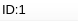
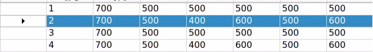
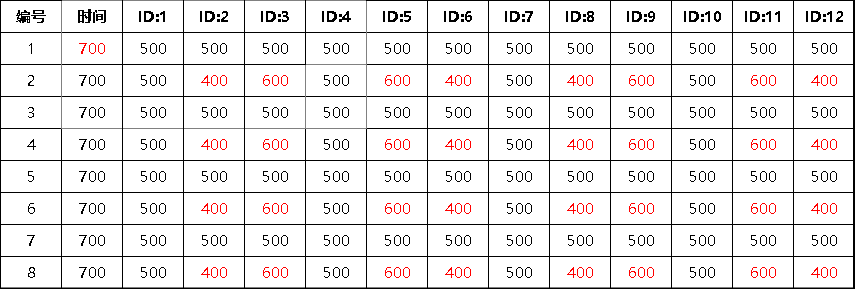

# 5. Action Editing Course

## 5.1 Introduction to PC Software

### 5.1.1 Open PC Software

* **Use Desktop Icon to Open PC Software (Beginner)**

(1) Double click on  to open PC software.

::: {Note}
This method is recommended for robotics beginners.
:::

* **Use Command line to Open PC Software**

(1) Click  or press **"Ctrl+Alt+T"** to open the command line terminal.

(2) Execute the command below to open PC software.

```
python3 Pug_PC_Software/ActionGroups/main.py
```

### 5.1.2 Interface Layout

The interface consists of servo control area, action data list, action setting area and deviation setting area.


* **Servo Control Area**

Adjust the value of corresponding servo to adjust the posture of ROSPug.

| Icon | Function |
|:--:|:--:|
|  | Change the language |
|  | Servo ID number |
|  | Apply to adjust servo angle with a range from 500 to 2500. |
|  | Apply to adjust servo deviation, with a range from -100 to 100. |
|  | Coordinates of the leg's foot end along the x, y, and z axes, in meters. |

* **Action Data List**

We can view the action duration and servo parameters in the list.


| Icon | Function |
|:--:|:--:|
|  | Action Number |
|  | Action duration |
|  | The angle value for corresponding servo ID. It is allowed to double click to modify the value |
|  | Run the selected action |

* **Action Setting Area**

| Icon | Function |
|:--:|:--:|
|  | The time required to run a single action. It can be directly modified in the box. |
|  | The time required to run a complete action group. |
|  | After clicking, you can manually adjust the servo rotation angle. |
|  | Read the current angle of the servo |
|  | Add the current servo values from the control area as an action to the last line of the action details list. |
|  | Replace the action selected in action data list with the current servo values in servo control area, and time will also be changed to the set time. |
|  | Insert an action before the selected action. Servo parameters are the values in servo control area. |
|  | Swap the position of a selected action with its previous action. |
|  | Delete a selected action in action data list. |
|  | Delete all the actions in action action data list. |
|  | Swap the position of a selected action with its next action. |
|  | Run all actions in action data list once. **"loop"** represents running the action in a loop |
|  | Open a required action group file. |
|  | Store the actions in action data list in a designated position. |
|  | After opening an action group through **"Open action file"**, clicking **"Integrate action file"** to open another action group allows you link them together. |
|  | Display the stored action group in PC software. |
|  | Refresh the selected action group. |
|  | Run the selected action group. |
|  | Stop the currently running action group. |
|  | Overwrite the selected action group. |
|  | Exit the host computer's control interface. |

::: {Note}
All action group files are stored in **"home/Pug_PC_Software/ActionGroups"**.
:::

* **Deviation Setting Area**

(ROSPug has been adjusted deviation before shipment. This section is just for reference)

| Icon | Function |
|:--:|:--:|
|  | Read the deviation value for each servo. (It is necessary to read deviation before adjusting deviation) |
|  | Store the deviation adjusted in ROSPug. |
|  | Reset all servo values in servo control area to 1500. |
|  | Restore the robot dog to standing pose |

<p id="anchor_5_2"></p>

## 5.2 Action Editing

### 5.2.1 Realization Purpose

The ROSPug robot dog's software enables you to control the robot to perform a variety of actions. By combining these actions, you can create a sequence of movements known as an action set.

In this section, we will configure an action set for the ROSPug robot dog to perform a **"push-up."** This action set includes 8 distinct actions, categorized into two phases: **"Down"** and **"Up".**

### 5.2.2 Edit Action

(1) Click  to open PC software.

(2) Step 1: Click **"Reset servo"** in deviation area to have ROSPug restored to its initial posture, the **"down"** action, with a duration of 700ms, and then click **"Add action"** in action editing area to add the action to the action list.


The specific parameters of action can be viewed in action data list.


::: {Note}
Each action edited needs to add it to the action list.
:::

(3) Step 2: Double click the text box of No.9 servo or drag its upper slider to adjust the servo parameter to 600.


(4) Step 3: Modify the parameters of other servos according to the following picture to make ROSPug in the **"stand-up"** position, then add this action to the action list.


(5) Step 4: Click **"Reset servo"** to execute the **"Down"** action. At this point, you can find that there are three actions in action list.


(6) Step 5: From the action list, select the action numbered 2, which is the **"Stand Up"** action added in Step 3. Click the button to make the robot dog perform the **"Stand Up"** action. Then, click **"Add Action"** to include this action in the list. The action list will now contain 4 actions: actions 1 and 3 are **"Lie Down,"** while actions 2 and 4 are **"Stand Up."**




(7) Repeat Step 4 and 5 actions to add two more sets of **"Down"** and **"Stand-up"** actions. Then the action list will have 8 independent actions in total, which indicates this action group has been completed. Select No.1 action and click **"Run"**. ROSPug will perform **"Push-up"** action group.


The following table displays all the servo parameters of this action group:



::: {Note}
The red value represent the time or servo parameters that require adjustment in each step.
:::

### 5.2.3 Save Action

(1) To facilitate the debug and management, you can click **"Save action file"** to save action group.


(2) Save the action group in **"home/Pug_PC_Software/ActionGroups"** and name it as **"Pushups"**, then click **"Save"**.


## 5.3 Import And Export Action

ROSPug contains some specific action groups by default. The action group files are stored in **"home/Pug_PC_Software/ActionGroups"**.

### 5.3.1 Export Action Group

(1) Turn on ROSPug, and then connect it to NoMachine and insert a U disk to any USB port on ROSPug.

(2) Click  in system status bar to open the file manager.

(3) Come to directory **"home/Pug_PC_Software/ActionGroups"**, then right click to copy the required action group. Or you can press **"Ctrl+C"** to copy the action group. In this case, we will select **"punch.d6a"** as example.


(4) Switch to the directory of U disk, and then right click or press **"Ctrl+V"** to paste the action group file.


### 5.3.2 Import Action Group

(1) Turn on ROSPug, and then connect it to NoMachine remote and insert a U disk to any USB port on ROSPug.

(2) Insert the U disk that stores action group files to any USB port, then system will pop up a file manager window.


(3) Right click action group file to select **"copy"** or press **"Ctrl+C"** to copy the action group file.


(4) Switch to the directory **"home/Pug_PC_Software/ActionGroups"**. Right click in a blank space, select **"Paste"** option or press **"Ctrl+V"** to the action group file, thus completing the import of the action group.


(5) Double click  to open PC software.

(6) Click **"Open action file",** then you can view the imported action group file **"punch.d6a"**.


## 5.4 APP Custom Control

### 5.4.1 Program Outcome

In the previous lesson, [5.2 Action Editing](#anchor_5_2), we learned how to edit the action group **"Pushups"**. In this lesson, we will use the custom function of the mobile app to execute this action group.

<p id="anchor_5_4_2"></p>

### 5.4.2 Preparation

(1) Turn on ROSPug, and then connect it to NoMachine remote desktop.

(2) Click  in system status bar to open the file manager.

(3) Enter directory **"home/Pug_PC_Software/ActionGroups"** to check the name of all existing action groups.


### 5.4.3 Operation Steps

(1) Open **"WonderROS"**, then connect ROSPug and enter **"Performance Mode"**.


(2) Click **"Custom"** key.


(3) Click "**Add**" key to add custom action.


(4) Fill in the required action information, then click **"OK"**.


::: {Note}
You can freely fill in the **"Action name"**, but the **"Action File Name"** should be filled in accordance with the existing action group. For the specific action group names, please refer to [5.4.2 Preparation](#anchor_5_4_2).
:::

(5) Click the **"Custom"** key and select the custom action, then ROSPug will perform this action.


(6) If you want to modify an action group, you can long press its name, and then click **"Modify"** in pop-up window.

