# 6. Simulation Course

## 6.1 URDF Model Introduction

The Unified Robot Description Format (**URDF**) is an **XML** file format widely used in **ROS** (**Robot Operating System**) to comprehensively describe all components of a robot.

Robots are typically composed of multiple links and joints. A link is defined as a rigid object with certain physical properties, while a joint connects two links and constrains their relative motion.

By connecting links with joints and imposing motion restrictions, a kinematic model is formed. The **URDF** file specifies the relationships between joints and links, their inertial properties, geometric characteristics, and collision models.

### 6.1.1 Comparison between Xacro and *URDF Model

The **URDF** model serves as a description file for simple robot models, offering a clear and easily understandable structure. However, when it comes to describing complex robot structures, using **URDF** alone can result in lengthy and unclear descriptions.

To address this limitation, the **xacro** model extends the capabilities of **URDF** while maintaining its core features. The **xacro** format provides a more advanced approach to describe robot structures. It greatly improves code reusability and helps avoid excessive description length.

For instance, when describing the two legs of a humanoid robot, the **URDF** model would require separate descriptions for each leg. On the other hand, the **xacro** model allows for describing a single leg and reusing that description for the other leg, resulting in a more concise and efficient representation.

### 6.1.2 Basic Syntax of URDF Model

* **XML Basic Syntax**

(1) Elements:

An element can be defined as desired using the following formula:

`<element>`

`</element>`

(2) Properties:

Properties are included within elements to define characteristics and parameters. Please refer to the following formula to define an element with properties:

`<element`

`property_1="property value1"`

`property_2="property value2">`

`</element>`

(3) Comments:

Comments have no impact on the definition of other properties and elements. Please use the following formula to define a comment:

`<!-- comment content -->`

* **Link**

The `Link` element describes the visual and physical properties of the robot's rigid component. The following tags are commonly used to define the motion of a link:


`<visual>`: Describe the appearance of the link, such as size, color and shape.

`<inertial>`: Describe the inertia parameters of the link, which will be used in dynamics calculation.

`<collision>`: Describe the collision inertia property of the link.

Each tag contains the corresponding child tag. The functions of the tags are listed below.

| Tag | Function |
|:---:|:---:|
| origin | Describe the pose of the link. It contains two parameters, including `xyz` and `rpy`. `Xyz` describes the pose of the link in the simulated map. `Rpy` describes the pose of the link in the simulated map. |
| mass | Describe the mass of the link |
| inertia | Describe the inertia of the link. As the inertia matrix is symmetrical, these six parameters need to be input, `ixx`, `ixy`, `ixz`, `iyy`, `iyz` and `izz`, as properties. These parameters can be calculated. |
| geometry | Describe the shape of the link. It uses `mesh` parameter to load texture file, and employs `filename` parameters to load the path for texture file. It has three child tags, namely `box`, `cylinder` and `sphere`. |
| material | Describe the material of the link. The parameter `name` is the required field. The tag `color` can be used to change the color and transparency of the link. |

<p id="6_1_2_3"></p>

* **Joint**

The **"Joint"** tag describes the kinematic and dynamic properties of the robot's joints, including the joint's range of motion, target positions, and speed limitations. In terms of motion style, joints can be categorized into six types.

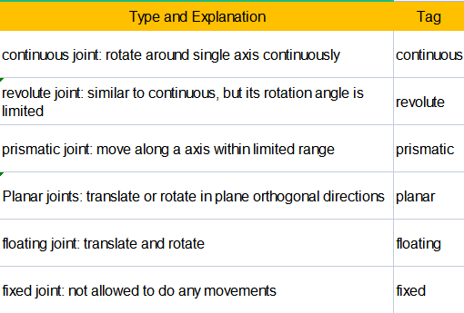

The following tags will be used to write joint motion.

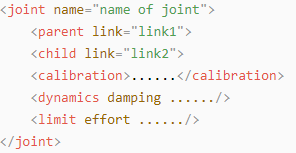

(1) `<parent_link>`: Parent link

(2) `<child_link>`: Child link

(3) `<calibration>`: Calibrate the joint angle

(4) `<dynamics>`: Describes some physical properties of motion

(5) `<limit>`: Describes some limitations of the motion

The function of each tag is listed below. Each tag involves one or several child tags.

| Tag | Function |
|:---:|:---:|
| origin | Describe the pose of the parent link. It involves two parameters, including xyz and rpy. Both xyz and rpy describe the pose of the link in simulated map. |
| axis | Control the child link to rotate around any axis of the parent link. |
| limit | The motion of the child link is constrained using the lower and upper properties, which define the limits of rotation for the child link. The effort  properties restrict the allowable force range applied during rotation (values: positive and negative; units: **N**). The velocity properties confine the rotational speed, measured in meters per second (**m/s**). |
| mimic | Describe the relationship between joints. |
| safety_controller | Describes the parameters of the safety controller used for protecting the joint motion of the robot. |

* **Robot Tag**

The complete top tags of a robot, including the `<link>` and `<joint>` tags, must be enclosed within the `<robot>` tag. The format is as follows:

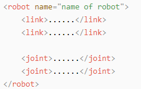

* **Gazebo Tag**

This tag is used in conjunction with the **Gazebo** simulator. Within this tag, you can define simulation parameters and import **Gazebo** plugins, as well as specify **Gazebo**'s physical properties, and more.

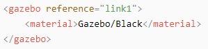

* **Write Simple URDF Model** 


(1) Name the model of the robot
To start writing the **URDF** model, we need to set the name of the robot following this format: `<robot name="robot model name">`. Lastly, input `</robot>` at the end to represent that the model is written successfully.

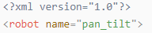

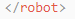

(2) Set Links

① To write the first link and use indentation to indicate that it is part of the currently set model. Set the name of the link using the following format: "`<link name="link name">`". Finally, conclude with `</link>` to indicate the successful completion of the link definition.

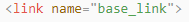

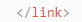

② Write the link description and use indentation to indicate that it is part of the currently set link, and conclude with `</visual>`.

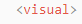


③ The **"geometry"** tag is employed to define the shape of a link. Once the description is complete, include `</geometry>`. Within the **"geometry"** tag, indentation is used to specify the detailed description of the link's shape. The following example demonstrates a link with a cylindrical shape: `<cylinder length="0.01" radius="0.2"/>`. In this instance, `length="0.01"` signifies a length of 0.01 meters for the link, while `radius="0.2"` denotes a radius of 0.2 meters, resulting in a cylindrical shape.

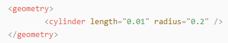

④ The **"origin"** tag is utilized to specify the position of a link, with indentation used to indicate the detailed description of the link's position. The following example demonstrates the position of a link: `<origin rpy="0 0 0" xyz="0 0 0" />`. In this example, `rpy` represents the roll, pitch, and yaw angles of the link, while `xyz` represents the coordinates of the link's position. This particular example indicates that the link is positioned at the origin of the coordinate system.


⑤ The **"material"** tag is used to define the visual appearance of a link, with indentation used to specify the detailed description of the link's color. To start describing the color, include `<material>`, and end with `</material>` when the description is complete. The following example demonstrates setting a link color to yellow: `<color rgba="1 1 0 1" />`. In this example, `rgba="1 1 0 1"` represents the color threshold for achieving a yellow color.

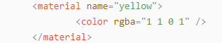

(3) Set Joint

① To write the first joint, use indentation to indicate that the joint belongs to the current model being set. Then, specify the name and type of the joint as follows: `<joint name="joint name" type="joint type">`. Finally, include `</joint>` to indicate the completion of the joint definition.

:::{Note}
To learn about the type of the joint, please refer to [Joint](#6_1_2_3).
:::


② Write the description section for the connection between the link and the joint. Use indentation to indicate that it is part of the currently defined joint. The `parent` parameter and `child` parameter should be set using the following format: `<parent link="parent link"/>`, and `<child link="child link" />`. With the parent link serving as the pivot, the joint rotates the child link.

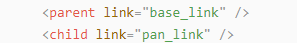

③ `origin` describes the position of the joint using indentation. This example describes the position of the joint: `<origin xyz="0 0 0.1" />`. `xyz` is the coordinate of the joint.


④ `axis` describes the position of the joint adopting indentation. `<axis xyz="0 0 1" />` describes one posture of a joint. `Xyz` specifies the pose of the joint.


⑤ `limit` imposes restrictions on the joint using indentation. The **"limit"** tag is used to restrict the motion of a joint, with indentation indicating the specific description of the joint angle limitations. The following example describes a joint with a maximum force limit of 300 Newtons, an upper limit of 3.14 radians, and a lower limit of -3.14 radians. The settings are defined as follows: `effort="joint force (N)", velocity="joint motion speed", lower="lower limit in radians", upper="upper limit in radians"`.

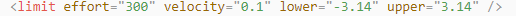

⑥ `dynamics` describes the dynamics of the joint using indentation. `<dynamics damping="50" friction="1" />` describes dynamics parameters of a joint.

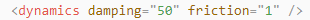

## 6.2 ROSPug URDF Model Introduction

(1) Start the robot dog, and access the robot system desktop using **NoMachine**.

(2) Double-click  to initiate the command-line terminal.

(3) Run the following command to launch the game.

```
roslaunch pug_description gazebo.launch
```

(4) Execute the command below to start **Gazebo** simulation. When the terminal prints the content illustrated as the picture below, it means that the **Gazebo** model is enabled successfully.

```
roslaunch pug_description gazebo.launch
```

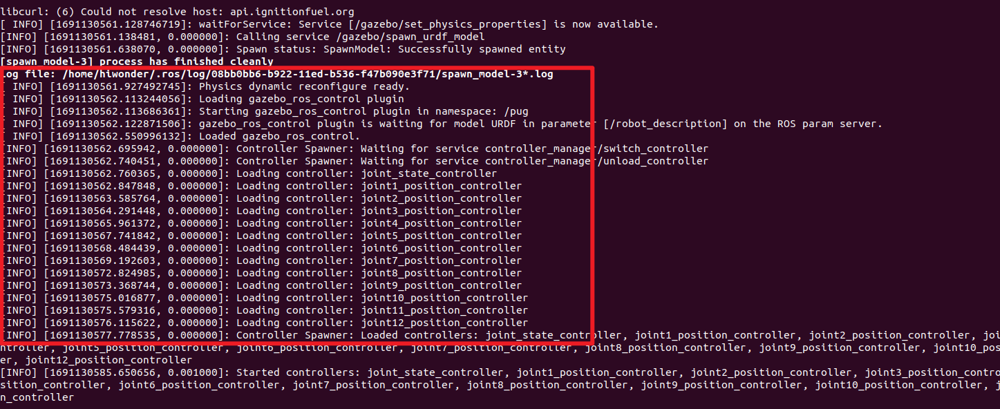

(5) Simply click on the **Gazebo** window to visualize the model. For ease of comprehension, envision the **ROSPug** robot model comprising 4 mechanical legs, controllers, a camera, and a **LiDAR**. To optimize the simulation's fluidity, the model has been moderately streamlined, introducing minor distinctions from the actual robot.

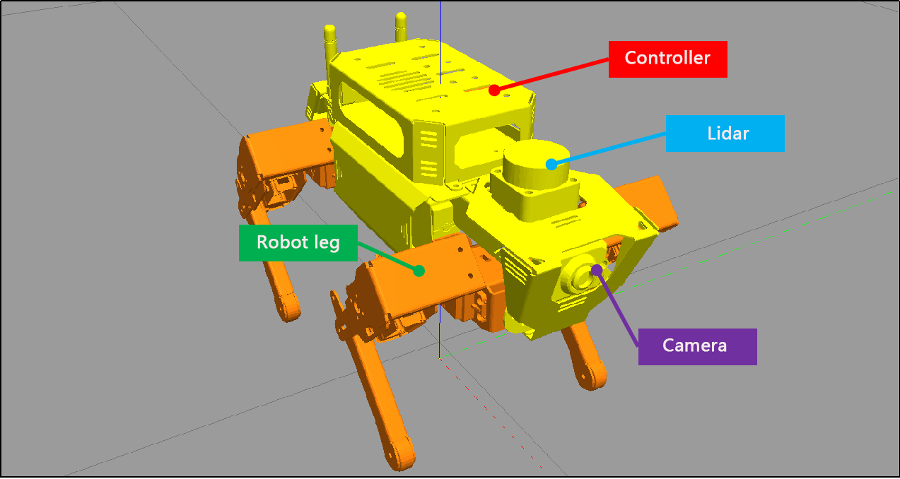

(6) Each leg consists of 3 joints and 4 links, with one servo corresponding to each joint.

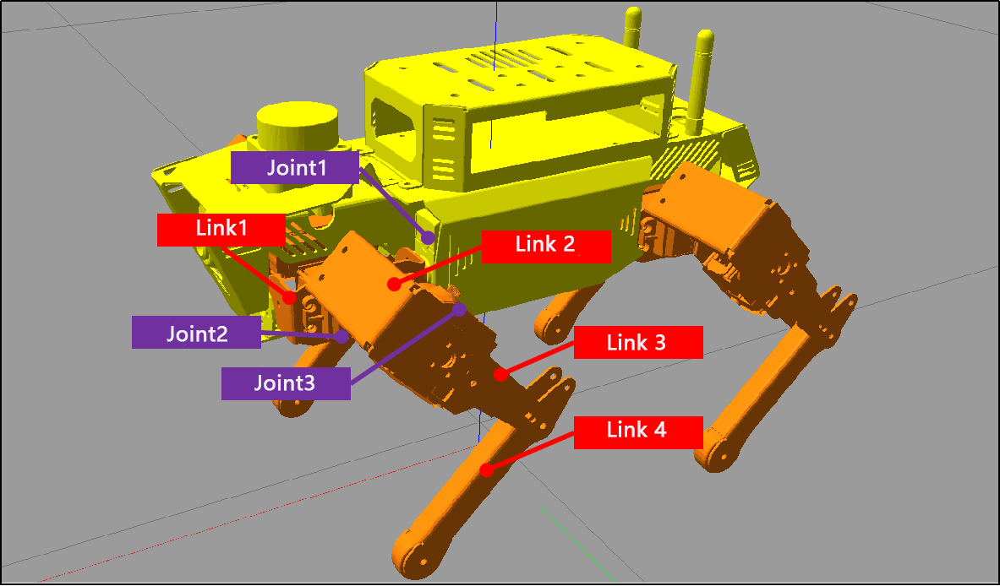

### 6.2.1 Open **URDF** Model File

(1) Open the terminal and enter the following command to navigate to the folder storing the **URDF** mode.

```
cd pug/src/pug_description/urdf
```

(2) Take `pug.urdf.xacro` as example. Execute the command below and open **URDF** model using **vim** editor.

```
vim pug.urdf.xacro
```

(3) When the terminal prints the following content, it indicates that the **ROSPug** robot **URDF** model file has been opened successfully:

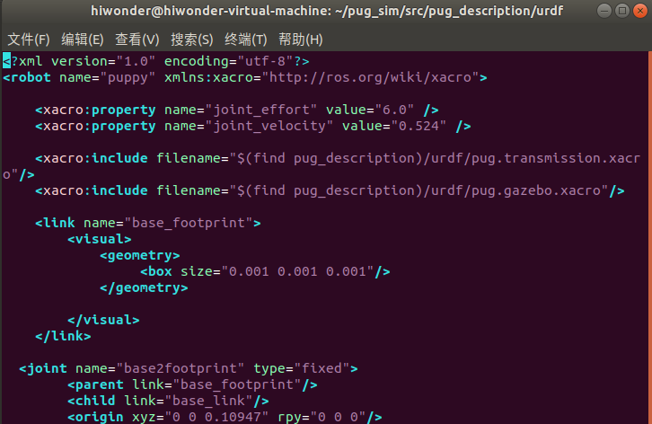

### 6.2.2 Analysis of  URDF Model

* **URDF Model Structure**

The **URDF** model file for **ROSPug** consists of three files: `'pug.urdf.xacro,' 'pug.gazebo.xacro,'` and `'pug.transmission.xacro.'` Among them, `'pug.urdf.xacro'` serves as the main **URDF** file for the entire robot. It incorporates the other two **xacro** files using `'include,'` bringing together various files within the **URDF** that define the complete mechanical structure, dynamics, simulation, and other information for **ROSPug**. The organization of files through `'include'` and macro references helps compartmentalize functional modules, making it easier to read and maintain, ultimately resulting in a comprehensive **URDF** model file.

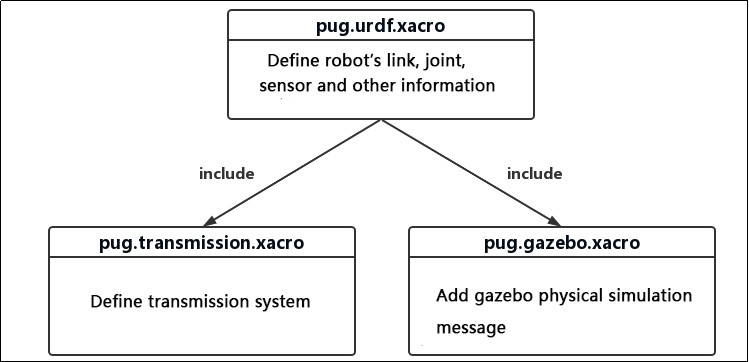

* **Analysis of pug.urdf.xacro File**

It outlines the fundamental structure of the robot, encompassing the chassis, joints, connections, and more. This file also incorporates various macro and attribute definitions, enabling their repeated use in the code to simplify and prevent redundancy. Given the extensive code, it will be divided into three parts here for illustration, focusing mainly on the following sections:

(1) Model and Attribute Definition

① The **"robot"** tag establishes the name of the robot model as `"`puppy`,"` while the **"property"** tag defines certain attribute values, representing maximum torque and joint maximum velocity.

② The **"include"** statement brings in two files: `'pug.transmission.xacro'` and `'pug.gazebo.xacro'`. These files encompass the robot's transmission system and various attributes in the **Gazebo** simulation environment.

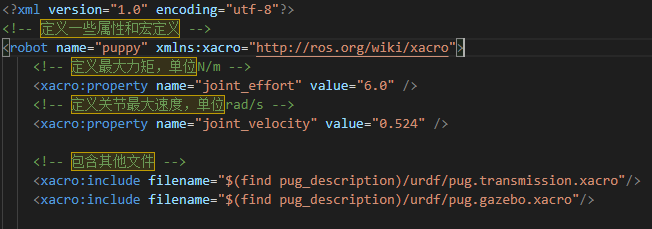

(2) Definition of Link

The `Link` element represents a rigid body within the robot model, and it can include information such as inertia, visualization details, collision data, and more. Below is an example code for a `Link` element, encompassing inertia, visualization, and collision information:

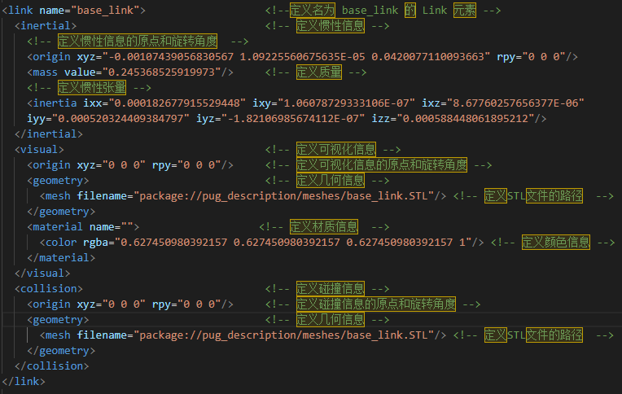

(3) Definition of Joint

The `Joint` element signifies a joint within the robot model, connecting two `Links` and defining their relative motion. Below is an example code for a `Joint` element, encompassing information such as the joint type, connected `Links`, the direction of the joint axis, and joint constraints:

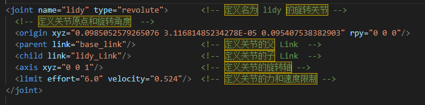

* **Analysis of pug.gazebo.xacro File**

Primarily employed for crafting robot models within the **Gazebo** simulator, it outlines the physical characteristics, joint control, sensor data, and other details of various components of a robot. This facilitates simulation, control, and testing in the **Gazebo** environment. Given the extensive code, it will be presented in three parts for illustration, focusing mainly on the following sections:

(1) Definition of Gazebo Plugin

This section defines a **Gazebo** plugin, `'gazebo_ros_control,'` used for implementing robot control. The specific implementation of this plugin is provided by the `'libgazebo_ros_control.so'` library. It also configures **Gazebo** simulation types and namespaces.

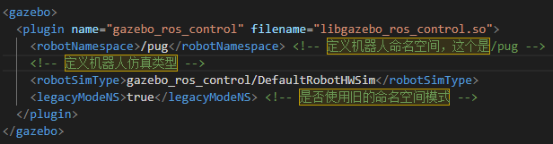

(2) Macro Definition

This tag defines several **Xacro** macros for conveniently configuring the color and physical properties of various `Links` within the robot model. The `'model_color'` macro is used for setting the color of a `Link`, while the `'link_setup_block'` macro is employed for configuring the physical properties of a `Link`.

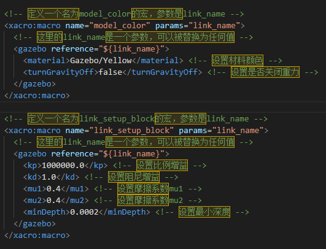

(3) Use Macros

Utilize the mentioned macros to configure the color and physical properties of various `Links` within the robot model. Specifically, the `'gazebo_coxa,' 'gazebo_thigh,'` and `'gazebo_calf'` macros are employed to set the physical properties of the hip, thigh, and calf, respectively. These macros utilize the `'gazebo'` tag to configure the physical properties of the `Link`, such as friction coefficient, spring stiffness, and more.

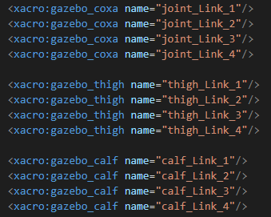

* **Analysis of pug.transmissions.xacro File**

This `'transmissions.xacro'` file defines the transmission system within the robot model, specifying how the various joints interact with the motors. During runtime, **ROS** translates the `'transmissions.xacro'` file into the transmission system within the robot model. It primarily consists of the following two sections:

(1) Xacro Macro Definition

`\<xacro:macro\>` is employed to define templates for the transmission system. Within this, the `<transmission>` tag is used to specify the type and name of the transmission system, the `<joint>` tag designates the joint driver interface, and the `<actuator>` tag specifies mechanical reduction ratios and other related attributes.

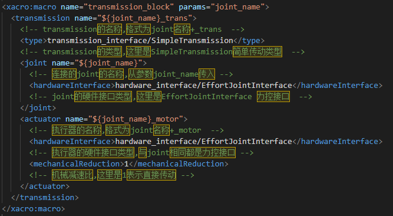

(2) Define Different Types of Transmission

Invoke the transmission block **Xacro** macro to define corresponding transmissions for each joint. This allows for the uniform definition of the robot's transmission system through configuration files.

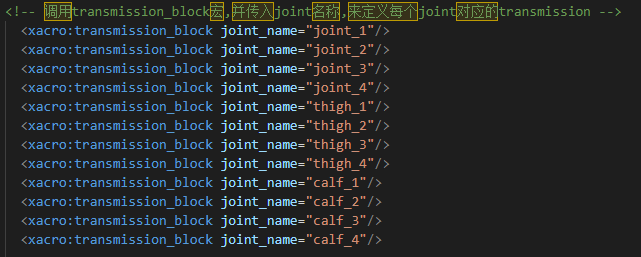

## 6.3 Gazebo Introduction

(1) **Gazebo** is a **3D** dynamic simulator that accurately and effectively simulates robots in complex indoor and outdoor environments. Similar to game engines providing high-fidelity visual simulation, **Gazebo** offers high-fidelity physics simulation. It provides a comprehensive set of sensor models and a user-friendly interaction method for both users and programs.

(2) Key features of **Gazebo**:

① Incorporates multiple physics engines

② Includes a diverse range of robot models and environment libraries

③ Offers various sensors

④ Convenient programming and a simple graphical interface

(3) **Gazebo**'s official recommendation is to run on **Ubuntu** or other **Linux** distributions. Additionally, your computer should have the following capabilities:

① Dedicated **GPU**: **Nvidia** cards often perform well on **Ubuntu**

② At least an **Intel I5** or equivalent **CPU**

③ Minimum of **500MB** available disk space

④ Install the highest version of **Ubuntu Trusty** whenever possible

### 6.3.1 **Gazebo** System Structure

**Gazebo** employs a distributed architecture that encompasses separate libraries for communication, physics simulation, rendering, sensor generation, and the user interface. Additionally, **Gazebo** provides two executable programs for running simulations:

(1) The server, `gzserver`, is responsible for simulating physics, rendering, and sensors.

(2) The client, `gzclient`, furnishes a graphical interface for visualizing the simulation and interacting with it.

(3) Communication between the client and server occurs through the **Gazebo** communication library.

**Gazebo**'s **Master** is akin to the master node in the **ROS** system's communication mechanism but operates with topics. It facilitates topic name discovery and management. A single **Master** can oversee the simulation of multiple physical environments, sensor generation, and graphical interfaces.

* **Communication Related Library**

(1) Dependent Libraries: `Protobuf` and `boot::ASIO`

(2) External Interface: Supports communication with **Gazebo** nodes through named topics

(3) Internal Interface: None

(4) Broadcast Topics: None

(5) Subscribed Topics: None

* **Library for Physics Environment**

(1) This physics environment library provides a simple and fundamental interface for the essential components of simulation, including rigid bodies, collision shapes, and constraints related to joints. This interface is embedded with four open-source physics engines: **Open Dynamics Engine** (**ODE**), **Bullet**, **Simbody**, and **Dynamic Animation and Robotics Toolkit** (**DART**).

(2) Model descriptions in **XML** format, based on the **SDF** (**Simulation Description Format**), can be loaded by these physics engines. They offer different implementation algorithms and simulation characteristics.

(3) Dependent Libraries: Dependencies include internal collision detection libraries from dynamic engine libraries.

(4) External Interface: Provides a simple, general interface for physics simulation.

(5) Internal Interface: Offers a basic interface defining the physics library for third-party dynamic engines

* **Rendering Library**

(1) This parsing library utilizes **OGRE** to provide a simple interface for parsing three-dimensional scenes. It includes simulation of lighting, textures, and the sky, allowing for the creation of plugins for rendering engines.

(2) Dependent Library: **OGRE**

(3) External Interface: Allows loading, initialization, and scene creation.

(4) Internal Interface: Stores metadata for visualization and calls the **OGRE** **API** to render models.

* **Sensor Data Generation Library**

(1) This sensor library enables various types of sensors to listen to updates from the simulated environment in the physics library. It generates different data based on the characteristics of each sensor.

(2) Dependent Libraries: Dependencies include the rendering library and the physics environment library.

(3) External Interface: Provides basic sensor initialization and settings.

(4) Internal Interface: To be determined (**TBD**).

* **GUI**

(1) The **GUI** library uses **QT** to create graphical widgets for user simulation interaction. Users can control the flow of time by pausing or changing the time step through **GUI** widgets. Additionally, users can modify the scene by adding, modifying, or removing models. There are also tools for visualizing and recording simulated sensor data.

(2) Dependent Libraries: Dependencies include the rendering library and **QT**.

(3) External Interface: None

(4) Internal Interface: None

### 6.3.2 Coordinate System

* **World Coordinate System**

The **World Coordinate System** is a stationary reference coordinate system located on the **'ground.'** It undergoes no translation or rotation changes over time. Of course, here, the term **'ground'** is broadly defined. For example, if the robot is on a tabletop, the world coordinate system would be situated on the plane of that table.

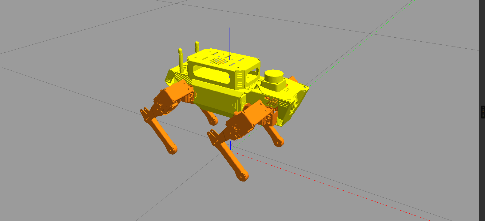

* **Leg Coordinate System**

The establishment of the joint coordinate system follows the right-hand rule. Therefore, in the example robot model in the diagram below, the red axis represents the **X-axis**, the green axis represents the **Y-axis**, and the blue axis represents the **Z-axis**.

The number of joint coordinate systems is not fixed and is mainly related to the number of legs. Therefore, extra attention should be paid when establishing joint coordinate systems.
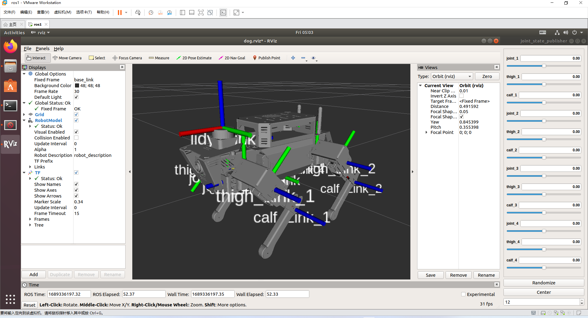

* **Introduction to Gazebo GUI**

Enter the following command in the virtual machine terminal to initiate **Gazebo** simulation. Wait for the service to start, and if the content appears as shown in the figure below, it indicates successful **Gazebo** launch.

```
roslaunch pug_description gazebo.launch
```


Click on the corresponding simulation icon on the desktop to open the simulation tool. The simulation interface is as below:

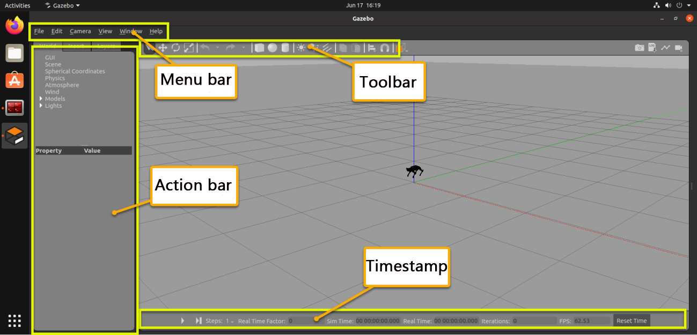

The function of each section is listed below.

| Name | Function |
|:---:|:---:|
| Tool bar | Provide the most commonly used options for interaction with simulator |
| Menu bar | Configure or modify the parameters of the simulation software and some interactive functions |
| Action bar | Make any operations on the models and modify the parameters |
| Timestamp | Set the time of the virtual space |
| Scene | The main part of the simulator where the simulated model is displayed |

## 6.4 **Gazebo** Simulation & Motion Planning

:::{Note}
*   Prior to commencing the simulation, ensure that the robot dog has ample battery power. It is preferable to conduct the simulation when the battery is fully charged.
*   The operations outlined below require coordination between the **VM** (**Virtual Machine**) and the robot dog. Please activate the robot dog in advance.
*   It is recommended to configure the robot in direct mode for this simulation, in order to fully experience this game.
:::

### 6.4.1 Install Virtual Machine

(1) Install **VMware** virtual machine software which can be found in [Appendix -> Virtual Machine & Installation Pack ](Appendix.md).

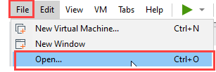

(2) Open **VMware** software, then click on **File** -> **Open** to open the folder containing virtual machine image.

(3) Go to the directory where the virtual machine files are stored, select the file, and click the **Open** button to import it.

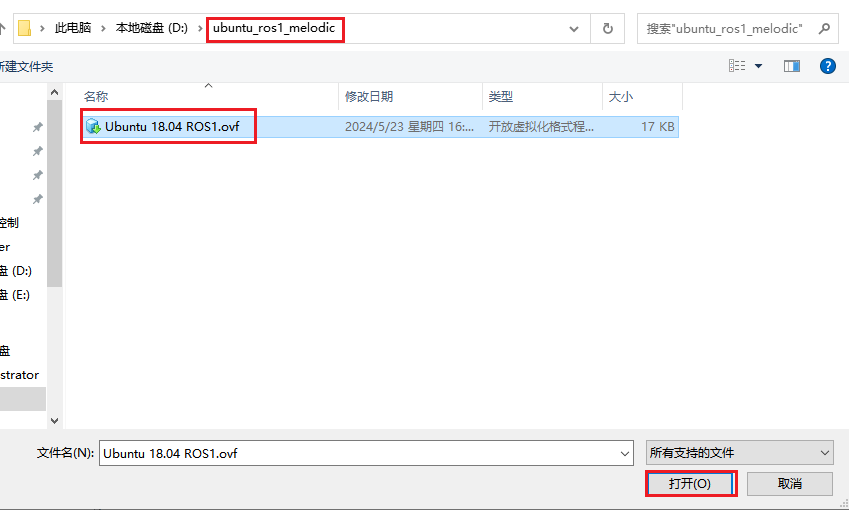

### 6.4.2 Copy Robot Files to the Virtual Machine and Compile

* **Export Files from the Robot**

(1) Start the robot dog and connect it to the remote control software **NoMachine**.

(2) Click  to open the command line terminal. Enter the following command to navigate to the `pug/src/` directory:

```
cd pug/src/
```

(3) Enter the following command to package the `pug_description` folder into a zip file:

```
zip -r pug_description.zip pug_description
```

(4) Click  to open the file directory, then navigate to the `home/` directory.

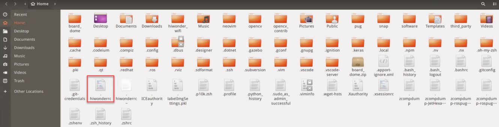

(5) Drag the `.hiwonderrc` file to your computer desktop.

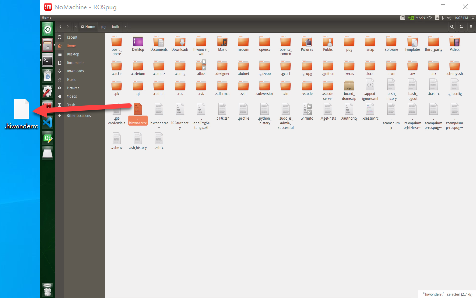

(6) Click  to open the file directory again, then navigate to the `home/pug/src` directory.

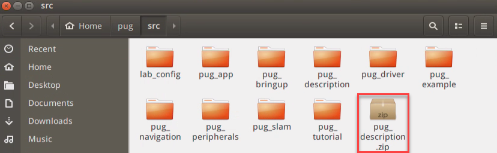

(7) Drag the [pug_description.zip](Appendix.md) file to your computer desktop.

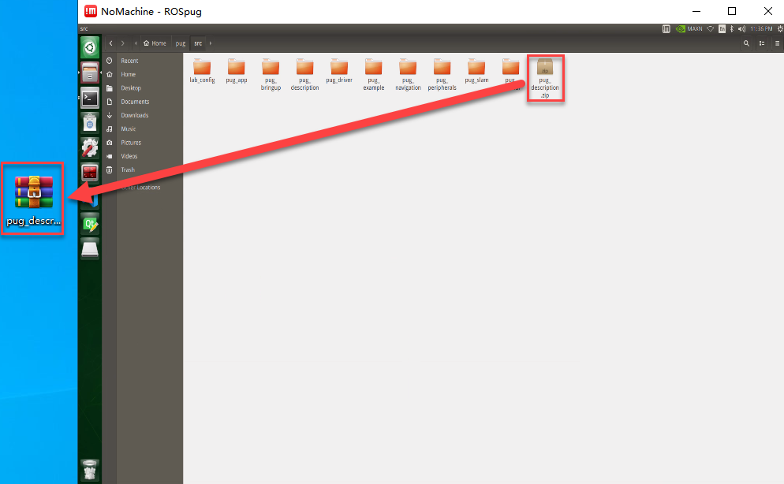

* **Export Files to Virtual Machine**

(1) Click on  to navigate to the home directory.


(2) Drag and drop the [pug_description.zip file](Appendix.md) from your computer desktop into the virtual machine:

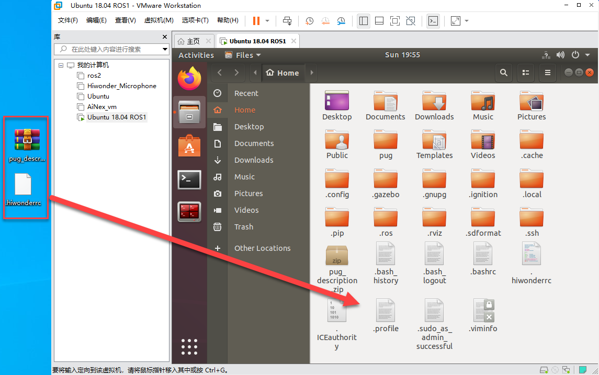

* **Create and Compile the Workspace**

(1) In the virtual machine, click  to open the command line terminal.

(2) Enter the following command to create the `pug/src` directory:

```
mkdir -p pug/src
```

(3) Unzip `pug_description.zip` into the current `home/pug/src` directory:

```
unzip pug_description.zip -d pug/src/
```

(4) Move the `.hiwonderrc` file to the `ros_ws` directory:

```
mv .hiwonderrc ros_ws/
```

(5) Navigate to the `pug` directory:

```
cd pug/
```

(6) Enter the following command to compile the workspace:

```
catkin_make
```

(7) If you encounter compilation errors related to missing header files, repeat the compilation process until it completes successfully.

(8) Edit the `.bashrc` file by entering the following command:

```
gedit ~/.bashrc
```

(9) Add the following lines to the `.bashrc` file:

```
source /home/ubuntu/pug/.hiwonderrc
source /home/ubuntu/pug/devel/setup.bash
```

(10) After editing, save and exit the file using **Ctrl + S** or by clicking the **Save** button in the top right corner.

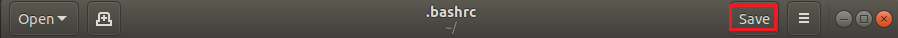

### 6.4.3 Configure Virtual Machine Network

* **Configure Virtual Machine Network**

(1) Begin by powering up the **ROSPug** robot dog.

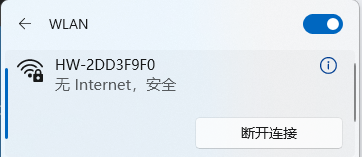

(2) After connecting to **VMware** virtual machine, click on **Edit** -> **Virtual Machine Network Configuration**.

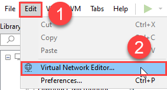

(3) Click the **"Add Network"** button.

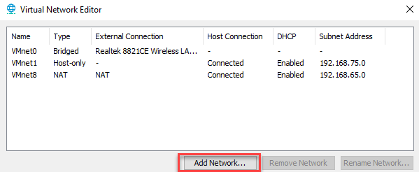

(4) Choose the network you want to add (e.g., **"VMnet0"**) and click **"OK"**.

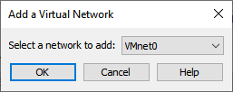

(5) Select the newly added network **"VMnet0"**, set it to **"Bridged"** mode, and set the bridging target to the network card. Click **"OK"** to apply the changes.

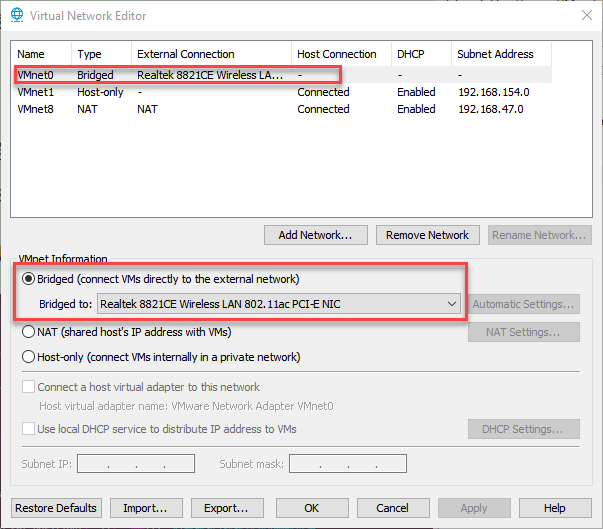

(6) Click **"Power on This Virtual Machine"** and wait for the system to boot.

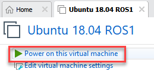

(7) Select the virtual machine, right-click to open the menu, and choose **"Settings"**.

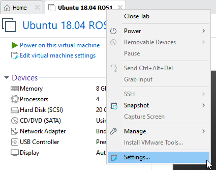

(8) Go to the **"Network Adapter"** section and set the network connection to **"Bridged"** mode.

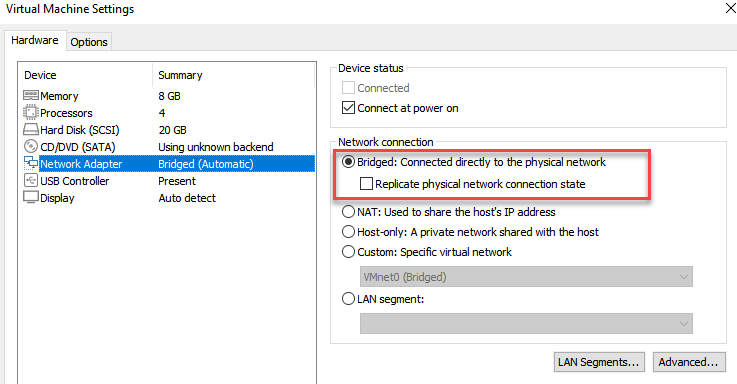

* **Configure the Virtual Machine to Publish the Node Address**

(1) Execute the following command to check the **IP** of the virtual machine.

```
ifconfig
```

(2) Record the **IP** in the red frame.

:::{Note}
If the **IP** address does not appear, you need to enter the command `sudo dhclient ens33` to refresh the **Wi-Fi**.
:::

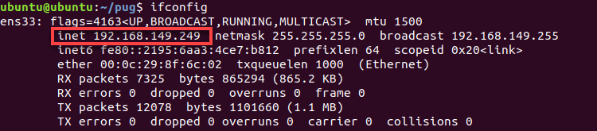

(3) Run the following command to start the virtual machine.

```
vim pug/.hiwonderrc
```

(4) Press the **'i'** key to enter edit mode. Update the location shown in the image with the **IP** address of the virtual machine you found earlier. Press **'Esc'**, then type **':wq'** to save and exit.

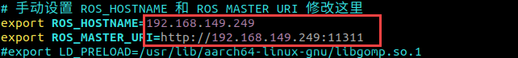

(5) Run the following command to update the virtual machine configuration file to activate the settings.

```
source .bashrc
```

### 6.4.4 Configure the Robot Dog's Node Publishing Address

(1) Run the following command to open the virtual machine configuration file.

```
vim .hiwonderrc
```

(2) Press the **'i'** key to enter edit mode, and set `ROS_HOSTNAME` to the robot's **IP** address. Set `ROS_MASTER_URI` to the virtual machine's **IP** address. Press **'Esc'**, then type **':wq'** to save and exit.

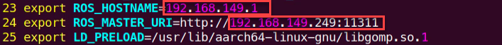

(3) Input the command below to update the virtual machine configuration file to validate the settings.

```
source .bashrc
```

### 6.4.5 Start Simulation

* **Start Gazebo in the Virtual Machine**

(1) Click on  to initiate the command-line terminal.

(2) Run the following command to access the virtual machine configuration file.

```
roslaunch pug_description gazebo.launch
```

(3) Click on the triangle button to start the simulation.


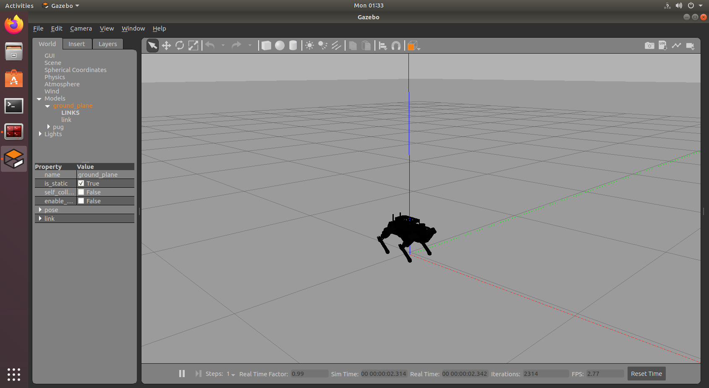

(4) If you want to close this game, press **'Ctrl+C'**. If it fails to close the game, please retry.

* **Start Simulation Control**

(1) Start the robot dog, and access the robot system desktop using **NoMachine**. Click on  to initiate the command-line terminal.

(2) Run the following command to start the game.

```
roslaunch pug_description sim_base.launch
```

(3) Activate the wireless handle to control the robot to move.

| Button | Function |
|:---:|:---:|
| START | Restore to Initial Pose |
| ↑ | Move Forward |
| ↓ | Move Backward |
| ← | Turn Left |
| → | Turn Right |
| △ | Raise Body Height |
| × | Lower Body Height |
| ◻ | Move Left |
| ○ | Move Right |
| L1 | Tilt Body Upward |
| L2 | Tilt Body Downward |
| R1 | Twist Body Left |
| R2 | Twist Body Right |
| Left joystick | Control the robot to go forward, backward, translate left and right |
| Right joystick | Turn left and right |

(4) If you want to terminate this game, press **'Ctrl+C'**. If it fails to close the game, please retry.