# 7. ROS+OpenCV Vision Projects

<p id="anchor_7_1"></p>

## 7.1 Color Threshold Adjustment

Objects may appear differently in color under various light sources, which can affect games involving color recognition. This lesson will guide you through using the `LabConfig` tool to adjust the color threshold and mitigate this issue effectively.

### 7.1.1 Enable LabConfig

:::{Note}
The input command should be case-sensitive, and keywords can be complemented using `Tab` key.
:::

(1) Start ROSPug robot dog, and access the robot system desktop using [NoMachine](Appendix.md).

(2) Double-click 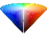 to start the `LabConfig` tool. If the software is enabled successfully, you can skip step (3) to (6).

(3) If `LabConfig` cannot be opened, double-click  to open the command-line terminal.

(4) Execute the command below:

```bash
roslaunch lab_config lab_config_manager.launch
```

(5) Run the following command, and hit `Enter` key to enable the camera service

```bash
roslaunch pug_peripherals camera.launch
```

(6) Double-click  to open the `LabConfig` tool.

### 7.1.2 Introduction to LabConfig Interface

The `LabConfig` interface is divided into two parts, including display area and parameter adjustment area.

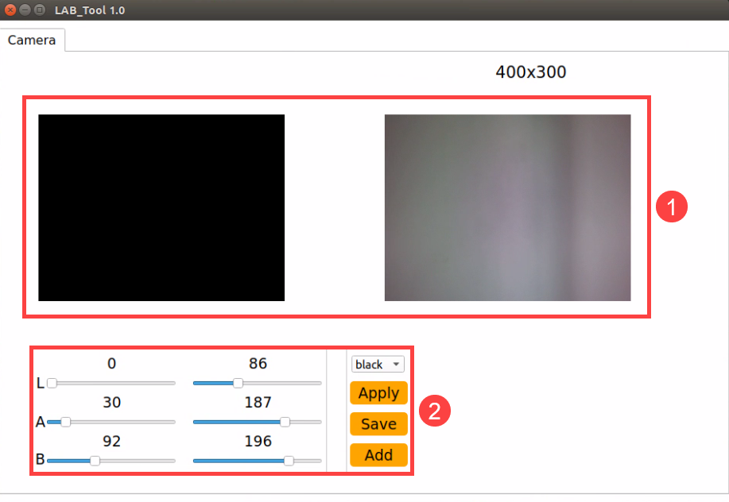

(1) Display area: The image on the left side is the camera-processed image, while the image on the right side is the original.

:::{Note}
If the live camera feed cannot be displayed properly, indicating a failure in camera connection, please ensure that the connection cable is securely plugged in.
:::

(2) Parameter adjustment area: adjust the color threshold parameters. The functions of the icons are listed below:

| **Icon**                                                              | **Function**                                                                                                            |
| :--------------------------------------------------------------------: | :----------------------------------------------------------------------------------------------------------------------: |
| 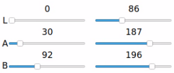 | Drag the sliders L, A and B to adjust the L, A and B components of the live camera feed.                                |
| 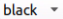 | Select the color to be adjusted.                                                                                        |
|  | Apply the color threshold currently adjusted.                                                                           |
| 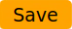 | Save the adjustment result.                                                                                             |
|  | Add new colors to be recognized.                                                                                        |

<p id="anchor_7_1_3"></p>

### 7.1.3 Adjust Color Threshold

(1) Start `LabConfig`. Select the color to be adjusted in the drop-down menu. Take adjusting red as example.

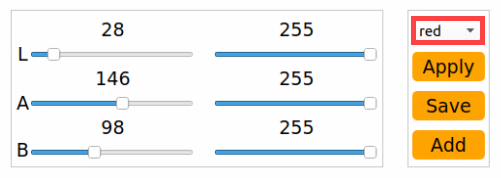

(2) Set the **'min'** value of L, A and B components as **'0'**, and the **'max'** values to **'255'**.

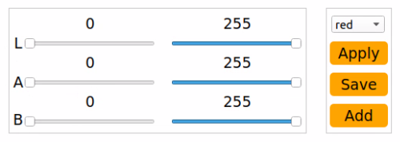

(3) Position the colored object within the camera's field of view, consult the LAB color space distribution map, and fine-tune the L, A, and B components to align with the desired color recognition range.

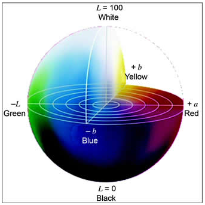

If the red hue is closer to **'+a'**, adjust by increasing the A component. This involves maintaining the **'max'** value of the A component unchanged while increasing its **'min'** value until the color object area on the left side of the screen turns white, while the remaining area turns black.

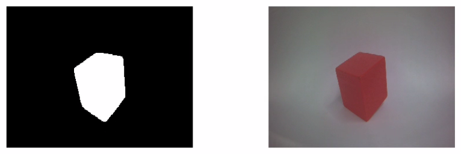

(4) Fine-tune the remaining L and B components based on the environmental conditions. If the red hue appears lighter, increase the **'min'** value of the L component. Conversely, if the red hue appears darker, decrease the **'max'** value of the L component. If the red hue appears warmer, increase the **'min'** value of the B component; if it appears cooler, reduce the **'max'** value of the B component.

The table below displays the parameter information for LAB threshold adjustment.

| **Color component** | **Range** | **Color zone**         |
| :-------------------: | :---------: | :--------------------: |
| L                   | 0~255     | Black-White（-L ~ +L） |
| A                   | 0~255     | Green-Red（-a ~ +a）   |
| B                   | 0~255     | Blue-Yellow（-b ~ +b） |

(5) Click-on **'Apply'** button to apply the color threshold parameters currently adjusted.

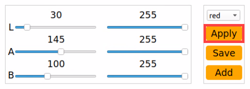

(6) Click the **"Save"** button to preserve the color threshold adjustment parameters.

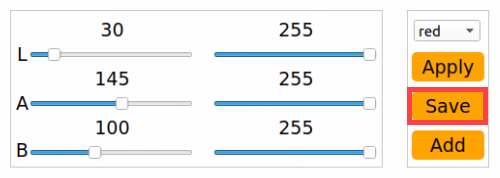

### 7.1.4 Add New Recognition Color

In addition to the three pre-defined recognition colors, users have the option to add other identifiable colors. Here, purple will be used as an example. The specific steps are as follows:

(1) Open `LabConfig`, then click-on **'Add'** button.

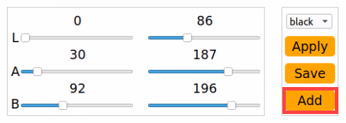

(2) Name the color, for example **'purple'**.

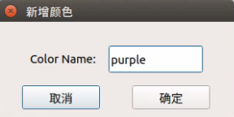

(3) Position the colored object within the camera's field of view, then adjust the L, A, and B component sliders until the color object area on the left side of the screen turns white, while the remaining areas turn black.

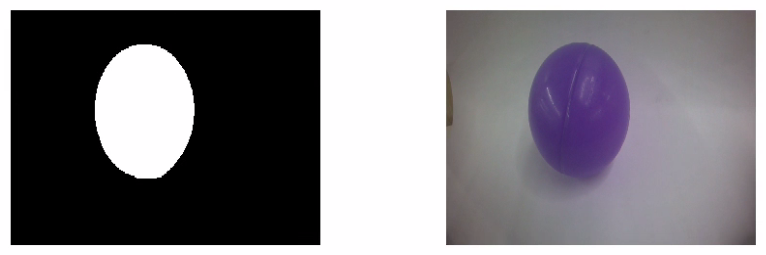

:::{Note}
To access the detailed instructions, please refer to section [7.1.3 Adjust Color Threshold](#anchor_7_1_3).
:::

(4) Click the **'Apply'** button to apply the currently adjusted color threshold parameters.

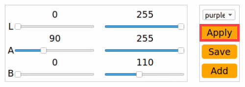

(5) Click-on **'Save'** button to save the the currently adjusted color threshold parameters.

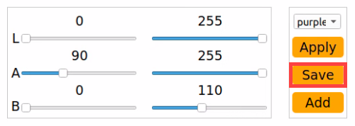

## 7.2 Color Recognition

:::{Note}
*   If color recognition is inaccurate, please refer to [7.1 Color Threshold Adjustment](#anchor_7_1) for further adjustments.
*   Ensure there are no other objects in the camera's field of view that contain the recognized color, as this may affect gameplay effectiveness.
:::

### 7.2.1 Program Logic

First, the color must be identified. To achieve this, we utilize the Lab color space for processing, converting the image color space from RGB to Lab. Subsequently, operations such as binarization, erosion, and dilation are applied to the image to extract the maximum contour containing the target color. Finally, the color recognition results are provided back through both the display screen and the terminal interface.

### 7.2.2 Operation Steps

:::{Note}
The input command should be case sensitive.
:::

(1) Start ROSPug robot dog, and access the robot system desktop using [NoMachine](Appendix.md).

(2) Click-on  to open the command-line terminal.

(3) Execute the following command, and hit `Enter` key to initiate the color recognition program.

```bash
rosrun pug_example color_detect_demo.py
```

(4) If you need to terminate this program, use short-cut **'Ctrl+C'**. If the program cannot be stopped, please retry.

### 7.2.3 Program Outcome

When red, green, or blue is recognized, the color name will be printed in the lower left corner of the screen and also displayed in the terminal. Additionally, the target item will be highlighted with a circle of the corresponding color on the screen.

Take recognizing red sphere as example.

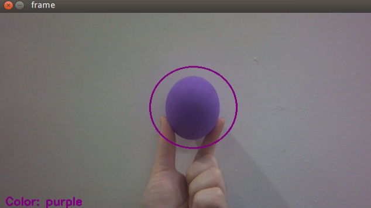

### 7.2.4 Program Parameters Explanation

The source code of this program is saved in: [/home/pug/src/pug_example/scripts/detect_and_track/color_detect_demo.py](../_static/source_code/detect_and_track.zip)

* **Image Processing**

(1) Gaussian Filtering

Before converting the image color space from RGB to Lab, it undergoes denoising. The `GaussianBlur()` function from the `cv2` library is employed for this purpose, performing Gaussian filtering on the image.

{lineno-start=53}
```python
    frame_gb = cv2.GaussianBlur(frame_resize, (3, 3), 3) 
```
The parameters in the function brackets are as follows:

The first parameter, `frame_resize`, represents the input image.

The second parameter, `(3, 3)`, denotes the Gaussian kernel size.

The third parameter, `3`, indicates the variance allowed around the mean value in Gaussian filtering. A larger value allows greater variance around the mean, while a smaller value allows less variance around the mean.

(2) Thresholding Processing

Utilize `inRange()` function from `cv2` library to perform thresholding on the image.

{lineno-start=61}
```python
        if i in ['red', 'green', 'blue', 'purple']:
            frame_mask = cv2.inRange(frame_lab,
                                            (color_range_list[i]['min'][0],
                                            color_range_list[i]['min'][1],
                                            color_range_list[i]['min'][2]),
                                            (color_range_list[i]['max'][0],
                                            color_range_list[i]['max'][1],
                                            color_range_list[i]['max'][2])) 
```

The first parameter in the function brackets represents the input image. The second and third parameters denote the lower and upper limits of the threshold, respectively. When the RGB color value of a pixel falls within the specified range, the pixel is assigned a value of 1; otherwise, it is assigned a value of 0.

(3) Erosion and Dilation

To reduce interference and achieve smoother images, erosion and dilation operations are applied.

{lineno-start=69}
```python
            eroded = cv2.erode(frame_mask, cv2.getStructuringElement(cv2.MORPH_RECT, (3, 3)))  
            dilated = cv2.dilate(eroded, cv2.getStructuringElement(cv2.MORPH_RECT, (3, 3)))
```
The `erode()` function performs erosion operations on images. In the code example `eroded = cv2.erode(frame_mask, cv2.getStructuringElement(cv2.MORPH_RECT, (3, 3)))`, the parameters in the brackets have the following meanings:

The first parameter, `frame_mask`, represents the input image.

The second parameter, `cv2.getStructuringElement(cv2.MORPH_RECT, (3, 3))`, defines the structural element or kernel that determines the operation's nature. The first parameter within parentheses specifies the kernel shape, and the second parameter specifies the kernel size.

Similarly, the `dilate()` function is used to dilate images. The parameters in its parentheses have the same meanings as those in the `erode()` function.

(4) Obtain the Contour with The Maximum Area

Upon completing the aforementioned image processing, the next step involves obtaining the contour of the recognized target, which utilizes the `findContours()` function in the `cv2` library. The parameters within the function brackets are as follows:

{lineno-start=71}
```python
            contours = cv2.findContours(dilated, cv2.RETR_EXTERNAL, cv2.CHAIN_APPROX_NONE)[-2]
```
① The first parameter represents the input image.

② The second parameter denotes the contour retrieval mode.

③ The third parameter specifies the contour approximation method.

Identify the contour with the largest area among the contours obtained. To minimize interference, a minimum threshold value must be set. Only when the area exceeds this threshold is the target contour considered valid.

{lineno-start=37}
```python
            if contour_area_temp > 50:  
                area_max_contour = c
```
(5) Feedback Information

After obtaining the contour with the maximum area, the recognition target is highlighted with a circle using the `circle()` function from the `cv2` library. The circle's color corresponds to the recognition color.

{lineno-start=83}
```python
        cv2.circle(img, (centerX, centerY), radius, range_rgb[color_area_max], 2)
```
Display the detected color on the returned image, using the `putText()` function from the `cv2` library.

{lineno-start=}
```python
    cv2.putText(img, "Color: " + detect_color, (10, img.shape[0] - 10), cv2.FONT_HERSHEY_SIMPLEX, 0.65, draw_color, 2)
```
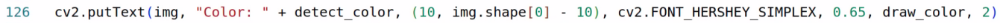

The parameters within the function brackets have the following meanings:

① The first parameter, `img`, represents the input image.

② The second parameter, `("Color: " + detect_color)`, specifies the content to be displayed.

③ The third parameter, `(10, img.shape[0] - 10)`, determines the display position.

④ The fourth parameter, `cv2.FONT_HERSHEY_SIMPLEX`, defines the font type.

⑤ The fifth parameter, `0.65`, indicates the font size.

⑥ The sixth parameter, `draw_color`, represents the font color.

⑦ The seventh parameter, `2`, signifies the font thickness.

## 7.3 Color Localization & Tracking

:::{Note}
*   Please ensure that objects with the same or similar color as the one being tracked are not present within the camera's field of view, as this may affect game.
*   During tracking, ensure that the color block does not move too quickly.
*   If color recognition accuracy is unsatisfactory, refer to [7.1 Color Threshold Adjustment](#anchor_7_1) for guidance on adjustments.

The object is tracked using images captured by a high-definition camera. When the target color block is positioned within the camera's field of view, the leg servos will adjust their position to mimic the movement of the target color block.
:::

### 7.3.1 Program Logic

The camera captures an RGB image, which is then resized and processed with Gaussian blur. The image's color space is converted from RGB to LAB (for more details on the LAB color space, refer to OpenCV Computer Vision Course->Image Processing---Color Space Conversion.

Next, the color thresholds set in [7.1 Color Threshold Adjustment](#anchor_7_1) are used to match the image. Once the colors are detected, a morphological opening operation is applied, and the detected colors are highlighted with circles.

Opening Operation: Erosion followed by dilation. This removes small objects, smooths shape boundaries, and preserves the object's area. It also eliminates small noise particles and separates connected objects.

Erosion: Reduces the boundary points of objects, causing the boundary to shrink inward, and removes objects smaller than the structuring element.

Dilation: Expands the boundary of objects, merging background points into the object and causing the boundary to expand outward.

Finally, the center of the color block is calculated based on the circle's position. The positional deviation between the color block's center and the image center is then determined. A PID algorithm is used to adjust the robot in real-time, allowing the gimbal servo to follow the movement of the color block.

### 7.3.2 Operation Steps

:::{Note}
The input command should be case sensitive, and keywords can be complemented using `Tab` key.
:::

(1) Start ROSPug robot dog, and access the robot system desktop using [NoMachine](Appendix.md).

(2) Click-on  to open the command-line terminal.

(3) Execute the following command, and hit `Enter` key to initiate the color tracking program.

```bash
rosrun pug_example color_tracking_demo.py
```

(4) If you need to terminate this program, use short-cut **'Ctrl+C'**. If the program cannot be stopped, please retry.

### 7.3.3 Program Outcome

After activating the mode, position the purple ball in front of the HD camera. The returned image will show the detected color of the target, and the robot dog will track and follow the target's vertical movements.

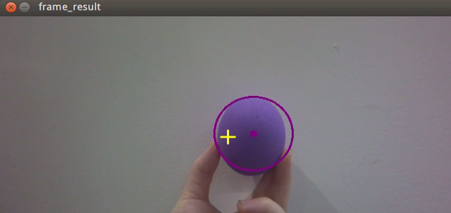

### 7.3.4 Code Analysis

The source code of this program is saved in :[/home/pug/src/pug_example/scripts/detect_and_track/color_tracking_demo.py](../_static/source_code/detect_and_track.zip)

* **Import Function Library**

{lineno-start=1}
```python
#!/usr/bin/env python3
# encoding: utf-8
import cv2
import math
import time
import rospy
import numpy as np
from pug_sdk import pid, common
from pug_control.msg import Pose
from sensor_msgs.msg import Image
from pug_control.srv import SetActionName
```

(1) `cv2`: OpenCV library used for image processing.

(2) `rospy`: ROS Python client library for node communication.

(3) `numpy`: Library for numerical computations.

(4) `pid & common`: Custom PID controller and utility functions.

(5) `Pose`, `Image`, `SetActionName`: ROS message and service types.

* **Global Variable Definition**

{lineno-start=13}

```python
size = (320, 180)
target_color = ''
color_range = None
pose_pub = None

y_dis = 0
y_pid = pid.PID(P=0.0003, I=0, D=0)
```
* **Color Mapping Table**

{lineno-start=21}
```python
range_rgb = {
    'red': (0, 0, 255),
    'blue': (255, 0, 0),
    'green': (0, 255, 0),
    'black': (0, 0, 0),
    'white': (255, 255, 255),
    'purple': (255, 0, 255),
} 
```

 Map color names to corresponding BGR values for visualization.

* **def run(img) Function**

This is the main processing function, which performs the following operations:

(1) Image Preprocessing

{lineno-start=55}
```python
    frame_resize = cv2.resize(img_copy, size, interpolation=cv2.INTER_NEAREST)
    frame_lab = cv2.cvtColor(frame_resize, cv2.COLOR_BGR2LAB) 
```

① Resize the image to improve processing efficiency.

② Convert the image to LAB color space, which is more suitable for color recognition.

(2) Color Recognition and Contour Extraction

{lineno-start=63}

```python
        frame_mask = cv2.inRange(frame_lab, tuple(target_color_range['min']), tuple(target_color_range['max']))  
        eroded = cv2.erode(frame_mask, cv2.getStructuringElement(cv2.MORPH_RECT, (3, 3))) 
        dilated = cv2.dilate(eroded, cv2.getStructuringElement(cv2.MORPH_RECT, (3, 3))) 
        contours = cv2.findContours(dilated, cv2.RETR_EXTERNAL, cv2.CHAIN_APPROX_NONE)[-2]  
        area_max_contour, area_max = getAreaMaxContour(contours)  
```

① Use a mask to extract regions of a specific color.

② Apply morphological operations (erosion and dilation) to reduce noise.

③ Detect and filter contours, selecting the largest one as the target.

(3) Target Localization and Feedback Control

{lineno-start=69}

```python
    if area_max > 100:  
        (center_x, center_y), radius = cv2.minEnclosingCircle(area_max_contour)  
        center_x = int(common.val_map(center_x, 0, size[0], 0, img_w))
        center_y = int(common.val_map(center_y, 0, size[1], 0, img_h))
        radius = int(common.val_map(radius, 0, size[0], 0, img_w))
        if radius > 100:
            return img
        cv2.circle(img, (int(center_x), int(center_y)), int(radius), range_rgb[target_color], 2)
        cv2.circle(img, (int(center_x), int(center_y)), 5, range_rgb[target_color], -1)
        
        y_pid.SetPoint = img_h / 2.0
        y_pid.update(center_y)
        y_dis += y_pid.output

        y_dis = np.radians(20) if y_dis > np.radians(20) else y_dis
        y_dis = np.radians(-20) if y_dis < np.radians(-20) else y_dis
        pose_pub.publish(0, y_dis, 0, -0.13, 0, 0, 0, 0)
```

① Determine the center coordinates of the target.

② Use a PID controller to calculate the pitch angle.

③ Publish posture commands to the robot control system.

* **Image Callback Function**

{lineno-start=98}

```python
if __name__ == '__main__':
    rospy.init_node('color_tracking_demo', log_level=rospy.INFO)
    pose_pub = rospy.Publisher('/pug_control/pose', Pose, queue_size=1)
    rospy.Subscriber('/csi_camera/image_rect_color', Image, image_callback)
    color_range = rospy.get_param('/lab_config_manager/color_range_list', {})
    run_action_group_srv = rospy.ServiceProxy('/pug_control/run_action_group', SetActionName)
    time.sleep(0.1)
    
    run_action_group_srv('stand')
    target_color = 'purple'
    
    try:
        rospy.spin()
    except KeyboardInterrupt:
        rospy.loginfo("Shutting down")
    finally:
        cv2.destroyAllWindows()
```

(1) Initialize the ROS node.

(2) Set the target color to purple.

(3) Start the service call and subscribe to the image topic.

(4) Enter the ROS main loop using rospy.spin().

## 7.4 KCF Target Tracking

:::{Note}
Make sure to keep the object within the camera's view, and avoid moving too quickly. If the object goes out of the camera's range, tracking will stop. To resume tracking, simply reselect the object.
:::

In this lesson, we will employ the KCF algorithm to use the mouse to frame the target. The ROSPug robot dog will then identify and frame the target, displaying its coordinates on the terminal.

### 7.4.1 Introduction to KCF

KCF (Kernel Correlation Filter) is an algorithm proposed by Joao F. Henriques, Rui Caseiro, Pedro Martins, and Jorge Batista in 2014. It is a discriminative tracking method that utilizes the cyclic matrix of the area surrounding the target to gather positive and negative samples. These samples are then used to train a target detector. This detector is employed to determine if the predicted position in the next frame matches the target. Based on this detection, the training set and consequently the object detector are updated.

### 7.4.2 Program Logic

First, build a tracker using OpenCV's KCF object tracking algorithm and subscribe to topic messages to receive the real-time camera feed.

Next, use a mouse callback function to select the tracking target in the returned image. The tracker will then provide the real-time position of the target, which is updated using a PID algorithm.

Finally, control the ROSPug to track the target vertically based on its position.

### 7.4.3 Operation Steps

:::{Note}
The input command should be case sensitive, and keywords can be complemented using `Tab` key.
:::

(1) Start the robot dog, and access the robot system desktop using [NoMachine](Appendix.md).

(2) Double-click  to open the command-line terminal.

(3) Execute the following command and hit `Enter` key to disable the auto-start service.

```bash
rosrun pug_example kcf_tracking.py
```

(4) If you need to terminate the program, use short-cut **'Ctrl+C'** to stop the program.

### 7.4.4 Program Outcome

After starting the game, position the target tracking object within the camera's field of view. Press **'s'** and use the left mouse button to select it on the screen. While selecting, the chosen area will be highlighted with a blue box. Release the left mouse button and press **'Space'** or **'Enter'** on the keyboard to confirm the selection; the box will turn green, indicating tracking can begin. If you need to reselect the tracking target, right-click the mouse on the screen to clear it, then repeat the selection process as described above.

### 7.4.5 Program Analysis

The source code is saved in : [/home/pug/src/pug_example/scripts/detect_and_track/kcf_tracking.py](../_static/source_code/detect_and_track.zip)

* **Initialize Configuration: init **

{lineno-start=16}
```python
    def __init__(self, name):
        rospy.init_node(name)
        self.name = name
        self.y_dis = 0
        self.y_pid = pid.PID(P=0.0005, I=0, D=0)

        self.image_queue = queue.Queue(maxsize=2)
        self.fps = FPS()
        signal.signal(signal.SIGINT, self.shutdown)
        self.running = True
        self.mouse_click = False
        self.selection = None  
        self.track_window = None  
        self.drag_start = None  
        self.start_circle = True
        self.start_click = False
        self.params = cv2.TrackerNano_Params()
        model_path = os.path.split(os.path.realpath(__file__))[0]
        self.params.backbone = os.path.join(model_path, 'nanotrack_backbone_sim.onnx')
        self.params.neckhead = os.path.join(model_path, 'nanotrack_head_sim.onnx')
        self.tracker = cv2.TrackerNano_create(self.params)

        cv2.namedWindow(name, 1)
        cv2.setMouseCallback(name, self.onmouse)

        self.image_sub = rospy.Subscriber("/csi_camera/image_rect_color", Image, self.image_callback, queue_size=1)
        self.pose_pub = rospy.Publisher('/pug_control/pose', Pose, queue_size=1)
        self.run_action_group_srv = rospy.ServiceProxy('/pug_control/run_action_group', SetActionName)
        time.sleep(0.2)
        self.run_action_group_srv('stand')
        self.run()
```

(1) Initialize the ROS node and related parameters (e.g., PID controller, image queue).

(2) Load the NanoTrack model file (in ONNX format) for object tracking.

(3) Create an image display window and bind a mouse event callback function.

(4) Subscribe to the image topic `/csi_camera/image_rect_color`.

(5) Publish posture information to `/pug_control/pose`.

(6) Call the service `/pug_control/run_action_group` to control the action group.

* **Image Callback Function: image_callback**

{lineno-start=52}

```python
    def image_callback(self, ros_image: Image):
        rgb_image = np.ndarray(shape=(ros_image.height, ros_image.width, 3), dtype=np.uint8,
                               buffer=ros_image.data)  
        if self.image_queue.full():

            self.image_queue.get()

        self.image_queue.put(rgb_image)
```

(1) Receives ROS image messages and places them into the image queue.

(2) Uses queue.Queue to buffer image data and prevent accumulation caused by processing delays.

* **Mouse Event Processing: onmouse**

{lineno-start=62}

```python
    def onmouse(self, event, x, y, flags, param):
        if event == cv2.EVENT_LBUTTONDOWN:  
            self.mouse_click = True
            self.drag_start = (x, y)  
            self.track_window = None
        if self.drag_start:  
            xmin = min(x, self.drag_start[0])
            ymin = min(y, self.drag_start[1])
            xmax = max(x, self.drag_start[0])
            ymax = max(y, self.drag_start[1])
            self.selection = (xmin, ymin, xmax, ymax)
        if event == cv2.EVENT_LBUTTONUP:  
            self.mouse_click = False
            self.drag_start = None
            self.track_window = self.selection
            self.selection = None
        if event == cv2.EVENT_RBUTTONDOWN:
            self.mouse_click = False
            self.selection = None  
            self.track_window = None  
            self.drag_start = None 
            self.start_circle = True
            self.start_click = False
            self.run_action_group_srv('stand')
            self.tracker = cv2.TrackerNano_create(self.params)
```

Allows the user to select the target area by drawing a box in the image window using the mouse.

* **Image Processing: image_proc**

{lineno-start=88}

```python
    def image_proc(self, image):
        if self.start_circle:
         
            if self.track_window: 
                cv2.rectangle(image, (self.track_window[0], self.track_window[1]),
                              (self.track_window[2], self.track_window[3]), (0, 0, 255), 2)
            elif self.selection: 
                cv2.rectangle(image, (self.selection[0], self.selection[1]), (self.selection[2], self.selection[3]),
                              (0, 0, 255), 2)
            if self.mouse_click:
                self.start_click = True
            if self.start_click:
                if not self.mouse_click:
                    self.start_circle = False
            if not self.start_circle:
                print('start tracking')
                bbox = (self.track_window[0], self.track_window[1], self.track_window[2] - self.track_window[0],
                        self.track_window[3] - self.track_window[1])
                self.tracker.init(image, bbox)
        else:
            ok, box = self.tracker.update(image)
            if ok and min(box) > 0:
                p1 = (int(box[0]), int(box[1]))
                p2 = (int(p1[0] + box[2]), int(p1[1] + box[3]))
                cv2.rectangle(image, p1, p2, (0, 255, 0), 2, 1)
                center_y = (p1[1] + p2[1]) / 2
                img_h, img_w = image.shape[:2]
                self.y_pid.SetPoint = img_h / 2.0

                self.y_pid.update(center_y)
                self.y_dis += self.y_pid.output

                self.y_dis = np.radians(20) if self.y_dis > np.radians(20) else self.y_dis
                self.y_dis = np.radians(-20) if self.y_dis < np.radians(-20) else self.y_dis

                self.pose_pub.publish(0, self.y_dis, 0, -0.13, 0, 0, 0, 0)
            else:
                # Tracking failure
                cv2.putText(image, "Tracking failure detected !", (10, 460), cv2.FONT_HERSHEY_SIMPLEX, 0.6,
                            (255, 255, 0), 1)
        self.fps.update()
        result_image = self.fps.show_fps(image)

        return result_image
```

(1) Display the currently selected target region.

(2) Use the KCF algorithm to track the target.

(3) If tracking is successful, calculate the target’s center position and adjust the robot’s posture using the PID controller.

(4) If tracking fails, display the message “Tracking failure detected!”

* **Main Loop: run**

{lineno-start=133}

```python
    def run(self):
        while self.running:
            image = self.image_queue.get(block=True)
            try:
                result_image = self.image_proc(np.copy(image))
            except BaseException as e:
                print(e)
                result_image = image
            cv2.imshow(self.name, cv2.cvtColor(result_image, cv2.COLOR_RGB2BGR))
            cv2.waitKey(1)
        self.run_action_group_srv('stand')
        rospy.signal_shutdown('shutdown')
```

(1) Continuously retrieve images from the image queue for processing and display the results.
(2) Listen for the SIGINT signal (Ctrl+C) to gracefully shut down the node and perform cleanup operations.

## 7.5 Autonomous Line Following

### 7.5.1 Program Logic

Line following is a common challenge in robot competitions. While traditional methods often rely on two or four-channel sensors, the ROSPug robot achieves autonomous line following using its visual module to detect line colors and process images.

The process begins with identifying the line color using the Lab color space. The image is converted from RGB to Lab and then processed with binarization, erosion, and dilation to isolate the contours of the target color, which are highlighted with rectangles.

Once the color is recognized, the robot uses image feedback to calculate the line's position. It then adjusts the ROSPug's movement to follow the line and displays the line coordinates on the terminal, enabling effective autonomous line-following.

### 7.5.2 Operation Steps

:::{Note}
The input command should be case and space sensitive.
:::

(1) Start the robot dog, and access the robot system desktop using [NoMachine](Appendix.md).

(2)  Double-click to open the command-line terminal.

(3) Execute the command to terminate the app auto-start service.

```bash
rosrun pug_example visual_patrol_demo.py
```

(4) If you need to terminate this game, press **'Ctrl+C'** on the terminal. If the program cannot be stopped, please retry.

### 7.5.3 Program Outcome

:::{Note}
The default detection color is black.
:::
Use black electrical tape to set a path, and put ROSPug on the black line. After initiating the game, the robot dog will move along the black line.

### 7.5.4 Function Extension

* **Change Followed Color**

By default, the line-following color is set to black. To change the line-following color to a different one, such as red, please follow these steps:

(1) Execute the command and hit `Enter` key to edit the autonomous line following program.

```bash
vim visual_patrol_demo.py
```

(2) Locate the code as indicated in red frame below.

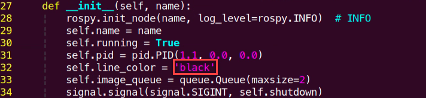

(3) Press **'i'** key to enter the editing mode, then change **'black'** to **'red'**. After modification, press **'Esc'** key, input **':wq'** and press `Enter` key to save and exit the editing.

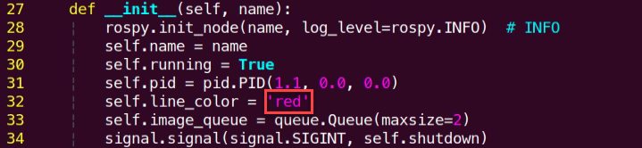

(4) Run the following command to initiate the game, and check the game effect.

```bash
rosrun pug_example visual_patrol_demo.py
```

### 7.5.5 Program Parameter Analysis

The source code of this program is saved in: [/home/hiwonder/pug/src/pug_example/scripts/almighty_functions/visual_patrol_demo.py](../_static/source_code/detect_and_track.zip)

* **Subscribe to a Publishing Topic**

{lineno-start=38}
```python
        self.image_sub = rospy.Subscriber("/csi_camera/image_rect_color", Image, self.image_callback, queue_size=1)
        self.pose_pub = rospy.Publisher('/pug_control/pose', Pose, queue_size=1)
        self.gait_pub = rospy.Publisher('/pug_control/gait', Gait, queue_size=1)
        self.cmd_vel_pub = rospy.Publisher('/cmd_vel', Twist, queue_size=10)
        self.run_action_group_srv = rospy.ServiceProxy('/pug_control/run_action_group', SetActionName)
        time.sleep(0.1)
        self.gait_pub.publish(0.2, 0.15, 0.0, 0.05)
        self.pose_pub.publish(0, math.radians(-18), 0, -0.13, 0, 0, 0, 0.5)
        self.run()
```

(1) Subscribe to the camera topic `/csi_camera/image_rect_color` to receive images.

(2) Publish pose messages to the topic `/pug_control/pose` and gait messages to the topic `/pug_control/gait`.

(3) Publish velocity messages to the topic `/cmd_vel`.

* **Image Processing**

The image is processed using OpenCV library functions to extract the contours of the color to be recognized. Then, the center point coordinates of the detected target are calculated.

{lineno-start=90}
```python
            for r in self.roi:
                roi_h = self.roi_h_list[n]
                blobs = frame_gb[r[0]:r[1], r[2]:r[3]]
                frame_lab = cv2.cvtColor(blobs, cv2.COLOR_BGR2LAB)  
                n += 1
                if self.line_color in self.lab_data:
                    frame_mask = cv2.inRange(frame_lab,
                                             (self.lab_data[self.line_color]['min'][0],
                                              self.lab_data[self.line_color]['min'][1],
                                              self.lab_data[self.line_color]['min'][2]),
                                             (self.lab_data[self.line_color]['max'][0],
                                              self.lab_data[self.line_color]['max'][1],
                                              self.lab_data[self.line_color]['max'][2]))  
                    opened = cv2.morphologyEx(frame_mask, cv2.MORPH_OPEN, np.ones((6, 6), np.uint8))  
                    closed = cv2.morphologyEx(opened, cv2.MORPH_CLOSE, np.ones((6, 6), np.uint8))   
                    contours = cv2.findContours(closed, cv2.RETR_EXTERNAL, cv2.CHAIN_APPROX_TC89_L1)[-2]   
                    max_contours = self.getAreaMaxContour(contours)[0]   
    
                    if max_contours is not None:   
                        rect = cv2.minAreaRect(max_contours)   
                        box = np.int0(cv2.boxPoints(rect))   
                        for i in range(4):
                            box[i, 1] = int(box[i, 1] + (n - 1) * roi_h + self.roi[0][0])
                        cv2.drawContours(image, [box], -1, (0, 0, 255, 255), 2)   
                        
                        pt1_x, pt1_y = box[0, 0], box[0, 1]
                        pt3_x, pt3_y = box[2, 0], box[2, 1]
    
                        center_x, center_y = (pt1_x + pt3_x) / 2, (pt1_y + pt3_y) / 2   
                        cv2.circle(image, (int(center_x), int(center_y)), 5, (0, 0, 255), -1)   
                        center_.append([center_x, center_y])
                        
                        centroid_x_sum += center_x * r[4]
                        weight_sum += r[4]
```

* **Movement Control**

Calculate the forward and turning speeds based on the center point coordinates, then publish velocity messages to control the movement of the machine.

{lineno-start=}
```python
            twist = Twist()
            twist.linear.x = 0.15
            if weight_sum is not 0:
                
                line_centerx = int(centroid_x_sum / weight_sum)
                deflection_angle = -math.atan((line_centerx - (img_w / 2.0)) / (img_h / 2.0))/2 
                # print(deflection_angle)
                # self.pid.SetPoint = 0.138
                self.pid.update(deflection_angle)
                twist.angular.z = common.set_range(-self.pid.output, -1.0, 1.0)
                self.cmd_vel_pub.publish(twist)
```

## 7.6 Autonomous Ball Shooting

### 7.6.1 Program Logic

Initialize the robot dog object, load the color threshold configuration file, define basic postures such as standing and bending, as well as gait parameters. Control the robot dog's movement in a thread, adjusting its advancement based on the recognized position of color blocks to move left and right.

Next, the main thread continuously loops to capture images, recognizing color blocks within the images, and passing them to the motion control thread. The camera captures the image, adjusts it to a suitable resolution, converts it to the LAB color space for color threshold segmentation, and identifies the contour with the largest area as the target. The center coordinates of its minimum circumscribed circle are obtained.

Finally, the robot dog moves towards the target position. Upon reaching the target, it transitions to the hitting state, adjusts its position as necessary, performs the hitting action, then transitions to the end state and exits the program. Key functions and classes utilized include Camera, color threshold processing, contour detection, and more. The primary objective is to control the robot dog's movement through color recognition to accomplish a simple ball delivery task. Colors, motion control logic, etc. can be customized as needed.

### 7.6.2 Operation Steps

:::{Note}
The input command should be case and space sensitive.
:::

(1) Start the robot dog, and access the robot system desktop using [NoMachine](Appendix.md).

(2)  Double-click to open the command-line terminal.

(3) Execute the command below to terminate the app auto-start service.

```bash
rosrun pug_example kick_ball_demo.py
```

(4) If you need to terminate this game, press **'Ctrl+C'** on the terminal. If the program cannot be stopped, please retry.

### 7.6.3 Program Outcome

:::{Note}
The default detection color is purple.
:::

Place the required balls on the field and position the ROSPug robot dog on the field, ensuring that the balls are within the camera's field of view. The distance between the balls and the robot should not exceed 1 meter.

### 7.6.4 Function Extension

* **Change Followed Color**

By default, the system recognizes the ball color as purple. If you need to change the recognized color, for example to red, please follow these steps:

(1) Execute the command `vim kick_ball_demo.py` and hit `Enter` key to edit the ball shooting program.

```bash
vim kick_ball_demo.py
```

(2) Locate the code as indicated in red frame below.

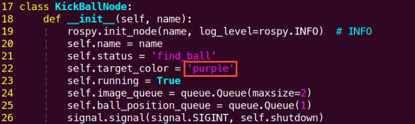

(3) Press the **"i"** key to enter editing mode, then change **"purple"** to **"red"**. Once the modification is complete, press the **"Esc"** key. Next, enter **":wq"** and press `Enter` to save and exit.

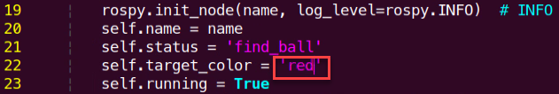

(4) To initiate the independent kicking game, enter the following command. You can restart the game to view the updated effects.

```bash
rosrun pug_example kick_ball_demo.py
```

### 7.6.5 Program Parameter Analysis

The source code of this program is saved in:[/home/hiwonder/pug/src/pug_example/scripts/almighty_functions/kick_ball_demo.py](../_static/source_code/detect_and_track.zip)

* **Subscribe to Publishing Topic**

{lineno-start=30}
```python
        self.image_sub = rospy.Subscriber("/csi_camera/image_rect_color", Image, self.image_callback, queue_size=1)
        self.pose_pub = rospy.Publisher('/pug_control/pose', Pose, queue_size=1)
        self.gait_pub = rospy.Publisher('/pug_control/gait', Gait, queue_size=1)
        self.velocity_pub = rospy.Publisher('/pug_control/velocity_move', Velocity, queue_size=1)
        self.run_action_group_srv = rospy.ServiceProxy('/pug_control/run_action_group', SetActionName)
        time.sleep(0.1)
```

(1) Subscribe to the camera topic `/csi_camera/image_rect_color` to receive images.

(2) Publish pose messages to the topic `/pug_control/pose` and gait messages to the topic `/pug_control/gait`.

* **Ball Recognition**

Run image processing in the main thread to obtain the ball's coordinate information and print it to the terminal. Then, use the ball's center coordinates to control the robot dog to track the ball, as shown in the figure below:

{lineno-start=111}
```python
     
    def run(self):
        while self.running:
            image = self.image_queue.get(block=True)

            if self.status == 'find_ball' or self.status == 'kick_ball':   
                GaussianBlur_img = cv2.GaussianBlur(image, (3, 3), 3)  
                frame_lab = cv2.cvtColor(GaussianBlur_img, cv2.COLOR_BGR2LAB)  
                frame_mask = cv2.inRange(frame_lab,
                                         (self.lab_data[self.target_color]['min'][0],
                                          self.lab_data[self.target_color]['min'][1],
                                          self.lab_data[self.target_color]['min'][2]),
                                         (self.lab_data[self.target_color]['max'][0],
                                          self.lab_data[self.target_color]['max'][1],
                                          self.lab_data[self.target_color]['max'][2]))   
                eroded = cv2.erode(frame_mask, cv2.getStructuringElement(cv2.MORPH_RECT, (3, 3)))   
                dilated = cv2.dilate(eroded, cv2.getStructuringElement(cv2.MORPH_RECT, (3, 3)))  
                contours = cv2.findContours(dilated, cv2.RETR_EXTERNAL, cv2.CHAIN_APPROX_NONE)[-2]   
                areaMax_contour = self.getAreaMaxContour(contours)[0]   

                if self.ball_position_queue.full():
                    self.ball_position_queue.get()
                if areaMax_contour is not None:
                    ball = cv2.minEnclosingCircle(areaMax_contour)   
                    ball_centerx = int(ball[0][0])
                    ball_centery = int(ball[0][1])
                    # print(ball_centerx, ball_centery, ball[1])
                    self.ball_position_queue.put([ball_centerx, ball_centery])
                    cv2.circle(image, (ball_centerx, ball_centery), int(ball[1]), (0, 255, 0), 2)
                    cv2.circle(image, (ball_centerx, ball_centery), 5, (0, 255, 0), -1)
                else:
                    self.ball_position_queue.put([-1, -1])
            cv2.imshow(self.name, image)
            cv2.waitKey(1)
        self.run_action_group_srv('stand')
        rospy.signal_shutdown('shutdown')
```

* **Ball Shooting Control**

{lineno-start=71}
```python
    def action_thread(self):
        while self.running:
            ball_position = self.ball_position_queue.get(block=True)
            if ball_position[0] != -1:
                ball_center_x, ball_center_y = ball_position[0], ball_position[1]
                # print(ball_center_x, ball_center_y)
                if self.status == 'find_ball':   
                    if ball_center_y < 250 and 200 < ball_center_x < 600: 
                        self.velocity_pub.publish(0.1, 0, 0, False)
                        time.sleep(0.5)
                    elif ball_center_y < 300 and 200 < ball_center_x < 600:  
                        self.velocity_pub.publish(0.05, 0, 0, False)
                        time.sleep(0.5)
                    elif ball_center_x > 600:   
                        self.velocity_pub.publish(0.01, 0, math.radians(-10), False)
                    elif ball_center_x < 540:   
                        self.velocity_pub.publish(0.01, 0, math.radians(10), False)
                    else:
                        self.status = 'kick_ball'
                elif self.status == 'kick_ball' :
                    if ball_center_y < 330:  
                        self.velocity_pub.publish(0.05, 0, 0, False)
                        time.sleep(0.5)
                    elif ball_center_x > 600:   
                        self.velocity_pub.publish(0.0, 0, math.radians(-10), False)
                    elif ball_center_x < 540:  
                        self.velocity_pub.publish(0.0, 0, math.radians(10), False)
                    else:
                        self.velocity_pub.publish(0.08, 0, 0, False)  
                        time.sleep(0.8)
                        self.velocity_pub.publish(0, 0, 0, True) 
                        time.sleep(0.5)
                        self.run_action_group_srv('stand')
                        self.run_action_group_srv('kick_ball_right')
                        self.status = 'End'
                elif self.status == 'End':   
                    time.sleep(0.01)
            else:
                time.sleep(0.01)
```

Run the robot's movement functions using multithreading. Once the ball's coordinates are obtained, control the robot's movement to approach and align with the ball for kicking. When the robot is correctly positioned, execute the kicking action sequence.