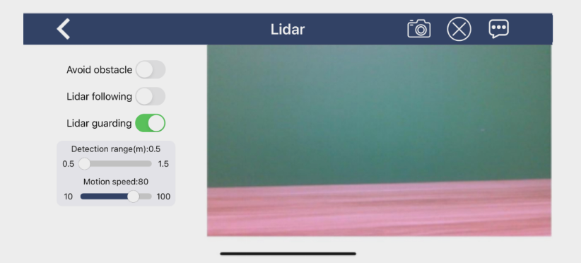

# 8. Lidar Course

## 8.1 Lidar Introduction

### 8.1.1 Product Introduction

Lidar (Light Detection and Ranging) is a remote sensing technology that uses laser beams to detect target features such as position and velocity. It offers several advantages, including high measurement accuracy, strong penetration capability, resistance to interference, and the ability to detect stealth objects.

Lidar systems can be classified into three types based on their measurement principles: triangulation lidar, pulsed lidar, and coherent lidar. The lidar used on the ROSPug robot dog is a pulsed lidar.


### 8.1.2 Working Principle

A lidar system is composed of a laser emission system, a scanning system, a laser receiving system, and a signal processing unit.

First, the laser emission system directs laser beams toward the target, while the scanning system sweeps the area to gather spatial information.

Next, the laser receiving system captures the reflected laser signals from the target.

Finally, the signal processing unit analyzes the incoming signals to extract the target's surface features and physical properties, such as position, height, and speed, which are then used to generate a 3D model of the object.

### 8.1.3 Specification

* **Electrical Parameters**

| **Parameter** | **Minimum value** | **Classic value** | **Maximum value** | **Note** |
|:--:|:--:|:--:|:--:|:--:|
| Operating voltage | 4.5V | 5.0V | 5.5V | DC power supply |
| Voltage ripple | - | - | 100mV | |
| Starting current | - | - | 400mA | |
| Operating current | 180mA | 230mA | 280mA | |
| Operating temperature | -10℃ | 25℃ | 50℃ | |
| Storage temperature | 20℃ | 25℃ | 70℃ | |
| Operating humidity | 0 | 30% | 80% | Non - condensing |

* **Technical Specifications**

| **Model** | **MS200** |
|:--:|:--:|
| Type | Close-range detection |
| Ranging principle | TOF ranging (support indoor and outdoor application) |
| Scanning angle | 360° |
| Angle resolution | 0.8° |
| Ranging frequency | 4500 times/S |
| Scanning frequency | 7-15Hz |
| Size | 37.7\*37.5\*33mm |
| Weight | 40g |
| Measuring precision | 3m~12m: +/-20mm |
| Light source | 905nm laser |
| Ranging radius | White object: 13.4; Black object: 13.4m |
| Minimum measurement distance | 0.1m |
| Anti-ambient light intensity | 30KLux |
| Power supply | DC5V±0.5V |
| Temperature requirement | Operation: -10°~50° Storage: -30°~70° |
| Driving method | Built-in brushless motor |
| Windows support | Provide Windows PC software |
| ROS support | ROS1/ROS2 |
| Communication port | Standard asynchronous serial port（UART） |

* **Interface Description and Communication Protocol**

The MS200 connects to external systems via a ZH1.5T-4P 1.5mm connector, providing both power supply and data transmission. For detailed interface definitions and parameter specifications, please refer to the table below.


| **Pin** | **Signal** | **Attribute** | **Description** |
|:-------:|:----------:|:-----------------------------:|:-----------------------:|
| 1 | Tx | Serial data transmission | Tx（Transmit，0V~3.3V） |
| 2 | Rx | Serial data reception | Rx |
| 3 | GND | Input power positive terminal | GND |
| 4 | VCC | Input power negative terminal | DC 5V（4.5V~5.5V） |

## 8.2 Lidar Ranging Principle

### 8.2.1 Lidar Ranging

Lidar can range the distance in two ways, including triangulation ranging and TOF.

The working principle of TOF is as pictured. Firstly, Lidar will cast the light on the object, and the object will reflect the light on the Lidar. Then Lidar will calculate the time taken for light to return, and multiply the time times the speed of light to get the distance between object and it.


Triangulation ranging is as the picture shown. During Lidar production, its angle of light casting on the object will be adjusted to let the light not directly hit on the object, but at a certain angle. This angle is set in advance and will not change during operation. And we can calculate the distance from the object to the Lidar by substituting this angle into the trigonometric function.


## 8.3 Lidar Obstacle Avoidance

### 8.3.1 Program Logic

The robot dog measures the distance between objects directly in front of it and its own body. If the distance exceeds 35 cm, it will follow the object; if it is less than 35 cm, it will reverse. The robot dog automatically stops when it detects a distance of exactly 35 cm in front. This program integrates an obstacle avoidance and tracking control node using lidar, and includes the following features:

*   Obstacle Avoidance Mode: When an obstacle is detected ahead, the robot dog will rotate in the opposite direction by a specified angle and then proceed forward.

*   Tracking Mode: Upon detecting a target, the robot dog will move towards it and use a PID controller to adjust its angular velocity to keep aligned with the target.

*   Lidar Data Subscription: The program subscribes to lidar scan data and processes it as point cloud data.

*   Service Interface: Provides an interface for changing operating modes and parameters.

*   Heartbeat Detection: Monitors for heartbeat signals to manage node termination.

This program allows the robot dog to use lidar data to sense its environment and execute obstacle avoidance or tracking maneuvers. Obstacle avoidance is based on detecting obstacles within a certain range in front of the robot, while tracking involves identifying and moving towards the nearest target. Adjustable parameters allow for customized behavior.

### 8.3.2 Enable Lidar Games Through App

To access the detailed instructions about the app connection, please refer to the file locating in [2. Quick User Experience->2.1 App Installation & Connection](2.Quick_User_Exprience.md#app-installation--connection).

* **Open the App**

(1) Open **WonderROS** app, and connect the robot dog to the app.

(2) Click-on **Lidar** icon on mode selection interface to enter the game interface.


* **Lidar Obstacle Avoidance**

(1) Switch on **'Avoid obstacle'** button to initiate this game.


(2) The robot dog will walk straight to detect the obstacle. When detecting the obstacle, the robot dog will turn automatically to avoid the obstacle.


### 8.3.3 Enable Lidar Games Through Command

(1) Start the ROSPug robot dog and access the robot system desktop using NoMachine.

(2) Click on  to open the command line terminal.

(3) Enter the following command and press Enter to access the lidar application:

```
rosservice call /lidar_app/enter "{}"
```

(4) Enter the following command and press Enter to activate the Lidar obstacle avoidance mode:

```
rosservice call /lidar_app/set_running "data: 1"
```

(5) To exit the lidar application, enter the following command in the terminal:

```
rosservice call /lidar_app/exit "{}"
```

After completing your lidar application experience, you can either use the command or restart the robot dog to enable the mobile app service. If the mobile app service is not enabled, app-related features will be inactive. (Restarting the robot dog will automatically enable the mobile app service.)

### 8.3.4 Program Analysis

The source code for this program can be found at: [/home/hiwonder/pug/src/pug_app/scripts/lidar_app.py](../_static/source_code/pug_app.zip)

You can start this feature in two ways: either through the mobile app or by using commands after remotely connecting to the system.

* **Import necessary Python libraries and ROS modules**

For example, `math`, `time`, `rospy`, and message types such as `Twist` and `LaserScan`. Define constants such as the node name and maximum scan angle.

{lineno-start=1}
```python
#!/usr/bin/env python3
# encoding: utf-8
import math
import time
import rospy
import numpy as np
from threading import RLock
from pug_app.common import Heart
from geometry_msgs.msg import Twist
from sensor_msgs.msg import LaserScan
import sensor_msgs.point_cloud2 as pc2
from laser_geometry import LaserProjection
from std_srvs.srv import Empty, Trigger, TriggerRequest, TriggerResponse
from pug_control.srv import SetInt64, SetInt64Request, SetInt64Response
from pug_control.srv import SetFloat64List, SetFloat64ListRequest, SetFloat64ListResponse

MAX_SCAN_ANGLE = 360 
```

* **Define auxiliary functions**

(1) `reset_value()`: Resets variables when exiting the node.

(2) `enter_func()` and `exit_func()`: Callback functions for the enter/exit services.

(3) `heartbeat_srv_cb()`: Handles the heartbeat service.

{lineno-start=46}
```python
    def reset_value(self):
        with self.lock:
            self.running_mode = 0
            self.threshold = 0.8
            self.speed = 0.12
            self.scan_angle = math.radians(90)

    def enter_func(self, msg):
        rospy.loginfo("lidar enter")
        self.reset_value()
        rospy.ServiceProxy('/pug_control/go_home', Empty)()
        with self.lock:
            self.lidar_sub = rospy.Subscriber('/scan', LaserScan, self.lidar_callback)
        return TriggerResponse(success=True)

    def exit_func(self, msg):
        rospy.loginfo('lidar exit')
        with self.lock:
            try:
                if self.lidar_sub is not None:
                    rospy.loginfo('lidar unregister')
                    self.lidar_sub.unregister()
                    self.lidar_sub = None
            except Exception as e:
                rospy.logerr(str(e))
            if isinstance(msg, TriggerRequest):
                self.heart.stop()
                self.velocity_pub.publish(Twist())
        return TriggerResponse(success=True)


    def set_running_srv_callback(self, req):
        rsp = SetInt64Response(success=True)
        new_running_mode = req.data
        rospy.loginfo("set_running " + str(new_running_mode))
        if not 0 <= new_running_mode <= 3:
            rsp.success = False
            rsp.message = "Invalid running mode {}".format(new_running_mode)
        else:
            self.running_mode = new_running_mode
        self.velocity_pub.publish(Twist())
        return rsp
```

* **Define the LidarController class**

(1) Constructor: Initializes the ROS node, publishers, subscribers, etc.

{lineno-start=19}
```python
class LidarController:
    def __init__(self, name):
        rospy.init_node(name, anonymous=True)
        self.name = name
        self.running_mode = 0 
        self.threshold = 0.2 
        self.scan_angle = math.radians(90)  
        self.speed = 0.12 
        self.timestamp = 0
        self.lock = RLock()
        self.lidar_sub = None
        self.laser_projection = LaserProjection()
        self.velocity_pub = rospy.Publisher('/cmd_vel', Twist, queue_size=1)

```

(2) `lidar_callback()`: Processes raw lidar data to detect obstacles and uses a PID controller for obstacle avoidance

{lineno-start=110}
```python
    def lidar_callback(self, lidar_data):
        cloud = self.laser_projection.projectLaser(lidar_data)
        points = np.array(list(pc2.read_points(cloud, skip_nans=True)), dtype=np.float32)

        twist = Twist()
        with self.lock:
            
            if self.running_mode == 1 and self.timestamp <= time.time():
                
                points = filter(lambda p: abs(p[1]) < 0.2, points)
                
                points = filter(lambda p: p[0] <= self.threshold, points)
                
                points = filter(lambda p: abs(math.atan2(p[1], p[0])) < self.scan_angle / 2, points)
               
                points = list(points)
```
(3) `set_running_srv_callback()`: Service callback function for setting the operation mode.

{lineno-start=77}
```python
    def set_running_srv_callback(self, req):
        rsp = SetInt64Response(success=True)
        new_running_mode = req.data
        rospy.loginfo("set_running " + str(new_running_mode))
        if not 0 <= new_running_mode <= 3:
            rsp.success = False
            rsp.message = "Invalid running mode {}".format(new_running_mode)
        else:
            self.running_mode = new_running_mode
        self.velocity_pub.publish(Twist())
        return rsp
```

(4) `set_parameters_srv_callback()`: Service callback function for setting parameters such as speed and thresholds.

{lineno-start=90}
```python
    def set_parameters_srv_callback(self, req):
        rsp = SetFloat64ListResponse(success=True)
        new_parameters = req.data
        new_threshold, new_scan_angle, new_speed = new_parameters
        rospy.loginfo("n_t:{:2f}, n_a:{:2f}, n_s:{:2f}".format(new_threshold, new_scan_angle, new_speed))
        if not 0.3 <= new_threshold <= 1.5:
            rsp.success = False
            rsp.message = "New threshold ({:.2f}) is out of range (0.3 ~ 1.5)".format(new_threshold)
            return rsp
        if not new_speed > 0:
            rsp.success = False
            rsp.message = "Invalid speed"
            return rsp

        with self.lock:
            self.threshold = new_threshold
            self.speed = new_speed * 0.002

        return rsp

```

* **In the main program**

In the main program (`if __name__ == "__main__":`)

(1) Create an instance of `LidarController`

(2) Set up the enter/exit services and heartbeat service

(3) Configure services for setting the operation mode and parameters

(4) Run the ROS node to handle callback functions

{lineno-start=189}
```python
if __name__ == "__main__":
    LidarController('lidar_app')
```

## 8.4 Lidar Following

### 8.4.1 Program Logic

The robot dog measures the distance between objects directly in front of it and its own body. If the distance exceeds 35 cm, it will follow the object; if it is less than 35 cm, it will reverse. The robot dog automatically stops when it detects a distance of exactly 35 cm in front. This program integrates an obstacle avoidance and tracking control node using lidar, and includes the following features:

*   Obstacle Avoidance Mode: When an obstacle is detected ahead, the robot dog will rotate in the opposite direction by a specified angle and then proceed forward.

*   Tracking Mode: Upon detecting a target, the robot dog will move towards it and use a PID controller to adjust its angular velocity to keep aligned with the target.

*   Lidar Data Subscription: The program subscribes to lidar scan data and processes it as point cloud data.

*   Service Interface: Provides an interface for changing operating modes and parameters.

*   Heartbeat Detection: Monitors for heartbeat signals to manage node termination.

This program allows the robot dog to use lidar data to sense its environment and execute obstacle avoidance or tracking maneuvers. Obstacle avoidance is based on detecting obstacles within a certain range in front of the robot, while tracking involves identifying and moving towards the nearest target. Adjustable parameters allow for customized behavior.

### 8.4.2 Enable Lidar Games Through App

To access the detailed instructions about the app connection, please refer to the file locating in [2. Quick User Experience->2.1 App Installation & Connection](2.Quick_User_Exprience.md#app-installation--connection).

* **Open the App**

(1) Open **WonderROS** app, and connect the robot dog to the app.

(2) Click-on **Lidar** icon on mode selection interface to enter the game interface.


* **Lidar Following**

(1) Activate **'Lidar following'** button to start the game.


(2) When an obstacle is detected, the robot dog will adjust its position to maintain a distance of approximately 0.35 meters from the obstacle.


### 8.4.3 Enable Lidar Games Through Command

(1) Start the robot dog ROSPug, and access the robot system desktop using NoMachine.

(2) Click-on  to start the command-line terminal.

(3) Execute the command to initiate the Lidar game.

```
rosservice call /lidar_app/enter "{}"
```

(4) Run the following command to start the Lidar following game.

```
rosservice call /lidar_app/set_running "data: 2"
```

(5) If you need to terminate the game, input the command below:

```
rosservice call /lidar_app/exit "{}"
```

After completing your lidar application experience, you can either use the command or restart the robot dog to enable the mobile app service. If the mobile app service is not enabled, app-related features will be inactive. (Restarting the robot dog will automatically enable the mobile app service.)

### 8.4.4 Program Analysis

The source code for this program is located at [/home/hiwonder/pug/src/pug_app/scripts/lidar_app.py](../_static/source_code/pug_app.zip).

You can activate this feature in two ways: through the mobile app or by issuing commands after connecting to the system remotely.

* **Import necessary Python libraries and ROS modules**

Import the necessary Python libraries and ROS modules, such as `math`, `time`, `rospy`, and message types like `Twist` and `LaserScan`. Also, define constants such as the node name and maximum scan angle.

{lineno-start=1}
```python
#!/usr/bin/env python3
# encoding: utf-8
import math
import time
import rospy
import numpy as np
from threading import RLock
from pug_app.common import Heart
from geometry_msgs.msg import Twist
from sensor_msgs.msg import LaserScan
import sensor_msgs.point_cloud2 as pc2
from laser_geometry import LaserProjection
from std_srvs.srv import Empty, Trigger, TriggerRequest, TriggerResponse
from pug_control.srv import SetInt64, SetInt64Request, SetInt64Response
from pug_control.srv import SetFloat64List, SetFloat64ListRequest, SetFloat64ListResponse

MAX_SCAN_ANGLE = 360
```

* **Define auxiliary functions**

Define auxiliary functions:

(1) `reset_value()`: Resets variables when exiting the node.

(2) `enter_func()` and `exit_func()`: Callback functions for the enter/exit services.

(3) `heartbeat_srv_cb()`: Handles the heartbeat service.

{lineno-start=46}

```python
    def reset_value(self):
        with self.lock:
            self.running_mode = 0
            self.threshold = 0.8
            self.speed = 0.12
            self.scan_angle = math.radians(90)

    def enter_func(self, msg):
        rospy.loginfo("lidar enter")
        self.reset_value()
        rospy.ServiceProxy('/pug_control/go_home', Empty)()
        with self.lock:
            self.lidar_sub = rospy.Subscriber('/scan', LaserScan, self.lidar_callback)
        return TriggerResponse(success=True)

    def exit_func(self, msg):
        rospy.loginfo('lidar exit')
        with self.lock:
            try:
                if self.lidar_sub is not None:
                    rospy.loginfo('lidar unregister')
                    self.lidar_sub.unregister()
                    self.lidar_sub = None
            except Exception as e:
                rospy.logerr(str(e))
            if isinstance(msg, TriggerRequest):
                self.heart.stop()
                self.velocity_pub.publish(Twist())
        return TriggerResponse(success=True)
```

* **Define the LidarController class**

Define the `LidarController` class

(1) Constructor: Initializes the ROS node, publishers, subscribers, etc.

{lineno-start=19}
```python
class LidarController:
    def __init__(self, name):
        rospy.init_node(name, anonymous=True)
        self.name = name
        self.running_mode = 0 
        self.threshold = 0.2 # meters  距离阈值
        self.scan_angle = math.radians(90)  # radians  向前的扫描角度
        self.speed = 0.12 # 单位米，避障模式的速度
        self.timestamp = 0
        self.lock = RLock()
        self.lidar_sub = None
        self.laser_projection = LaserProjection()
        self.velocity_pub = rospy.Publisher('/cmd_vel', Twist, queue_size=1)
```

(2) `lidar_callback()`: Processes raw lidar data to detect obstacles and uses a PID controller for obstacle avoidance

{lineno-start=110}
```python
    def lidar_callback(self, lidar_data):
        cloud = self.laser_projection.projectLaser(lidar_data) 
        points = np.array(list(pc2.read_points(cloud, skip_nans=True)), dtype=np.float32) 

        twist = Twist()
        with self.lock:
           
            if self.running_mode == 1 and self.timestamp <= time.time():
                
                points = filter(lambda p: abs(p[1]) < 0.2, points)
                
                points = filter(lambda p: p[0] <= self.threshold, points)
               
                points = filter(lambda p: abs(math.atan2(p[1], p[0])) < self.scan_angle / 2, points)
             
                points = list(points)

```

(3) `set_running_srv_callback()`: Service callback function for setting the operation mode.

{lineno-start=77}
```python
    def set_running_srv_callback(self, req):
        rsp = SetInt64Response(success=True)
        new_running_mode = req.data
        rospy.loginfo("set_running " + str(new_running_mode))
        if not 0 <= new_running_mode <= 3:
            rsp.success = False
            rsp.message = "Invalid running mode {}".format(new_running_mode)
        else:
            self.running_mode = new_running_mode
        self.velocity_pub.publish(Twist())
        return rsp
```

(4) `set_parameters_srv_callback()`: Service callback function for setting parameters such as speed and thresholds

{lineno-start=90}
```python
    def set_parameters_srv_callback(self, req):
        rsp = SetFloat64ListResponse(success=True)
        new_parameters = req.data
        new_threshold, new_scan_angle, new_speed = new_parameters
        rospy.loginfo("n_t:{:2f}, n_a:{:2f}, n_s:{:2f}".format(new_threshold, new_scan_angle, new_speed))
        if not 0.3 <= new_threshold <= 1.5:
            rsp.success = False
            rsp.message = "New threshold ({:.2f}) is out of range (0.3 ~ 1.5)".format(new_threshold)
            return rsp
        if not new_speed > 0:
            rsp.success = False
            rsp.message = "Invalid speed"
            return rsp

        with self.lock:
            self.threshold = new_threshold
            self.speed = new_speed * 0.002

        return rsp
```

* **In the main program**

In the main program (`if __name__ == "__main__":`)

(1) Create an instance of `LidarController`

(2) Set up the enter/exit services and heartbeat service

(3) Configure services for setting the operation mode and parameters

(4) Run the ROS node to handle callback functions

{lineno-start=189}
```python
if __name__ == "__main__":
    LidarController('lidar_app')
```

## 8.5 Lidar Guarding

### 8.5.1 Program Logic

The robot dog measures the distance between objects directly in front of it and its own body. If the distance exceeds 35 cm, it will follow the object; if it is less than 35 cm, it will reverse. The robot dog automatically stops when it detects a distance of exactly 35 cm in front. This program integrates an obstacle avoidance and tracking control node using lidar, and includes the following features:

*   Obstacle Avoidance Mode: When an obstacle is detected ahead, the robot dog will rotate in the opposite direction by a specified angle and then proceed forward.

*   Tracking Mode: Upon detecting a target, the robot dog will move towards it and use a PID controller to adjust its angular velocity to keep aligned with the target.

*   Lidar Data Subscription: The program subscribes to lidar scan data and processes it as point cloud data.

*   Service Interface: Provides an interface for changing operating modes and parameters.

*   Heartbeat Detection: Monitors for heartbeat signals to manage node termination.

This program allows the robot dog to use lidar data to sense its environment and execute obstacle avoidance or tracking maneuvers. Obstacle avoidance is based on detecting obstacles within a certain range in front of the robot, while tracking involves identifying and moving towards the nearest target. Adjustable parameters allow for customized behavior.

### 8.5.2 Enable Lidar Games Through App

To access the detailed instructions about the app connection, please refer to the file locating in [2. Quick User Experience->2.1 App Installation & Connection](2.Quick_User_Exprience.md#app-installation--connection).

* **Open the App**

(1) Open **WonderROS** app, and connect the robot dog to the app.

(2) Click-on **Lidar** icon on mode selection interface to enter the game interface.


* **Lidar Guarding**

(1) Activate the Lidar Guarding icon to start the game.



(2) When an obstacle is detected, the robot dog will adjust its orientation to face the obstacle, ensuring that the camera is directed at it.


### 8.5.3 Enable Lidar Games Through Command

* **Start Lidar Service**

(1) Start the robot dog ROSPug, and access the robot system desktop using NoMachine.

(2) Click-on  to start the command-line terminal.

(3) Execute the command to initiate the Lidar game.

```
rosservice call /lidar_app/enter "{}"
```

(4) Run the following command to start the Lidar guarding game.

```
rosservice call /lidar_app/set_running "data: 3"
```

(5) If you need to terminate the game, input the command below:

```
rosservice call /lidar_app/exit "{}"
```

After completing your lidar application experience, you can either use the command or restart the robot dog to enable the mobile app service. If the mobile app service is not enabled, app-related features will be inactive. (Restarting the robot dog will automatically enable the mobile app service.)

### 8.5.4 Program Analysis

The source code for this program is located at [/home/hiwonder/pug/src/pug_app/scripts/lidar_app.py](../_static/source_code/pug_app.zip).

You can activate this feature in two ways: through the mobile app or by issuing commands after connecting to the system remotely.

* **Import necessary Python libraries and ROS modules**

Import the necessary Python libraries and ROS modules, such as `math`, `time`, `rospy`, and message types like `Twist` and `LaserScan`. Also, define constants such as the node name and maximum scan angle.

{lineno-start=1}
```python
import math
import time
import rospy
import numpy as np
from threading import RLock
from pug_app.common import Heart
from geometry_msgs.msg import Twist
from sensor_msgs.msg import LaserScan
import sensor_msgs.point_cloud2 as pc2
from laser_geometry import LaserProjection
from std_srvs.srv import Empty, Trigger, TriggerRequest, TriggerResponse
from pug_control.srv import SetInt64, SetInt64Request, SetInt64Response
from pug_control.srv import SetFloat64List, SetFloat64ListRequest, SetFloat64ListResponse

MAX_SCAN_ANGLE = 360 
```

* **Define auxiliary functions**

Define auxiliary functions:

(1) `reset_value()`: Resets variables when exiting the node.

(2) `enter_func()` and `exit_func()`: Callback functions for the enter/exit services.

(3) `heartbeat_srv_cb()`: Handles the heartbeat service.

{lineno-start=46}
```python
    def reset_value(self):
        with self.lock:
            self.running_mode = 0
            self.threshold = 0.8
            self.speed = 0.12
            self.scan_angle = math.radians(90)

    def enter_func(self, msg):
        rospy.loginfo("lidar enter")
        self.reset_value()
        rospy.ServiceProxy('/pug_control/go_home', Empty)()
        with self.lock:
            self.lidar_sub = rospy.Subscriber('/scan', LaserScan, self.lidar_callback)
        return TriggerResponse(success=True)

    def exit_func(self, msg):
        rospy.loginfo('lidar exit')
        with self.lock:
            try:
                if self.lidar_sub is not None:
                    rospy.loginfo('lidar unregister')
                    self.lidar_sub.unregister()
                    self.lidar_sub = None
            except Exception as e:
                rospy.logerr(str(e))
            if isinstance(msg, TriggerRequest):
                self.heart.stop()
                self.velocity_pub.publish(Twist())
        return TriggerResponse(success=True)

    # 设置运行模式
    def set_running_srv_callback(self, req):
        rsp = SetInt64Response(success=True)
        new_running_mode = req.data
        rospy.loginfo("set_running " + str(new_running_mode))
        if not 0 <= new_running_mode <= 3:
            rsp.success = False
            rsp.message = "Invalid running mode {}".format(new_running_mode)
        else:
            self.running_mode = new_running_mode
        self.velocity_pub.publish(Twist())
        return rsp
```

* **Define the LidarController class**

Define the `LidarController` class

(1) Constructor: Initializes the ROS node, publishers, subscribers, etc.

{lineno-start=19}
```python
class LidarController:
    def __init__(self, name):
        rospy.init_node(name, anonymous=True)
        self.name = name
        self.running_mode = 0 
        self.threshold = 0.2 
        self.scan_angle = math.radians(90)   
        self.speed = 0.12  
        self.timestamp = 0
        self.lock = RLock()
        self.lidar_sub = None
        self.laser_projection = LaserProjection()
        self.velocity_pub = rospy.Publisher('/cmd_vel', Twist, queue_size=1)
```

(2) `lidar_callback()`: Processes raw lidar data to detect obstacles and uses a PID controller for obstacle avoidance

{lineno-start=110}
```python
    def lidar_callback(self, lidar_data):
        cloud = self.laser_projection.projectLaser(lidar_data) 
        points = np.array(list(pc2.read_points(cloud, skip_nans=True)), dtype=np.float32) 

        twist = Twist()
        with self.lock:
            
            if self.running_mode == 1 and self.timestamp <= time.time():
                
                points = filter(lambda p: abs(p[1]) < 0.2, points)
               
                points = filter(lambda p: p[0] <= self.threshold, points)
              
                points = filter(lambda p: abs(math.atan2(p[1], p[0])) < self.scan_angle / 2, points)
               
                points = list(points)
```

(3) `set_running_srv_callback()`: Service callback function for setting the operation mode.

{lineno-start=77}
```python
    def set_running_srv_callback(self, req):
        rsp = SetInt64Response(success=True)
        new_running_mode = req.data
        rospy.loginfo("set_running " + str(new_running_mode))
        if not 0 <= new_running_mode <= 3:
            rsp.success = False
            rsp.message = "Invalid running mode {}".format(new_running_mode)
        else:
            self.running_mode = new_running_mode
        self.velocity_pub.publish(Twist())
        return rsp
```

(4) `set_parameters_srv_callback()`: Service callback function for setting parameters such as speed and thresholds

{lineno-start=}
```python
    def set_parameters_srv_callback(self, req):
        rsp = SetFloat64ListResponse(success=True)
        new_parameters = req.data
        new_threshold, new_scan_angle, new_speed = new_parameters
        rospy.loginfo("n_t:{:2f}, n_a:{:2f}, n_s:{:2f}".format(new_threshold, new_scan_angle, new_speed))
        if not 0.3 <= new_threshold <= 1.5:
            rsp.success = False
            rsp.message = "New threshold ({:.2f}) is out of range (0.3 ~ 1.5)".format(new_threshold)
            return rsp
        if not new_speed > 0:
            rsp.success = False
            rsp.message = "Invalid speed"
            return rsp

        with self.lock:
            self.threshold = new_threshold
            self.speed = new_speed * 0.002

        return rsp
```

* **In the main program**

In the main program (`if __name__ == "__main__":`)

(1) Create an instance of `LidarController`

(2) Set up the enter/exit services and heartbeat service

(3) Configure services for setting the operation mode and parameters

(4) Run the ROS node to handle callback functions

{lineno-start=189}
```python
paste source code here.if __name__ == "__main__":
    LidarController('lidar_app')
```

## 8.6 Introduction to Odometry and Implementing Odometry with Lidar

### 8.6.1 Introduction to Odometry

Odometry is a method that utilizes sensor data to estimate changes in robot posture over time, crucial for autonomous positioning technology. In the realm of autonomous driving, Lidar serves as a commonly used sensor capable of providing high-precision three-dimensional point cloud data, reflecting the geometric structure of the surrounding environment. Implementing odometry with Lidar data involves finding the optimal alignment between adjacent frame point clouds to ascertain the robot's motion status.

### 8.6.2 Lidar Odometry

Lidar acquires three-dimensional point cloud data of the environment by emitting a laser beam and measuring its echo time. Lidar odometry utilizes this point cloud data to estimate the position and attitude changes of moving objects. The fundamental principle involves comparing point cloud data between consecutive frames to calculate the displacement and rotation of an object in three-dimensional space.

The typical workflow of Lidar odometry comprises the following steps:

(1) Data acquisition: Obtain point cloud data of the environment through the Lidar sensor. Generally, Lidar rotates or scans at a certain frequency and records point cloud data in various directions.

(2) Feature extraction: Extract stable feature points from the point cloud data of consecutive frames, such as ground points, corner points, or other significant feature points. These features play a crucial role in the subsequent matching and estimation process.

(3) Feature matching: Match feature points from the current frame with those from the previous frame. This matching process can be based on descriptors or geometric relationships of feature points.

(4) Motion estimation: Calculate the displacement and rotation changes of the moving object through matching feature points. Common methods include least squares, filters, or optimization algorithms.

(5) Position update: Apply the estimated displacement and rotation to the current position, updating the position and attitude of the moving object.

The implementation methods of Lidar odometry can be categorized into two major types: feature-based methods and point cloud matching-based methods.

Feature-based methods involve extracting representative and distinguishing feature points or lines from the point cloud and estimating motion transformation based on feature correspondences. These methods offer relatively low computational requirements and are suitable for real-time applications. However, they may suffer from poor performance in environments with limited or no distinctive features.

Point cloud matching-based methods use the entire point cloud directly to estimate motion transformations. Typically, they employ the iterative closest point (`ICP`) algorithm or its variants to minimize the distance between point clouds. While these methods are versatile and applicable to various scenarios, they often require higher computational resources and may converge to local optimal solutions.

To enhance the accuracy and robustness of lidar odometry, some research integrates other sensor data, such as inertial measurement units (`IMU`) or wheel odometry. The `IMU` provides information on the robot's acceleration and angular velocity, while wheel odometry offers data on linear and angular velocity. This additional information can serve as prior knowledge or constraints to improve the stability and continuity of lidar odometry.

| **Algorithm** | **Description** |
|:--:|:--:|
| LOAM | A Lidar odometry and mapping approach utilizing feature extraction and matching. |
| F-LOAM | An enhanced fast Lidar odometry and mapping method based on LOAM. |
| PL-ICP | A Lidar odometry technique leveraging point cloud matching and probability modeling. |
| DeepLO | A Lidar odometry approach integrating deep learning and geometric perception. |
| FAST-LIO2 | A Lidar inertial odometry method incorporating IMU assistance and factor graph optimization. |

### 8.6.3 Enable or Disable Game

:::{Note}
The input command should be case sensitive, and keywords can be complemented by pressing **Tab** key.
:::

(1) Start the robot dog, and access the robot system desktop using NoMachine.

(2) Double-click  to open the command-line terminal.

(3) Run the command, and hit **Enter** key to terminate the app auto-start service.

```
sudo systemctl stop pug_bringup.service
```

(4) Execute the command, and hit **Enter** key to initiate the Lidar service.

```
roslaunch pug_peripherals lidar.launch
```

(5) Open a new terminal, and type the command, then press **Enter** key to enable the Lidar simulated service.

```
roslaunch pug_slam rf2o_laser_odometry.launch
```

If you receive the following message, please ignore.


(6) Open a new command-line terminal, execute the command below, then hit **Enter** key to initiate the RVIZ software.

```
rviz
```


(7) Select **'odom'** as imu's reference coordinate system.


(8) Add Odometry display option according to the picture.


(9) Select the topic **'/odom_rf2o'** to view the Lidar simulated odometer.


(10) If you need to terminate the program, you can use short-cut **'Ctrl+C'**.

(11) After experiencing this game, you can run the following command **'sudo systemctl restart start_app_node.service'** to restart the auto-start service.

```
sudo systemctl restart start_app_node.service
```