# 9. SLAM Mapping & Autonomous Navigation Course

<p id="anchor_9_1"></p>

## 9.1 SLAM Mapping Working Principle

### 9.1.1 SLAM Introduction

SLAM stands for Simultaneous Localization and Mapping.

Localization involves determining the pose of a robot in a coordinate system. The origin of orientation of the coordinate system can be obtained from the first keyframe, existing global maps, landmarks, or GPS data.

Mapping refers to building a map constructed by the surroundings.

Mapping involves creating a map of the surrounding environment perceived by the robot. The basic geometric elements of the map are points. The main purpose of the map is for localization and navigation. Navigation can be divided into guidance and control. Guidance includes global planning and local planning, while control involves controlling the robot's motion after the planning is done.

### 9.1.2 SLAM Mapping Principle

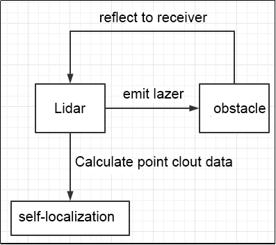

SLAM mapping is composed of the following three processes:

* **Pre-processing**
  

Generally, the surrounding environmental information obtained by a Lidar is called "**point cloud**", which represents a portion of the environment that the robot perceives. The collected object information is presented as a series of scattered data information with exact angles and distances.

* **Matching**
  

The point cloud data of this current local environment is matched by finding the corresponding position on the established map.

The SLAM system calculates the distance and pose changes of Lidar's relative motion by matching and comparing point clouds at different moments. This process completes the self-localization of the robot.

* **Map fusion**
  

The new round of data from Lidar is merged into the original map to complete the map update.

With Lidar as a signal source, pulse laser emitted by the Lidar's emitter hits the surrounding obstacles, causing scattering. A portion of the light waves reflects back to the Lidar's receiver, and by utilizing the principle of laser ranging, the distance from the Lidar to the target point can be calculated. By continuously scanning the target object with pulse lasers, data of all target points on the object can be obtained. After performing imaging processing on this data, an accurate three-dimensional image can be generated.

### 9.1.3 Mapping Knacks

(1) When initializing the mapping process, it's advisable for the robot to face a straight wall or use a closed cardboard box instead. This allows the Lidar to scan as many points as possible.


(2) Strive to move in straight lines to minimize the robot's rotational movements. Otherwise, the density of feature points in the map may be reduced. When environmental features are weak, position the robot close to the most prominent side of the environment to facilitate mapping.


(3) In certain large-environment scenarios, it's beneficial to allow the robot to complete a closed-loop mapping first, then proceed to scan smaller details in the environment meticulously. For instance, in settings like shopping malls with numerous transparent surfaces and less distinctive features, it's advantageous to pause the robot at conspicuous environmental features such as pillars, corridors, or inclined walls. Rotate the robot towards these features, allowing the radar to capture them thoroughly. After understanding the characteristic environment, rotate the robot back and resume forward movement. However, avoid stepping backward while rotating whenever possible.

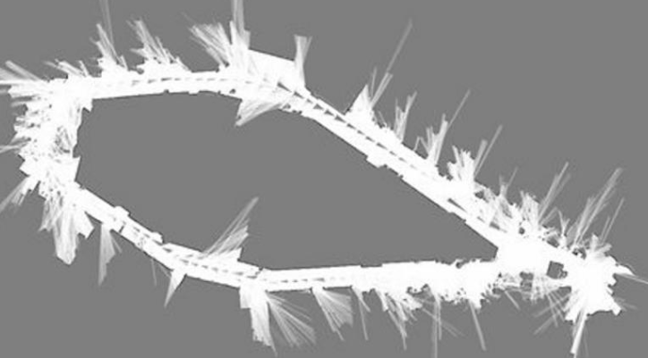

<p id="anchor_9_2"></p>

## 9.2 Gmapping Mapping

:::{Note}
Please ensure the robot dog has sufficient battery level before mapping. It's recommended to conduct mapping operations after the robot dog is fully charged.
:::

### 9.2.1 Gmapping Description

There are numerous algorithms for two-dimensional SLAM mapping. Some of the current SLAM algorithms based on the ROS framework include: HectorSLAM, Gmapping, KartoSLAM, CoreSLAM, LagoSLAM, and the more classic Cartographer algorithm.

The Gmapping algorithm is based on the RBPF particle filter algorithm, which separates the positioning and mapping processes. It first performs positioning and then mapping. This algorithm effectively utilizes odometry information, thereby imposing lower frame rate requirements for Lidar.

As the scene complexity increases, the number of particles required by the Gmapping algorithm will also increase. Since each particle needs to maintain a map, this can result in excessive computational and memory overheads when constructing a large map. Therefore, the Gmapping algorithm is more suitable for building small-scale maps.

### 9.2.2 Gmapping Principle

Gmapping algorithm will estimate the Lidar pose firstly based on the previous map and motion model. Then it will compute the weight according to the sensor observation to resample and update the map of particle. It will execute these steps in cycle to complete mapping.

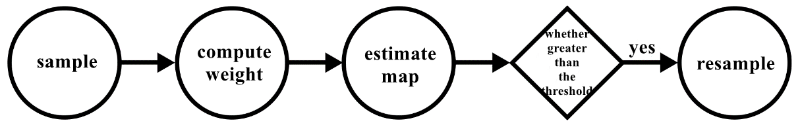

But RBPF particle filter algorithm has defects. It requires ample particles, and resamples frequently. Large amount of particles will result in great computation and storage occupation. And Gmapping has proposed two solutions for these two problems, including improving proposal distribution and selective resampling.

### 9.2.3 Enable Lidar Mapping

* **Start Mapping**

:::{Note}
The input command should be case-sensitive, and keywords can be complemented by pressing the Tab key.
:::

(1) Start the robot, and access the robot system desktop using NoMachine.

(2) Double click  to open the command line terminal.

(3) Execute the command and press Enter to disable app auto-start service.

```bash
sudo systemctl stop pug_bringup.service
```

(4) Open a new command line terminal window, enter the command to start the mapping service, and press Enter. If no error occurs, the mapping service has started successfully.

```bash
roslaunch pug_slam gmapping.launch
```

(5) Open a new command-line terminal, then run the command below to start the RVIZ to view the mapping simulation.

```bash
roslaunch pug_slam rviz_slam.launch
```

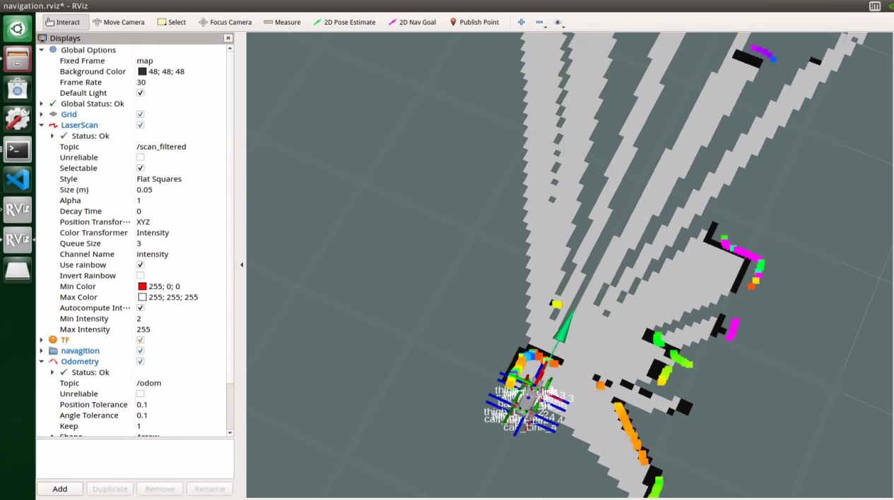

Control the robot to move around to map using the wireless handle.

| **Button** | **Function** |
|:---:|:---:|
| START | Reset robot's pose |
| L1 | Look up |
| L2 | Look down |
| R1 | Tilt forward |
| R2 | Tilt backward |
| ↑/ Move left slider forward | Go forward |
| ↓/ Move left slider downward | Go backward |
| ← / Move left slider to left | Turn left |
| → / Move left slider to right | Turn right |
| △ / Move right slider upward | Elevate the robot |
| × / Move right slider downward | Lower the robot |
| ◻ / Move right slider to left | Speed down (used with the button "**↑**","**↓**") |
| ○ / Move right slider to right | Speed up (used with the button "**↑**","**↓**") |

* **Save the Map**

(1) Open a new command-line terminal, and input the command to navigate to the folder where the map is saved.

```bash
roscd pug_slam/maps
```

(2) Run the following command to save the map.

```bash
rosrun map_server map_saver -f map_01
```

**`map_01`** in the command is the map name, which users can rename as needed. If the following message appears, the map has been saved successfully.


(3) Use the shortcut key "**Ctrl+C**" in each command line terminal window to terminate the program currently running in the window. After completing the mapping experience, you can initiate the mobile app service via commands or by restarting the robot. If the mobile app service is not activated, the related functions of the app will be inaccessible. (Upon robot restart, the mobile app service will automatically start.)

To restart the self-starting service of the app, enter the command below and await a single beep from the buzzer to confirm the service startup.

```bash
sudo systemctl restart pug_bringup.service
```

## 9.3 AMCL Adaptive Monte Carlo Positioning

### 9.3.1 AMCL Description

AMCL (Adaptive Monte Carlo Localization), also known as adaptive Monte Carlo localization, stands as the primary positioning module within the ROS/ROS2 system. As the designated algorithm within the navigation module, it embodies an implementation in ROS/ROS2, leveraging diverse Monte Carlo fusion algorithms.

AMCL offers a probabilistic positioning system tailored for robots navigating two-dimensional space. Employing particle filters, it adeptly tracks the robot's pose within a known map.

### 9.3.2 AMCL Working Principle

The AMCL operates on the principle of utilizing the particle filtering method to approximate the posterior distribution (confidence) of the robot within a known map. This is achieved by employing a set of randomly sampled states (particles), each representing a potential robot pose (position and orientation). These particles are assigned weights based on how effectively the sensor data (e.g., laser scans) aligns with the map.

Through the resampling process, particles are extracted from the original set with replacement, proportionate to their weights. This eliminates low-weighted particles while bolstering high-weighted ones.

With multiple iterations, the particle set gradually converges towards the actual robot posture, a phenomenon known as particle convergence. Adaptation occurs through dynamically adjusting the number of particles using the KLD sampling method to match the state space complexity.

When particle distribution is widely dispersed, increasing particle count enhances exploration capabilities. Conversely, when distribution is concentrated, reducing particle count conserves computing resources. This adaptive approach effectively addresses challenges like robot kidnapping and fixed particle number constraints.

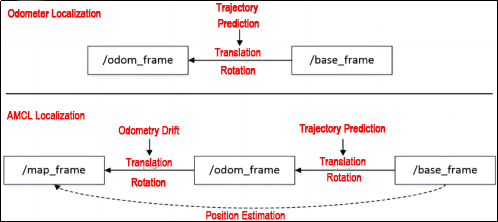

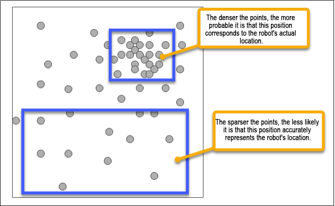

### 9.3.3 Steps for Adaptive Monte Carlo Localization (AMCL) Calculation

AMCL (Adaptive Monte Carlo Localization) is an algorithm designed for robot positioning, leveraging the Monte Carlo method while incorporating adaptive techniques to enhance accuracy. Here are the general steps of the AMCL algorithm:

(1) Particle Collection Initialization: Begin by randomly generating a set of particles (also known as hypotheses) within the robot's environment. Each particle represents a potential pose state of the robot, with the number of particles customizable based on requirements.

(2) Motion Update: As the robot traverses its environment, update the state of particles to reflect its movement. By accounting for the robot's motion information, such as velocity and orientation changes, adjust the position and orientation of each particle accordingly. Utilize a motion model to predict the robot's pose.

(3) Measurement Update: Robots typically gather environmental data through sensors like lidar scans or visual inputs. Match these measurements with the map to assess the fit of each particle within the observed data. The weight assigned to each particle indicates its alignment with the current environment.

(4) Resampling: To maintain diversity within the particle collection, perform resampling. This process involves sampling particles based on their weights, favoring those with higher weights while replacing some particles with lower weights. Resampling ensures a balanced representation within the particle set.

(5) Iterative Update: Continuously repeat steps 2 through 4 until specific convergence criteria are met. Typically, the algorithm terminates when positioning error decreases significantly or when particle weight distribution stabilizes.

(6) Through these iterative steps, the AMCL algorithm gradually and accurately estimates the robot's pose within its environment, fulfilling the positioning objective. It's important to note that the effectiveness of the AMCL algorithm is influenced by parameter selection and the number of particles, necessitating adjustment and optimization according to specific circumstances. AMCL offers improvements over traditional Monte Carlo localization (MCL) methods.

### 9.3.4 Description of a Simple MCL (Monte Carlo Localization) Example:

(1) Picture a: Initially, the robot is positioned near a door, but its precise location is unknown. We initialize all particles with equal weights.

(2) Picture b: As the robot senses the presence of a door ahead, particles closer to the door exhibit increased weights.

(3) Picture c: After resampling and the robot's movement, particles converge around the original points near the door, depicted as densely black areas in the image.

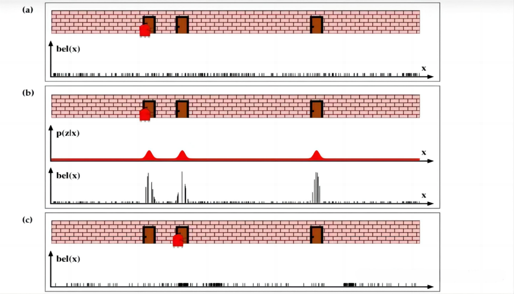

(4) Picture d: With renewed perception, the robot confirms the presence of the door ahead, further amplifying the weights of particles near the door. Notably, main sampling points shift towards the second door, leading the robot to ascertain its position relative to it.

(5) Picture e: Following another round of resampling and robot movement, it becomes evident that the robot's current position lies centrally. Reviewing the example picture provides a tangible sense of particle filtering's role in localization.

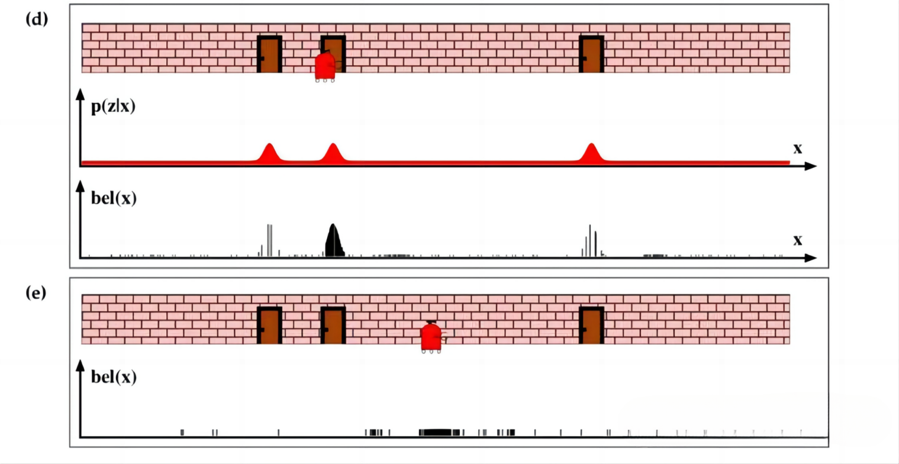

## 9.4 ROS Robot Autonomous Navigation

### 9.4.1 Autonomous Navigation Description

Autonomous navigation, often referred to as self-guided movement, enables a robot to navigate from point A to point B independently. Achieving this capability requires essential components integrated into the robot: a global map, self-positioning system, path planning algorithms, motion control mechanisms, and environmental perception sensors. It's through the synergy of these components that autonomous navigation becomes feasible. For further details, please consult the accompanying illustrations.

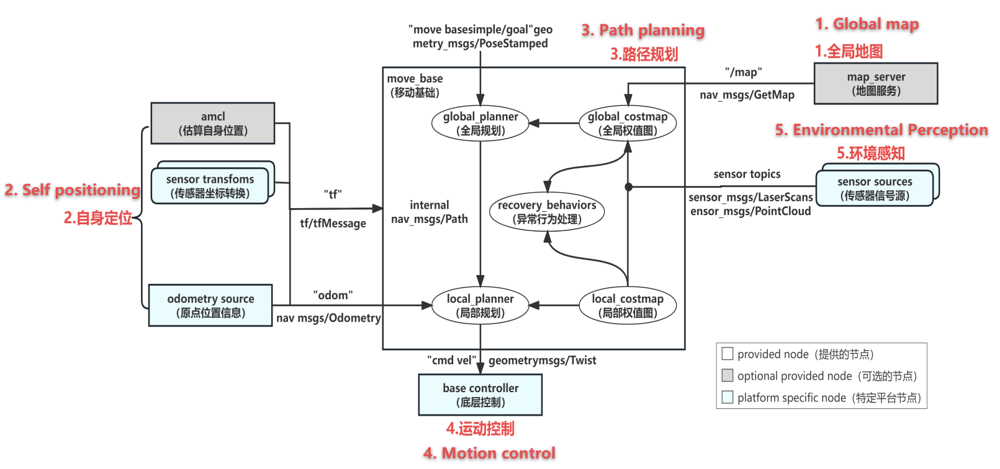

(1) Besides the planner, the navigation module encompasses a `cost_map`—a raster map containing static obstacle information, delineating passable and impassable areas.

(2) Concurrently, dynamic obstacle data is transmitted through sensor topics, prompting real-time updates to the `cost_map` for dynamic obstacle avoidance.

(3) Beyond mapping, the navigation module relies on positioning information furnished by the `amcl` module. For alternative positioning modules, simply publish the corresponding topic. Moreover, `tf` information is imperative, facilitating sensor conversion—a standard practice in robotics.

(4) Odometry supplies the robot's pose details, encompassing speed, angle, etc., crucial for the local planner in path planning.

(5) Ultimately, control commands generated are relayed to the control module via the `cmd_vel` command, regulating the robot's movement.

### 9.4.2 Key Technologies for Navigation Implementation

The autonomous navigation principle of ROS robots involves utilizing a suite of function packages and algorithms within ROS to achieve robot positioning, map construction, path planning, and motion control in both known and unknown environments. The ROS navigation module primarily comprises the following components:

(1) Global map: Provides an overarching view of the robot's environment. It can utilize SLAM algorithms (e.g., `gmapping`) to generate a two-dimensional raster map based on odometry and lidar data. Additionally, it can be saved and retrieved using the `map_server` function package. For insights into SLAM principles, refer to [9.1 SLAM Mapping Working Principle](#anchor_9_1) in the same folder.

(2) Self-positioning: Determines the robot's position on the map through algorithms. Typically, two algorithms are employed for this purpose: one calculates the current position relative to the origin using odometry, while the other utilizes radar sensors to compare surrounding environment data with map feature points to ascertain the robot's position.

(3) Path planning: Facilitates both overall and local path planning based on predefined target points and the global map. Global path planning (e.g., `global_planner`) employs Dijkstra or A* algorithms to compute the optimal route. Local path planning (e.g., `local_planner`) utilizes dynamic window techniques to navigate around obstacles and select the most favorable path while adhering to the global plan.

(4) Motion control: Governs the robot's speed and direction to adhere to the planned path. The navigation function package can publish messages of type `geometry_msgs/Twist` via the "**cmd_vel**" topic. These messages, based on the robot's base coordinate system, transmit motion commands. Therefore, a node subscribing to the "**cmd_vel**" topic is required to convert speed commands into motor commands and transmit them accordingly.

(5) Environment perception: Enables the perception of surrounding environmental data using sensors such as lidar, cameras, encoders, etc. This data is utilized for map building, localization, `cost_map` updates, etc. The `cost_map`, a raster map, contains information on static and dynamic obstacles, delineating passable and impassable areas.

## 9.5 TEB & DWA Path Planning

### 9.5.1 DWA Algorithm

* **DWA Algorithm Description**

The DWA (Dynamic Window Approach) algorithm operates by sampling various velocity sets (v, w) within the velocity space and forecasting the motion trajectories of these velocities based on the robot's kinematic model. These trajectories are then evaluated using a scoring function, with the optimal trajectory selected to drive the robot's movement.

(1) Advantages:

① Low computational complexity: Due to speed and acceleration constraints, only safe trajectories are considered, resulting in a small trajectory space.

② Real-time obstacle avoidance: The algorithm can achieve real-time obstacle avoidance, although the effectiveness may vary.

③ Suitable for two-wheel differential and omnidirectional mobile models.

(2) Disadvantages:

① Limited foresight: The algorithm only simulates and evaluates the next step, which may result in suboptimal obstacle avoidance, especially for complex scenarios.

② Inadequate dynamic obstacle avoidance: Simulated motion trajectories may be disrupted, leading to poor dynamic obstacle avoidance.

③ Lack of global optimality: The algorithm selects the next best path rather than the globally optimal path.

④ Inapplicable to Ackerman models.

The DWA algorithm transforms the position control of the mobile robot into speed control. When utilizing speed patterns to forecast the robot's motion trajectory, it is essential to analyze the robot's motion model. Here, `v(t)` and `w(t)` represent the translation speed and angular speed of the robot in the world coordinate system. Within the robot's sampling period `Δt`, it moves in a straight line at a constant speed, resulting in small displacements. The robot's motion model is as follows:

 ```math
\left\{ \begin{aligned}
& x(t) = x(t - 1) + v(t) \bullet \mathrm{\Delta}t \bullet cos(\theta(t - 1)) \\
& y(t) = y(t - 1) + v(t) \bullet \mathrm{\Delta}t \bullet sin(\theta(t - 1)) \\
& \theta(t) = \theta(t - 1) + w(t) \bullet \mathrm{\Delta}t
\end{aligned} \right.
 ```

In the equation, `x(t)`, `y(t)`, and `θ(t)` represent the robot's pose in world coordinates at time `t`.

* **Velocity Space and Scoring Function**

The dynamic window method frames the obstacle avoidance challenge as a constrained optimization problem within velocity space. These constraints encompass the non-holonomic constraints of the robot, environmental obstacles, and the dynamic constraints inherent in the robot's structure.

Through the design of an evaluation function, the optimal trajectory is discerned within velocity space. During local planning, adherence to the global path, effective obstacle avoidance, and swift progress towards the target are imperative to ascertain the optimal trajectory.

The evaluation function is defined as follows:

```math
G(v,\ w) = k(\alpha Heading(v,\ w) + \beta Goal(v,\ w) + \gamma Path(v,\ w) + \sigma Occ(v,\ w))
```

The smallest value of `G(v, w)` yields the best path. Here, `k` denotes the smoothing function, while `α`, `β`, `γ`, and `σ` serve as weighting coefficients for each sub-function. The sub-functions are outlined below:

The "**Heading**" sub-function ensures the robot maintains its orientation towards the endpoint during movement. Lower values of this function correspond to smaller azimuth angles towards the endpoint.

The "**Goal**" sub-function evaluates the distance between the endpoint of the robot's local path and the target, continuously minimizing this distance.

The "**Path**" sub-function assesses the distance from the trajectory's endpoint to the global path.

The "**Occ**" sub-function gauges the distance between the robot's trajectory and obstacles, reflecting its obstacle avoidance capability. If the distance exceeds the robot's radius, collision risk is low; otherwise, the trajectory is deemed unsafe and discarded.

### 9.5.2 TEB Algorithm

* **TEB Algorithm Description**

The TEB (Timed Elastic Band) algorithm enhances motion trajectory by adjusting the initial trajectory from global path planning. Its optimization focuses on minimizing distance to obstacles, path length, and trajectory duration.

TEB treats path planning as a multi-objective optimization task, aiming to minimize trajectory execution time, maintain a safe distance from obstacles, and adhere to motion dynamics constraints. Since many optimization objectives are local and pertain only to specific continuous states of the robot, the optimization problem entails sparse model optimization.

* **TEB Algorithm Realization Procedure**

The enhanced framework for robot control system operates as follows: Global path——>constraints are integrated——>g2o optimization——>speed commands

(1) Advantage:

① Suitable for various common car models: including differential, omnidirectional, and Ackerman models.

② Demonstrates strong foresight: optimizing trajectories in advance.

③ Exhibits effective dynamic obstacle avoidance: adeptly navigates around dynamic obstacles, and can directly encapsulate obstacle types.

(2) Disadvantage:

① High computational complexity: This can be mitigated by sacrificing prediction distance.

② Significant fluctuations in speed and angle, leading to unstable control: The source code computes speed and angular velocity within the control period based on distance, angle difference, and time difference between two states, resulting in notable fluctuations during control.

③ Lack of global optimality: Though superior to DWA.

* **TEB Model**

The TEB algorithm generates trajectories consisting of N discrete poses with associated time information. These trajectories are then optimized using the General Graph Optimization (G2O) algorithm to minimize path length, minimize time duration, maximize distance from obstacles, and impose constraints on velocity and acceleration, ensuring compliance with robot kinematics requirements.

The center coordinates and turning direction of a mobile robot jointly determine its pose within the environment. First, define the robot's pose:

```math
X_{a} = {(x_{i},y_{i},\ \beta_{i})}^{T} \in R^{2} \times S^{1}
```

Where `xi`, `yi`, and `βi` represent the robot's position and orientation in the map coordinate system.

The time interval between two robot poses is defined as `ΔTi`, recorded in a time sequence:

```math
\tau = {\{\mathrm{\Delta}T_{i}\}}_{i = 0,1,\ldots,n - 1}
```

Next, merge the poses and time sequence:

```math
B ≔ (Q,\tau)
```

The TEB algorithm treats poses and time intervals as optimization variables and, under dynamic constraints, seeks the optimal path. These constraints include velocity and acceleration limits, path length, distance between obstacles and the robot, and the robot's running time along the trajectory. Subsequently, the optimal path `Q` is obtained by setting a weighted multi-objective function.

## 9.6 Lidar Multi-Point Navigation & Obstacle Avoidance

If you need to know more details about the map construction, please refer to the file locating in [9.2 Gmapping Mapping](#anchor_9_2).

### 9.6.1 Navigation Configuration

(1) Start the robot dog, and access the robot system desktop using NoMachine.

(2) Double-click  to open the command-line terminal.

(3) Execute the command to terminate the app auto-start service.

```bash
sudo systemctl stop pug_bringup.service
```

(4) Open a new command-line terminal, and run the command below to enable the navigation service. If there is no error reported, it means that the navigation service is enabled successfully.

```bash
roslaunch pug_navigation navigation.launch map:=map_01
```

(5) Open a new command-line terminal and enter the command below to launch the RViz model for viewing the navigation simulation.

```bash
roslaunch pug_navigation rviz_navigation.launch
```

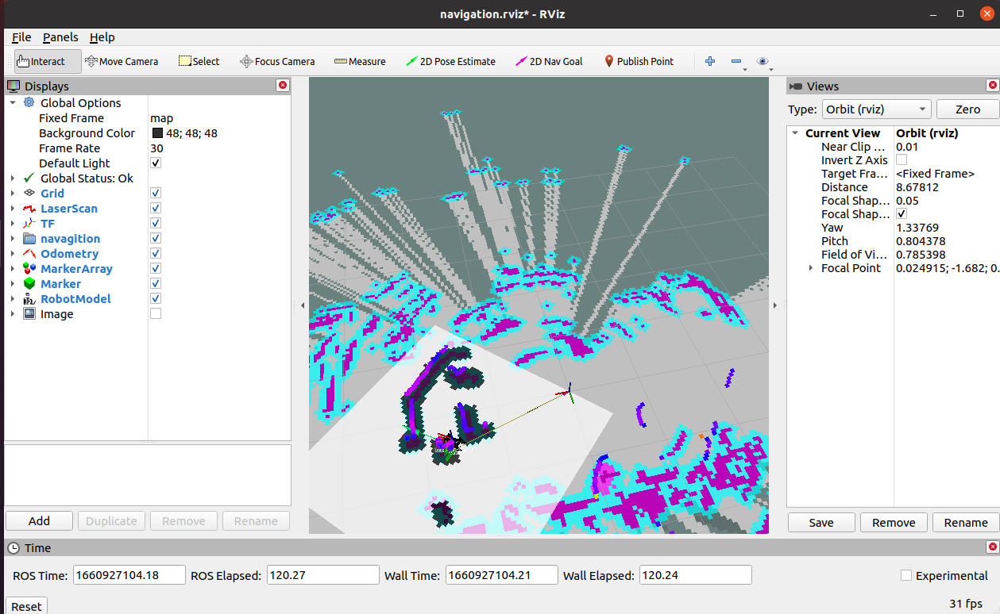

### 9.6.2 Start Navigation

The functions of the tools are as follows:

(1) 2D pose estimation: Sets the initial position of the robot dog.

(2) 2D Nav Goal: Sets the target point for navigation.

(3) Publish point: Publishes multiple target points. The robot dog will automatically plan a path to reach each target point while avoiding obstacles.

:::{Note}
If you need to terminate the navigation, click on '**2D Nav Goal**'. If the robot dog's position is changed due to external force, you need to reset the robot dog's position.
:::

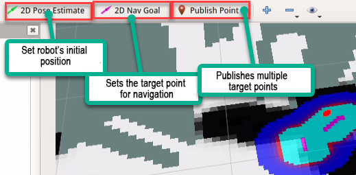

After setting the target points, two paths will be generated. The red line represents the direct distance between the robot dog and the target, while the green line depicts the path planned by the robot dog.

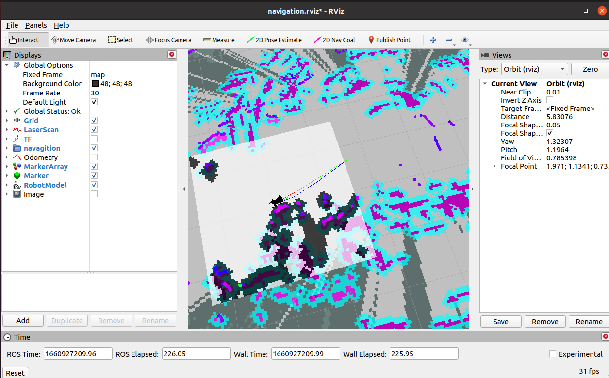

## 9.7 App Mapping & Navigation

### 9.7.1 Preparation

You can control the robot dog and monitor its mapping progress using your phone. Additionally, you can set navigation target points for the robot dog.

(1) The "**Make A APP**" app is for mapping, and "**Map Nav**" is for navigation.

(2) Both apps are compatible only with Android systems. You can find the software installation package in the same directory, which you can then transfer to your phone for installation.

### 9.7.2 Mapping

* **App Mapping**

(1) Start the robot dog, and access the robot system desktop using NoMachine.

(2) Start SLAM mapping. To access the detailed instructions, please refer to the file saved in [9.2 Gmapping Mapping](#anchor_9_2).

(3) Run the following command to initiate the app mapping service.

```bash
roslaunch pug_slam gmapping.launch
```

(4) Connect to the WiFi generated by the robot dog starting with **HW**.


(5) Open the "**Make A Map**" app, and change the "**Master URI**" field to http://192.168.149.1:11311, then click on "**CONNECT**" button.

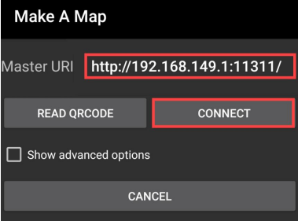

The app interface is divided into two zones. The map is displayed on the yellow frame, and the blue frame section is for controlling the robot.

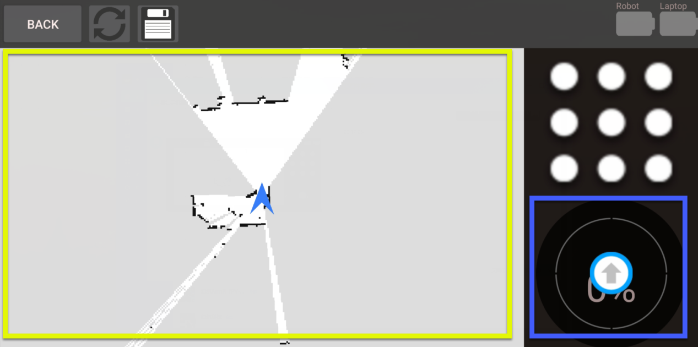

* **Save the Map**

(1) Open a new command line terminal window, enter the following command, and press Enter to navigate to the folder where maps are stored:

```bash
roscd pug_slam/maps
```

(2) Run the command below to save the map.

```bash
rosrun map_server map_saver -f map_01
```

**`map_01`** in the command is the map name, which can be renamed according to your needs. If the following message appears, the map has been saved successfully.

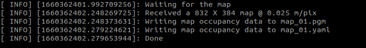

### 9.7.3 Navigation

* **APP Navigation**

(1) Start the robot dog, and access the robot system desktop using NoMachine.

(2) Enter the following command to initiate the navigation service. If there is no error reported, it means that the navigation service is enabled successfully.

```bash
roslaunch pug_navigation navigation.launch map:=map_01
```

(3) Connect your phone to the WiFi starting with **HW**. The initial password is **hiwonder**.


(4) Open "**Map Nav**" app, and input `http://192.168.149.1:11311` in "**Master URI**" bar, then click "**CONNECT**".

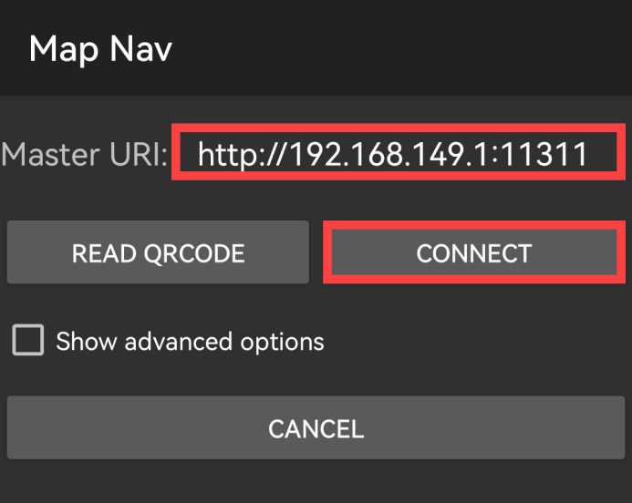

:::{Note}
The icon '**CHOOSE A MAP**' serves no practical purpose. Map will be loaded automatically.
:::

The "**Map Nav**" interface is divided into three sections. The green box displays the map; the red box controls the robot dog's movement; and the options '**Set Pose**' and '**Set Goal**' in the blue box, used together with the green box, are for setting the robot dog's initial position and navigation target.

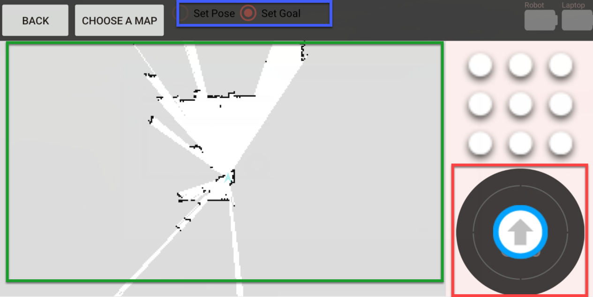

(1) Select "**Set Pose**", then press one point on the map to set it as the initial position of robot.

(2) Drag arrow in red section to control ROSPug to move so as to calibrate the position.

(3) Select "**Set Goal**", then press one point on the map to set it as the destination.

(4) After initial position and destination are set, the path between these two points is generated automatically. Then robot will move from the initial position to the set destination.